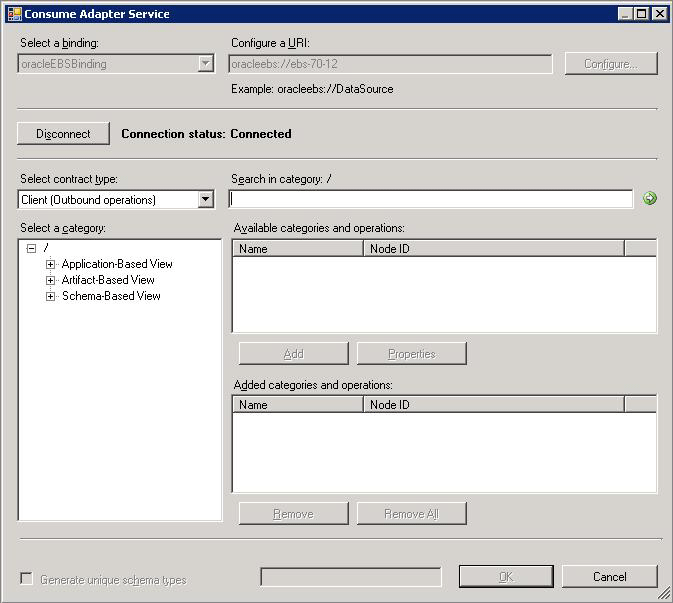

# Connect to Oracle E-Business Suite in Visual Studio using Add Adapter Metadata Wizard
The [!INCLUDE[adapteroraclebusinessshort](../../includes/adapteroraclebusinessshort-md.md)] is also exposed as a BizTalk adapter and, therefore, you can use the [!INCLUDE[addadapterwiz](../../includes/addadapterwiz-md.md)] to generate schema for the operations you want to perform on Oracle E-Business Suite using the adapter.  
  
## Connecting to Oracle E-Business Suite Using the Add Adapter Metadata Wizard  
 Perform the following steps to connect to Oracle E-Business Suite using the [!INCLUDE[addadapterwiz](../../includes/addadapterwiz-md.md)].  
  
#### To connect to Oracle E-Business Suite  
  
1.  To connect using the [!INCLUDE[addadapterwiz](../../includes/addadapterwiz-md.md)] in a BizTalk solution:  
  
    1.  Create a BizTalk project using Visual Studio.  
  
    2.  Right-click the project in Solution Explorer, point to **Add**, and then click **Add Generated Items**.  
  
    3.  In the **Add Generated Items** dialog box, do the following:  
  
        |Use this|To do this|  
        |--------------|----------------|  
        |**Categories**|Click **Add Adapter**.|  
        |**Templates**|Click **Add Adapter Metadata**.|  
  
    4.  Click **Add**. The [!INCLUDE[addadapterwiz](../../includes/addadapterwiz-md.md)] opens.  
  
    5.  In the [!INCLUDE[addadapterwiz](../../includes/addadapterwiz-md.md)], select **WCF-OracleEBS**. Select the computer on which [!INCLUDE[btsBizTalkServerNoVersion](../../includes/btsbiztalkservernoversion-md.md)] is installed and the name of the BizTalk database.  
  
        > [!IMPORTANT]
        >  If you already have a WCF-OracleEBS port configured in BizTalk, select the port from the **Port** list.  
  
    6.  Click **Next**.  
  
2.  From the **Select a binding** drop-down list, select **oracleEBSBinding** and click **Configure**.  
  
3.  In the **Configure Adapter** dialog box, click the **Security** tab, and from the **Client credential type** drop-down list box, select **Username** and specify the user name and password to connect to the Oracle E-Business Suite.  
  
    |||  
    |-|-|  
    |Use this|To do this|  
    |**To connect using Oracle database credentials**|Specify the **ClientCredentialType** binding property to **Database** and specify database credentials for **User name** and **Password** text boxes.|  
    |**To connect using Oracle E-Business Suite credentials**|Specify the **ClientCredentialType** binding property to **EBusiness** and specify Oracle E-Business Suite credentials for **User name** and **Password** text boxes. In this case, you must also specify Oracle database credentials for **OracleUserName** and **OraclePassword** binding properties.|  
    |**To connect using Windows Authentication if ClientCredentialType is set to “Database”**|Specify a “/” for the **User name** text box and leave the **Password** text box blank.|  
    |**To connect using Windows Authentication if ClientCredentialType is set to “EBusiness”**|Specify Oracle E-Business Suite credentials for **User name** and **Password** text boxes. You must also specify a “/” for the **OracleUserName** binding property and leave the **OraclePassword** binding property blank.|  
  
4.  Click the **URI Properties** tab, and specify values for the connection parameters. For more information about the connection URI for the [!INCLUDE[adapteroraclebusinessshort](../../includes/adapteroraclebusinessshort-md.md)], see [Create the Oracle E-Business Suite connection URI](../../adapters-and-accelerators/adapter-oracle-ebs/create-the-oracle-e-business-suite-connection-uri.md)).  
  
    > [!NOTE]
    >  If the connection parameters contain any reserved characters, you must specify them as-is in the **URI Properties** tab, that is, without using any escape characters. However, if you specify the URI directly in the **Configure a URI** field and the connection parameters contain reserved characters, you must specify the connection parameters using proper escape characters.  
  
5.  Click the **Binding Properties** tab, and then specify values for the binding properties, if any, required by the operations you want to target. For more information about binding properties, see [Read about the BizTalk Adapter for Oracle E-Business Suite binding properties](../../adapters-and-accelerators/adapter-oracle-ebs/read-about-the-biztalk-adapter-for-oracle-e-business-suite-binding-properties.md).  
  
    > [!NOTE]
    >  If you are generating metadata using [!INCLUDE[addadapterwiz](../../includes/addadapterwiz-md.md)] and you selected an existing WCF-OracleEBS send port, you need not specify the binding properties. The binding properties are picked from the send port configuration. However, you may choose to specify the binding properties that are required at design-time, if any. In such case, the new values for binding properties will be used at design-time while generating the metadata. However, at run-time the values specified for binding properties in the send port configuration will be applicable.  
  
6.  Click **OK**.  
  
7.  Click **Connect**. After the connection is established, the connection status is shown as **Connected**.  
  
     The following figure shows the [!INCLUDE[consumeadapterservshort](../../includes/consumeadapterservshort-md.md)] immediately after the connection is established.  
  
       
  
     The [!INCLUDE[consumeadapterservshort](../../includes/consumeadapterservshort-md.md)] displays different nodes containing various operations that can be performed on the Oracle E-Business Suite and the Oracle database. For more information on how the metadata is categorized under the various nodes, see [Connect to Oracle E-Business Suite in Visual Studio using Add Adapter Metadata Wizard](../../adapters-and-accelerators/adapter-oracle-ebs/connect-to-oracle-ebs-in-visual-studio-using-add-adapter-metadata-wizard.md).  
  
## See Also  
 [Connect to the Oracle E-Business Suite in Visual Studio](../../adapters-and-accelerators/adapter-oracle-ebs/connect-to-the-oracle-e-business-suite-in-visual-studio.md)   
 [Connect to Oracle E-Business Suite using Windows Authentication](../../adapters-and-accelerators/adapter-oracle-ebs/connect-to-oracle-e-business-suite-using-windows-authentication.md)