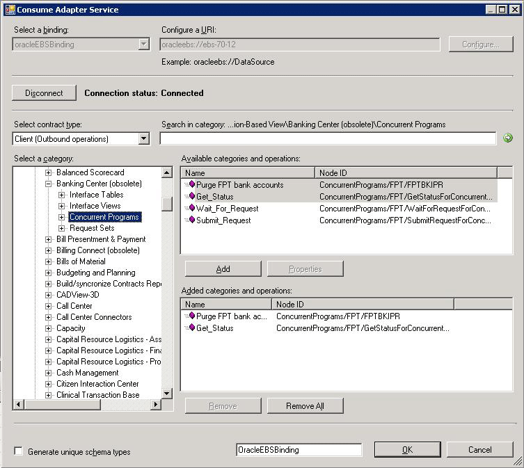
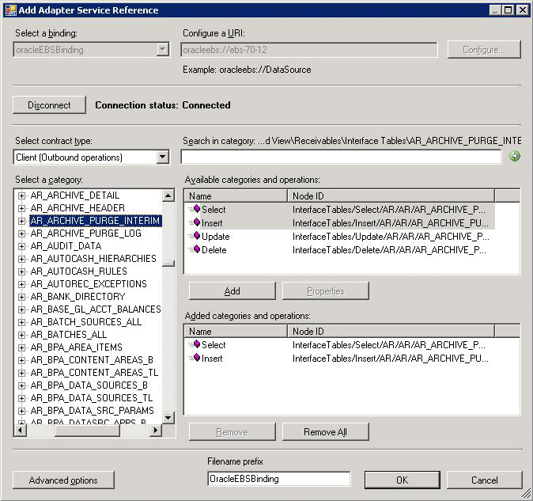
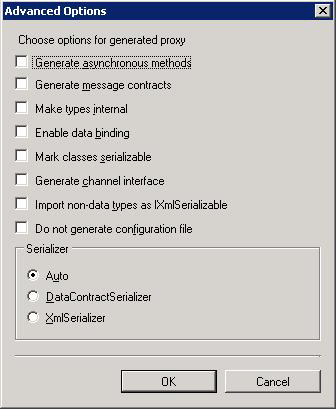

# Get the Oracle E-Business Suite operations metadata
You can use the [!INCLUDE[consumeadapterservshort](../../includes/consumeadapterservshort-md.md)] to generate schema for selected Oracle E-Business Suite artifacts. After you have browsed and searched for the artifacts you want to invoke, you can generate schema for those artifacts and send messages, conforming to the schema, to Oracle E-Business Suite.  
  
> [!NOTE]
>  The [!INCLUDE[consumeadapterservshort](../../includes/consumeadapterservshort-md.md)] and the [!INCLUDE[addadapterservrefshort](../../includes/addadapterservrefshort-md.md)] present essentially the same interface when you browse and search for operations, so both components are covered in the same topics.  
  
## Prerequisites  
 You must connect to the Oracle E-Business Suite before you retrieve metadata for target operations. For information about how to connect to the Oracle database when you use the [!INCLUDE[consumeadapterservshort](../../includes/consumeadapterservshort-md.md)] or the [!INCLUDE[addadapterservrefshort](../../includes/addadapterservrefshort-md.md)], see [Connect to the Oracle E-Business Suite in Visual Studio](../../adapters-and-accelerators/adapter-oracle-ebs/connect-to-the-oracle-e-business-suite-in-visual-studio.md).  
  
## Generating Schema Using the Consume Adapter Service Add-in  
  
> [!NOTE]
>  You can select category nodes to return all the operations in that category's sub-tree—for example, you can select the **Concurrent Programs** node (to generate schema for all the concurrent programs for an Oracle application) or you can select a specific concurrent program. For more information about the nodes, see Metadata Node IDs.  
  
#### To generate schema for Oracle E-Business Suite artifacts  
  
1.  Connect to Oracle E-Business Suite using the [!INCLUDE[consumeadapterservshort](../../includes/consumeadapterservshort-md.md)] or the [!INCLUDE[addadapterservrefshort](../../includes/addadapterservrefshort-md.md)]. See [Connect to the Oracle E-Business Suite in Visual Studio](../../adapters-and-accelerators/adapter-oracle-ebs/connect-to-the-oracle-e-business-suite-in-visual-studio.md) for instructions.  
  
    > [!IMPORTANT]
    >  To generate schema for performing operations using [!INCLUDE[btsBizTalkServerNoVersion](../../includes/btsbiztalkservernoversion-md.md)] you must set the **EnableBizTalkCompatibilityMode** binding property to **True**. You must set this binding property while establishing a connection to the Oracle E-Business Suite.  
  
2.  From the **Select contract type** list, select the type of contract based on whether you are generating schema for inbound or outbound operations.  
  
3.  Click the category node for which you want to generate metadata. For example, if you want to generate metadata for a concurrent program within an Oracle application, click **Concurrent Programs**.  
  
4.  Expand the category node, and select the specific item within that node for which you want to generate metadata. For example, to generate metadata for concurrent programs for the “Banking Center” application, expand the **Concurrent Programs** node, and then click **Banking Center**.  
  
5.  In the **Available categories and operations** box, select the operations that you want to invoke and then click **Add**. The selected operations are listed in the **Added categories and operations** box. For example, to invoke “Purge FTP bank account” and “Get_Status” concurrent programs, click the operation names, and then click **Add**.  
  
     The following figure shows the [!INCLUDE[consumeadapterservshort](../../includes/consumeadapterservshort-md.md)], which lists the selected operations.  
  
       
  
     If you want to generate schema for multiple operations, there may be some duplicate element definitions among these schema that may cause failure in compiling the BizTalk project. For example, consider a scenario where you generate schema for an operation “Op1”. The schema for “Op1” contains a parameter of data type “CT1”. After generating the schema for “Op1” you close the [!INCLUDE[consumeadapterservshort](../../includes/consumeadapterservshort-md.md)] and re-open it to generate schema for another operation “Op2”. Assume that “Op2” also contains a parameter of data type “CT1”. After you exit the [!INCLUDE[consumeadapterservshort](../../includes/consumeadapterservshort-md.md)] and compile the project, you will get compilation errors because the complex data type “CT1” is defined twice in different XSD files. In such situations, we recommend the following:  
  
    -   Generate schema for all the operations in a single run of [!INCLUDE[consumeadapterservshort](../../includes/consumeadapterservshort-md.md)]. This ensures that the [!INCLUDE[consumeadapterservshort](../../includes/consumeadapterservshort-md.md)] generates only one definition for the complex data type “CT1”.  
  
    -   If you want to generate schema for multiple operations across different runs of [!INCLUDE[consumeadapterservshort](../../includes/consumeadapterservshort-md.md)], make sure you select the **Generate unique schema types** check box, so that the generated XSD files contain unique namespaces for the complex data type “CT1”.  
  
6.  Click **OK**. The schema file is saved with an .xsd extension at the same location as the BizTalk project.  
  
    > [!NOTE]
    >  If you are using the Consume Adapter Service Add-in to generate metadata for operations on Oracle artifacts, by default the files are created with a specific naming convention: The generated XSD file name has the following three parts:  
    >   
    >  -   "OracleEBSBinding” or the prefix provided in the **Filename prefix** box.  
    > -   The name included in the **fileNameHint** annotation tag in the generated WSDL. For operations, the file name hint is same as the operation group. For the complex types, the file name hint is the namespace without the “http://schemas.microsoft.com/OracleEBS/2008/05/” prefix. For example, the file name hint for an interface table operation follows the convention \<InterfaceTables>+<app_short_name>+<interface_table_name>.  
    > -   (Optional) An integer to ensure that the file name is unique.  
    >   
    >  Finally, the name of an XSD file is arrived upon as <file_name_prefix>+\<fileNameHint>+n, where “n” is an unique integer.  
  
    > [!NOTE]
    >  The [!INCLUDE[consumeadapterservshort](../../includes/consumeadapterservshort-md.md)] also creates a binding file (an XML file) containing the binding properties that you specified when generating the schema for an operation and the SOAP action to invoke the operation. You can import this binding file in the [!INCLUDE[btsBizTalkServerNoVersion](../../includes/btsbiztalkservernoversion-md.md)] Administration console to create a WCF-Custom port with the connection URI, binding properties, and the SOAP action set. For more information, see [Configure a physical port binding using a port binding file to Oracle Database](../../adapters-and-accelerators/adapter-oracle-database/configure-a-physical-port-binding-using-a-port-binding-file-to-oracle-database.md).  
  
     You have successfully generated metadata for Oracle E-Business Suite artifacts. You can use the metadata to send messages to Oracle E-Business Suite to perform specific operations. See [Develop BizTalk applications using the Oracle E-Business Suite adapter](../../adapters-and-accelerators/adapter-oracle-ebs/develop-biztalk-applications-using-the-oracle-e-business-suite-adapter.md) for more information about how to perform these operations.  
  
## Generating a WCF Client or WCF Service Contract Using the Add Adapter Service Reference Plug-in  
 You can use the [!INCLUDE[addadapterservrefshort](../../includes/addadapterservrefshort-md.md)] to generate either WCF client code for outbound operations or WCF service code for the inbound operations.  
  
#### To generate WCF client class or service contract for Oracle E-Business Suite operations  
  
1.  In the [!INCLUDE[addadapterservrefshort](../../includes/addadapterservrefshort-md.md)], from the **Select contract type** drop-down list, select the type of contract based on whether you will be performing inbound or outbound operations.  
  
2.  Browse or search for categories (such as an interface table) or for the specific operations for which you want to generate a WCF client (or WCF service contract).   
    For example, to browse for the operations on the AR_ARCHIVE_PURGE_INTERIM interface table, in the **Select a category** box:  
  
    1.  Expand the root node (**/**) to see the categories under which the operations are surfaced for the Oracle E-Business Suite. The same interface table can be available under the **Application-Based View** node as well as the **Artifact-Based View** node. In this example, you generate the WCF client class from the **Application-Based View** node.  
  
    2.  Under the root node, expand the **Application-Based View** node to see the available applications in the Oracle E-Business Suite.  
  
    3.  Expand the node for the **Receivables** application and then expand the **Interface Tables** node.  
  
    4.  Click the **AR_ARCHIVE_PURGE_INTERIM** interface table node, and in the **Available categories and operations** box, select the operations for which you want to generate a WCF client (or WCF service contract), and then click **Add**. The selected operations are listed in the **Added categories and operations** box.  
  
         The following figure shows the [!INCLUDE[addadapterservrefshort](../../includes/addadapterservrefshort-md.md)] with the Insert and Select operations for the AR_ARCHIVE_PURGE_INTERIM table selected.  
  
           
  
        > [!IMPORTANT]
        >  Depending on the outbound operations (or categories) that you select, more than one WCF client class may be generated. For more details, see [Generate a WCF client or a WCF service contract for Oracle E-Business Suite solution artifacts](../../adapters-and-accelerators/adapter-oracle-ebs/create-a-wcf-client-or-wcf-service-contract-for-oracle-ebs-solution-artifacts.md).  
  
3.  For most scenarios the default serialization options are sufficient; however, if needed, you can control several aspects about the code that is generated and the type of serializer that is used. To set these options:  
  
    1.  Click **Advanced Options** to open the **Advanced Options** box.  
  
    2.  In the **Advanced Options** box under **Choose options for generated proxy**, select the options that you want. For example, you can select whether asynchronous methods are generated for the WCF client or disable the generation of a configuration file.  
  
    3.  Under **Serializer** select the serializer that should be used.  
  
     The following figure shows the **Advanced Options** box with the default selections (**Auto** is selected for the serializer and no other options are selected).  
  
       
  
     The options that you can configure in the **Advanced Options** box are equivalent to some of the options available when you use the ServiceModel Metadata Utility Tool (svcutil.exe). For more information about these options, see [ServiceModel Metadata Utility Tool (Svcutil.exe)](https://msdn.microsoft.com/library/aa347733.aspx).
  
4.  Click **OK**. The [!INCLUDE[addadapterservrefshort](../../includes/addadapterservrefshort-md.md)] saves the WCF client class (or WCF service interface) and helper code for the operations and categories that you have selected in your project directory. By default, a configuration file is also saved. Slightly different files are generated for inbound and outbound operations; for more information, see [Generate a WCF client or a WCF service contract for Oracle E-Business Suite solution artifacts](../../adapters-and-accelerators/adapter-oracle-ebs/create-a-wcf-client-or-wcf-service-contract-for-oracle-ebs-solution-artifacts.md).  
  
 You can select any node that is listed in the **Available categories and operations** box. If you select a category node then all of the operations available under that node and its sub-nodes will be selected. For example, to generate a WCF client for all of the operations surfaced for the AR_ARCHIVE_PURGE_INTERIM table, you can select the **AR_ARCHIVE_PURGE_INTERIM** node.  
  
## See Also  
 [Browse, search, and get metadata for Oracle E-Business Suite operations](../../adapters-and-accelerators/adapter-oracle-ebs/browse-search-and-get-metadata-for-oracle-e-business-suite-operations.md)