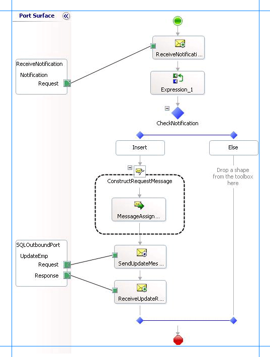

# Step 2: Send the Request Message to SQL Server and Receive Response
  
  
 **Time to complete:** 10 minutes  
  
 **Objective:** In this step, you send the request message to execute the **UPDATE_EMPLOYEE** stored procedure and receive the response.  
  
## Prerequisites  
 You must have completed [Step 1: Create the Request Message for UPDATE_EMPLOYEE Stored Procedure](../../adapters-and-accelerators/adapter-sql/step-1-create-the-request-message-for-update-employee-stored-procedure.md).  
  
### To send the request message and receive a response  
  
1.  To the existing orchestration, under the **Insert** block of the **Decide** shape, add a **Message Assignment** shape. From the Toolbox, drag the **Message Assignment** shape to the space indicated.  
  
    > [!NOTE]
    >  When you drop the **Message Assignment** shape onto the design surface, Orchestration Designer creates the enclosing **Construct Message** shape for you.  
  
2.  On the design surface, right-click the **ConstructMessage_1** shape, and then click **Properties Window**.  
  
3.  In the **Properties** pane for the **ConstructMessage_1** shape, specify the following values.  
  
    |Set this property|To this value|  
    |-----------------------|-------------------|  
    |**Messages Constructed**|UpdateEmployee|  
    |**Name**|ConstructRequestMessage|  
  
4.  Double-click the **MessageAssignment** shape to open the **BizTalk Expression Editor**.  
  
5.  In the **BizTalk Expression Editor**, add the following:  
  
    ```  
    UpdateEmployee = UpdateEmployeeMessageCreator.UpdateEmployeeMessageCreator.XMLMessageCreator();  
    UpdateEmployee(WCF.Action) = "TypedProcedure/dbo/UPDATE_EMPLOYEE";  
    ```  
  
     Here, **UpdateEmployee** is the message you created in [Step 2: Create Messages for BizTalk Orchestrations](../../adapters-and-accelerators/adapter-sql/step-2-create-messages-for-biztalk-orchestrations.md) for sending request messages for **UPDATE_EMPLOYEE** stored procedure. In the **MessageAssignment** shape, you invoke the **UpdateEmployeeMessageCreator** class to create a request message. Also, you set the WCF action for the request message.  
  
6.  Add the following shapes to the orchestration under the **Message Assignment** shape.  
  
    |Shape|Shape Type|Properties|  
    |-----------|----------------|----------------|  
    |SendUpdateMessage|Send|-   Set **Message** to *UpdateEmployee*<br />-   Set **Name** to *SendUpdateMessage*|  
    |ReceiveUpdateResponse|Receive|-   Set **Activate** to *False*<br />-   Set **Message** to *UpdateEmployeeResponse*<br />-   Set **Name** to *ReceiveUpdateResponse*|  
  
7.  Add a request-response send port to the orchestration. You will use this port to send request messages to the SQL Server and receive response. Set the following properties for the port.  
  
    |Set this property|To this value|  
    |-----------------------|-------------------|  
    |**Communication Direction**|Send-Receive|  
    |**Communication Pattern**|Request-Response|  
    |**Identifier**|SQLOutboundPort|  
  
     Also, change the operation name from Operation_1 to **UpdateEmp**.  
  
8.  Connect the port to action shapes. In Orchestration Designer, on the design surface, drag the green arrow-shaped handle for the port to the corresponding green handle of the action shape.  
  
    > [!NOTE]
    >  In this step, you use the drag-and-drop method to connect ports to action shapes. You could instead use the operation property of an action shape to connect the action shape to a port.  
  
     Connect the ports and action shapes as follows:  
  
    -   Connect the **SendUpdateMessage** action shape to the **Request** handle of the **SQLOutboundPort**.  
  
    -   Connect the **ReceiveUpdateResponse** action shape to the **Response** handle of the **SQLOutboundPort**.  
  
9. The following figure shows the in-progress orchestration.  
  
       
  
## What did I just do?  
 In this step, you updated the orchestration by adding a **MessageAssignment** shape, **Send** and **Receive** shapes, and a port. You connected the shapes and ports to send request message to execute the UDPATE_EMPLOYEE request message and receive the response.  
  
## Next Steps  
 In the next step, you add orchestration shapes to invoke the Insert operation on the **Purchase_Order** table, as described in [Lesson 4: Perform an Insert Operation on the Purchase Order Table](../../adapters-and-accelerators/adapter-sql/lesson-4-perform-an-insert-operation-on-the-purchase-order-table.md).  
  
## See Also  
 [Step 1: Create the Request Message for UPDATE_EMPLOYEE Stored Procedure](../../adapters-and-accelerators/adapter-sql/step-1-create-the-request-message-for-update-employee-stored-procedure.md)   
 [Lesson 3: Execute a Stored Procedure to Select New Employees Added](../../adapters-and-accelerators/adapter-sql/lesson-3-execute-a-stored-procedure-to-select-new-employees-added.md)