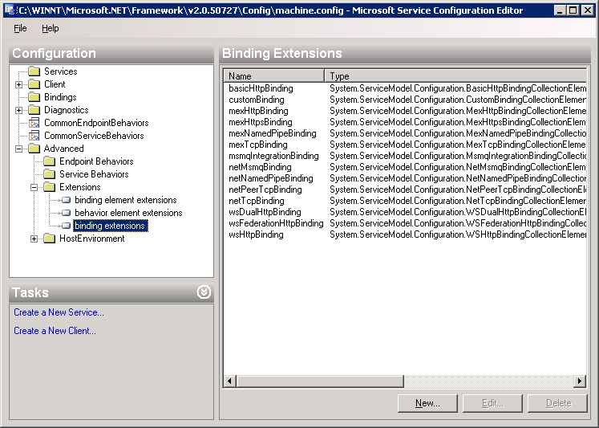
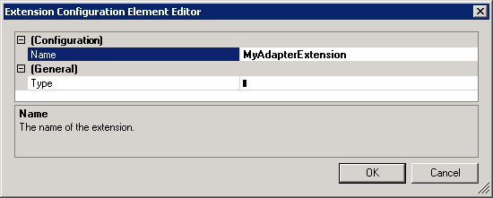
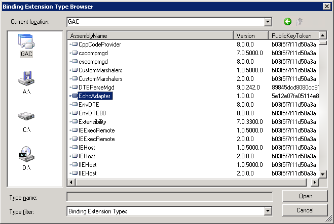
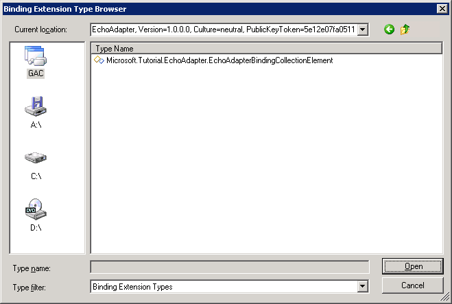
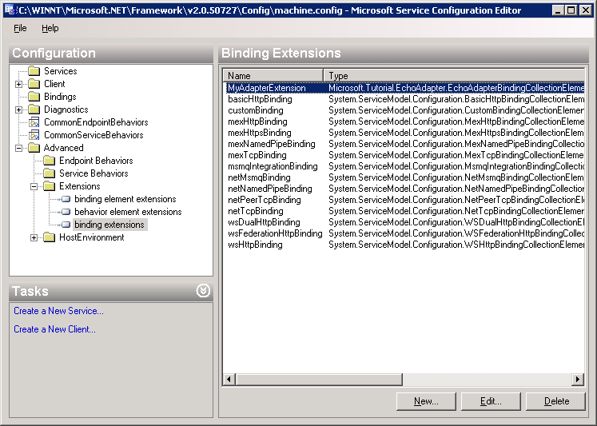

# Deploy an adapter using the WCF LOB adapter SDK
To deploy an adapter, you must install the adapter assembly into the global assembly cache (GAC), and then register the adapter in the machine.config file.  
  
## Install the Adapter Assembly into the GAC  
 Before consuming an adapter in Visual Studio using the [!INCLUDE[addadapterservrefshort](../../includes/addadapterservrefshort-md.md)] command or in [!INCLUDE[btsBizTalkServerNoVersion](../../includes/btsbiztalkservernoversion-md.md)] by using the [!INCLUDE[consumeadapterservshort](../../includes/consumeadapterservshort-md.md)] feature, you must install the assembly into the GAC. Only assemblies that are strong-named can be installed into the GAC.  
  
> [!NOTE]
>  To complete this procedure, you must be logged on with an account that has Write permissions on the GAC. The Administrators account on the local computer has these permissions.  
  
#### Configure a strong name assembly key file  
  
1.  In [!INCLUDE[btsVStudioNoVersion](../../includes/btsvstudionoversion-md.md)], load the adapter project file that needs a strong name.  
  
2.  Open a [!INCLUDE[btsVStudioNoVersion](../../includes/btsvstudionoversion-md.md)] command prompt.  
  
3.  At the command prompt, from the folder where you want to store the key file, type the following command, and then press ENTER:  
  
     **sn /k**  *file_name* **.snk**  
  
     Example: **sn /k EchoAdapter.snk**  
  
     A confirmation message, **Key pair written to** \<*file_name*>**.snk**`,` displays on the command line.  
  
4.  In Visual Studio Solution Explorer, right-click the project, and then click **Properties**.  
  
5.  In the left pane, expand **Common Properties**, and then click **Assembly**.  
  
6.  In the right pane, scroll to the **Strong name** box.  
  
7.  In the **Strong name** box, click the field next to **Assembly Key File**, click the browse button (**…**), and then browse to the key file.  
  
8.  Click the key file, click **Open**, and then click **OK**.  
  
9. On the Visual Studio menu, click **Build**, and then choose **Build Solution**.  
  
> [!NOTE]
>  If your adapter assembly depends on any other assemblies, ensure these referenced assemblies are signed with a strong name; otherwise you will get an error.  
  
 If you have the source, you can recompile with a strong name as shown previously. If the reference assembly belongs to a third-party and you cannot ensure that it will be given a strong name, you can disassemble and then reassemble the assembly with a strong name.  
  
 Your original assembly will be overwritten, so if you want to keep the original version, ensure you make a backup copy of it before proceeding with the following steps.  
  
 Use Microsoft Intermediate Language (MSIL) Disassembler to disassemble the assembly:  
  
-   ILDASM thirdparty.dll /out:thirdparty.il  
  
 Use MSIL Assembler to reassemble the assembly with a strong name:  
  
-   ILASM thirdparty.il /dll /key=strongkeyfile.snk  
  
#### Install an assembly in the GAC  
  
1.  Verify that your adapter has been signed.  
  
2.  Open a [!INCLUDE[btsVStudioNoVersion](../../includes/btsvstudionoversion-md.md)] command prompt.  
  
3.  Type the following command:  
  
     **gacutil.exe /if "\<** *path to the assembly .dll file* **>"**  
  
4.  This installs the assembly to the GAC, overwriting any existing assembly that has the same assembly name.  
  
## Register the Adapter in Machine.config  
 An adapter developed using the [!INCLUDE[afproductnameshort](../../includes/afproductnameshort-md.md)] is surfaced as a WCF binding.  See Microsoft.ServiceModel.Channels.Common.AdapterBinding for more information.  The adapter binding is registered with WCF using \<bindingExtensions> section within \<system.ServiceModel> and the adapter transport binding element is registered with WCF using \<bindingElementExtensions> section within \<system.ServiceModel>.  
  
 You can manually edit the machine.config file using a text editor.  
  
#### Manually edit the machine.config file  
  
1.  Edit the machine.config file located in the Microsoft .NET configuration folder. To do this, click **Start**, click **Run**, type notepad \<Windows install path>\Microsoft.NET\Framework\\<version\>\CONFIG\machine.config, and then click **OK**.  
  
2.  Update the machine.config file. If the file does not contain a system.serviceModel section, add the following section at the end of the configuration file but before the closing root tag.  
  
    > [!NOTE]
    >  Replace "myAdapterBinding", version, culture and other assembly-specific information with your adapter's information.  
  
    ```  
    \<system.serviceModel>  
      <extensions>  
        <bindingExtensions>  
            <add name="myAdapterBinding" type="Microsoft.Adapters.Samples.Echo.EchoAdapterBindingCollectionElement,EchoAdapter, Version=0.0.0.0, Culture=neutral, PublicKeyToken= fafafafafafafafa" />  
        </bindingExtensions>      <bindingElementExtensions>  
            <add name="echoAdapter" type="Microsoft.Adapters.Samples.Echo.EchoAdapterBindingElementExtension,EchoAdapter, Version=0.0.0.0, Culture=neutral, PublicKeyToken=37f23b4adb996dcf" />  
          </bindingElementExtensions>  
      </extensions>  
    \</system.serviceModel>  
    ```  
  
     - OR -  
  
     If your machine.config file contains a system.serviceModel section, determine which elements are missing and add them, replacing "MyAdapter" and other information with your adapter's information.  
  
    ```  
    <extensions>  
      <bindingExtensions>  
            <add name="myAdapterBinding" type="Microsoft.Adapters.Samples.Echo.EchoAdapterBindingCollectionElement,EchoAdapter, Version=0.0.0.0, Culture=neutral, PublicKeyToken= fafafafafafafafa" />  
      </bindingExtensions>  
          <bindingElementExtensions>  
            <add name="echoAdapter" type="Microsoft.Adapters.Samples.Echo.EchoAdapterBindingElementExtension,EchoAdapter, Version=0.0.0.0, Culture=neutral, PublicKeyToken=37f23b4adb996dcf" />  
          </bindingElementExtensions>  
    </extensions>  
    ```  
  
3.  Close and save the machine.config file.  
  
 You can also use the [Service Configuration Editor](https://msdn.microsoft.com/library/ms732009.aspx) to modify the machine.config file.
  
#### Edit the machine.config file using the Service Configuration Editor  
  
1.  Open the **Service Configuration Editor**. See [Service Configuration Editor](https://msdn.microsoft.com/library/ms732009.aspx) for  more information.
  
2.  In the tree view pane (labeled **Configuration**), expand the node tree. Click the **Advanced** folder, click the **Extensions** folder, and then select the binding extensions element.  
  
       
  
3.  Create a new binding extension. Click the **New** button to open the Extension **Configuration Element Editor** dialog box. In **Configuration Name**, enter a unique name for the extensions, for example *MyAdapterExtension*.  
  
       
  
4.  Click the **Type** field, and then click the ellipsis button (**...**) to open the **Binding Extension Type Browser** dialog box.  
  
5.  Click the global assembly cache (GAC) icon to list the DLLs in the GAC.  
  
6.  Click your adapter assembly.  
  
       
  
7.  Click the **Open** button to select the assembly.  
  
8.  In the **Binding Extension Type Browser** dialog box, click the type name that implements the binding collection element.  
  
       
  
9. Click the **Open** button to select the type.  
  
10. Click **OK** to close the **Extension Configuration Element Editor** dialog box.  
  
11. In the details pane of the **Binding Extensions Editor**, verify that your binding extension appears. In the following figure, MyAdapterExtension is highlighted.  
  
       
  
12. Close the **Service Configuration Editor**.  
  
## See Also  
 [Deployment](../../core/deployment-limitations1.md)   
 [Deploy an adapter using the WCF LOB adapter SDK](../../adapters-and-accelerators/wcf-lob-adapter-sdk/deploy-an-adapter-using-the-wcf-lob-adapter-sdk.md)