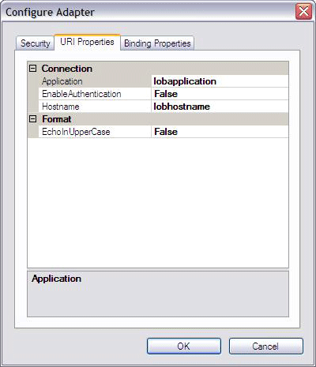
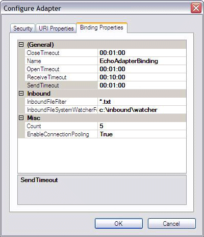

# Step 2: Categorize the Adapter and Connection Properties
  
  
 **Time to complete:** 30 minutes  
  
 In this step, you will update the **EchoAdapterBindingElement** and **EchoAdapterBindingElementExtensionElement** classes to assign a category to your adapter and connection properties. By doing so, properties are logically grouped by category in the [!INCLUDE[addadapterservrefshort](../../includes/addadapterservrefshort-md.md)] and [!INCLUDE[consumeadapterservshort](../../includes/consumeadapterservshort-md.md)] tools. For example, if you want the **Application**, **EnableAuthentication**, and **Hostname** properties to appear under the **Connection** category as shown below, you will need to assign the Connection category to each of the Application, EnableAuthentication, and Hostname properties.  
  
   
  
 Similarly, if you want the **InboundFileFilter** and **InboundFleSystemWatcherFolder** properties to appear under the **Inbound** category as shown below, you will need to assign the Inbound category to each. If you want **Count** and **EnableConnectionPooling** to appear under the **Misc** category, you will need to assign the Misc category to each.  
  
   
  
 Keep in mind that you can assign a property with any category name you choose. In this example, since the EnableConnnectionPooling property does not belong to any other categories, we categorize it as Misc (Miscellaneous). As to the InboundFileFilter property, since it is used during the inbound handling within the example, it is more appropriate to assign Inbound to the property, rather than Miscellaneous. Here is the complete custom property categorization for the echo adapter.  
  
|**Property**|**Category**|  
|------------------|------------------|  
|InboundFileFilter|Inbound|  
|InboundFileSystemWatcherFolder|Inbound|  
|Count|Misc|  
|EnableConnectionPooling|Misc|  
|Application|Connection|  
|EnableAuthentication|Connection|  
|Hostname|Connection|  
|EchoInUpperCase|Format|  
  
 In addition to those changes, you will also modify the Dispose method of **EchoAdapterHandlerBase**.  
  
 For the adapter properties exposed by the echo adapter, see the adapter properties section of the [Tutorial 1: Develop the Echo Adapter](../../adapters-and-accelerators/wcf-lob-adapter-sdk/tutorial-1-develop-the-echo-adapter.md).  
  
## Prerequisites  
 Before you begin this step, you must complete [Step 1: Use the WCF LOB Adapter Development Wizard to Create the Echo Adapter Project](../../adapters-and-accelerators/wcf-lob-adapter-sdk/step-1-use-the-wcf-lob-adapter-development-wizard-to-create-the-echo-adapter.md). You should also be familiar with the <xref:System.ServiceModel.Configuration.BindingElementExtensionElement> and <xref:System.ServiceModel.Configuration.StandardBindingElement> classes.  
  
### To update the EchoAdapterHandlerBase Dispose method  
  
1.  In **Solution Explorer**, double-click the **EchoAdapterHandlerBase.cs** file.  
  
2.  Remove the following statement from the **Dispose** method:  
  
    ```csharp  
    throw new NotImplementedException("The method or operation is not implemented.");  
    ```  
  
     The revised method should look similar to the following:  
  
    ```csharp  
    protected virtual void Dispose(bool disposing)  
    {  
       //  
       //TODO: Implement Dispose. Override this method in respective Handler classes  
       //  
    }  
    ```  
  
### To update the Adapter properties class  
  
1.  In **Solution Explorer**, double-click the **EchoAdapterBindingElement.cs** file.  
  
2.  In the Visual Studio editor, expand the **Custom Generated Properties** region.  
  
3.  To assign the **Misc** category to the **Count** property, add the following single statement to the beginning of the **Count** implementation.  
  
    ```csharp  
    [System.ComponentModel.Category("")]  
    ```  
  
     The **Count** implementation should now match the following:  
  
    ```csharp  
    [System.ComponentModel.Category("")]  
    [System.Configuration.ConfigurationProperty("count", DefaultValue = 5)]  
    public int Count  
    {  
        get  
        {  
            return ((int)(base["Count"]));  
        }  
        set  
        {  
            base["Count"] = value;  
        }  
    }  
    ```  
  
4.  To assign the **Misc** category to the **EnableConnectionPooling** property, add the following single statement to the beginning of the **EnableConnectionPooling** implementation.  
  
    ```csharp  
    [System.ComponentModel.Category("")]  
    ```  
  
5.  To assign the **Inbound** category to the **InboundFileFilter** property, add the following single statement to the beginning of the **InboundFileFilter** implementation.  
  
    ```csharp  
    [System.ComponentModel.Category("Inbound")]  
    ```  
  
6.  To assign the **Inbound** categoryto **inboundFleSystemWatcherFolder** property, add the following single statement to the beginning of the **inboundFleSystemWatcherFolder** implementation.  
  
    ```csharp  
    [System.ComponentModel.Category("Inbound")]  
    ```  
  
7.  Check to ensure that the code in the **Custom Generated Properties** region matches the following:  
  
    ```csharp  
    [System.ComponentModel.Category("")]  
    [System.Configuration.ConfigurationProperty("count", DefaultValue = 5)]  
    public int Count  
    {  
        get  
        {  
            return ((int)(base["Count"]));  
        }  
        set  
        {  
            base["Count"] = value;  
        }  
    }  
  
    [System.ComponentModel.Category("")]  
    [System.Configuration.ConfigurationProperty("enableConnectionPooling", DefaultValue = true)]  
    public bool EnableConnectionPooling  
    {  
        get  
        {  
            return ((bool)(base["EnableConnectionPooling"]));  
        }  
        set  
        {  
            base["EnableConnectionPooling"] = value;  
        }  
    }  
  
    [System.ComponentModel.Category("Inbound")]  
    [System.Configuration.ConfigurationProperty("inboundFileFilter", DefaultValue = "*.txt")]  
    public string InboundFileFilter  
    {  
        get  
        {  
            return ((string)(base["InboundFileFilter"]));  
        }  
        set  
        {  
            base["InboundFileFilter"] = value;  
        }  
    }  
  
    [System.ComponentModel.Category("Inbound")]  
    [System.Configuration.ConfigurationProperty("inboundFileSystemWatcherFolder", DefaultValue = "{InboundFileSystemWatcherFolder}")]  
    public string InboundFileSystemWatcherFolder  
    {  
        get  
        {  
            return ((string)(base["InboundFileSystemWatcherFolder"]));  
        }  
        set  
        {  
            base["InboundFileSystemWatcherFolder"] = value;  
        }  
    }  
  
    #endregion Custom Generated Properties  
    ```  
  
### To update the Connection Properties  
  
1.  In **Solution Explorer**, double-click the **EchoAdapterConnectionUri.cs** file.  
  
2.  In the Visual Studio editor, expand the **Custom Generated Properties** region.  
  
3.  To assign the **Format** category to the **EchoInUpperCase** property, add the following single statement to the beginning of the **EchoInUpperCase** implementation.  
  
    ```csharp  
    [System.ComponentModel.Category("Format")]  
    ```  
  
4.  To assign the **Connection** category to the **Hostname** property, add the following single statement to the beginning of the **Hostname** implementation.  
  
    ```csharp  
    [System.ComponentModel.Category("Connection")]  
    ```  
  
5.  To assign the **Connection** category to the **Application** property, add the following single statement to the beginning of the **Application** implementation.  
  
    ```csharp  
    [System.ComponentModel.Category("Connection")]  
    ```  
  
6.  To assign the **Connection** categoryto **EnableAuthentication** property, add the following single statement to the beginning of the **EnableAuthentication** implementation.  
  
    ```csharp  
    [System.ComponentModel.Category("Connection")]  
    ```  
  
7.  Check to ensure that the code in the **Custom Generated Properties** region matches the following:  
  
    ```csharp  
    #region Custom Generated Properties  
            [System.ComponentModel.Category("Format")]  
            public bool EchoInUpperCase  
            {  
                get  
                {  
                    return this.echoInUpperCase;  
                }  
                set  
                {  
                    this.echoInUpperCase = value;  
                }  
            }  
  
            [System.ComponentModel.Category("Connection")]  
            public string Hostname  
            {  
                get  
                {  
                    return this.hostname;  
                }  
                set  
                {  
                    this.hostname = value;  
                }  
            }  
  
            [System.ComponentModel.Category("Connection")]  
            public string Application  
            {  
                get  
                {  
                    return this.application;  
                }  
                set  
                {  
                    this.application = value;  
                }  
            }  
  
            [System.ComponentModel.Category("Connection")]  
            public bool EnableAuthentication  
            {  
                get  
                {  
                    return this.enableAuthentication;  
                }  
                set  
                {  
                    this.enableAuthentication = value;  
                }  
            }  
            #endregion Custom Generated Properties  
    ```  
  
8.  In Visual Studio, from the **File** menu, click **Save All**.  
  
> [!NOTE]
>  You saved your work. You can safely close Visual Studio at this time or go to the next step, [Step 3: Implement the Connection for the Echo Adapter](../../adapters-and-accelerators/wcf-lob-adapter-sdk/step-3-implement-the-connection-for-the-echo-adapter.md).  
  
## What Did I Just Do?  
 You just updated classes to assign a category to each adapter and connection property exposed by the echo adapter.  
  
## Next Steps  
 You will implement connection, metadata browsing, searching, and resolving capabilities, and the outbound message exchange. Lastly, you will build and deploy the echo adapter.  
  
## See Also  
 [Step 3: Implement the Connection for the Echo Adapter](../../adapters-and-accelerators/wcf-lob-adapter-sdk/step-3-implement-the-connection-for-the-echo-adapter.md)   
 [Tutorial 1: Develop the Echo Adapter](../../adapters-and-accelerators/wcf-lob-adapter-sdk/tutorial-1-develop-the-echo-adapter.md)