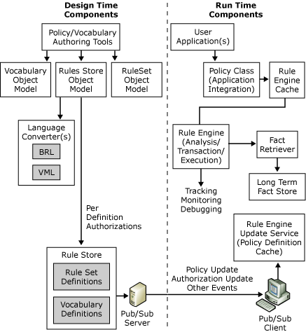

# Business Rules Framework Architecture
The following figure shows the component architecture of the Business Rules Framework.  
  
   
Microsoft Business Rules Framework Architecture  
  
 Some of the components of the framework are described in the following paragraphs.  
  
## Policy Class  
 A **Policy** object is a single instance of a business policy, and provides the interface that is used by rule-based applications. It provides an abstraction that frees the application developer from concern about the location of the rule store, extracting rule sets from the rule store, instantiating instances of the underlying rule engine, and ensuring that long-term facts are asserted into the engine. In many scenarios, a rule-based application uses concurrent instances of the **Policy** object. These concurrent instances can represent the same policy, different versions of the same policy, or different versions of different policies.  
  
## RuleEngine Class  
 The **RuleEngine** object serves as the execution engine for business policies. It uses three plug-in components (translator, inference engine, and tracking interceptor) for implementation. A **RuleEngine** object takes a **RuleSet** object representing a business policy as input and uses the translator, inference engine, and tracking interceptor configured for the rule set to implement the business policy defined by the rule set.  
  
## Fact Retriever  
 A fact retriever is an optional, user-defined, plug-in component that is responsible for gathering long-term facts for use by business policies. For more information, see [How to Create a Fact Retriever](../core/how-to-create-a-fact-retriever.md).  
  
 Before execution, a **Policy** object instance provides its **RuleEngine** instance to the fact retriever, giving it the opportunity to update the set of facts in the rule engine's working memory. For more information, see [Short-Term Facts vs. Long-Term Facts](../core/short-term-facts-vs-long-term-facts.md).  
  
## Rule Engine Update Service  
 The Rule Engine Update service provides dynamic business policy updates in a distributed environment. An autostart Microsoft Windows NT service application is responsible for subscribing to policy deployment and undeployment events that occur when business policies are changed.  
  
 In a typical enterprise scenario, business policies are deployed after being updated, tested, and versioned. Deployment consists of adding the updated policy to a secure, persistent rule store and optionally executing logic on the store to publish information about the updated policy to all interested parties (note that information about the policy is published and not the policy itself).  
  
 The Rule Engine Update service, running on a server hosting rule-based applications, receives the policy update notification and caches the information for subsequent use. The use of a pub/sub model for policy updates enables you to change business policies in near real time without service downtime or interruption.  
  
## Policy/Vocabulary Authoring Tools  
 The Business Rule Composer in Microsoft [!INCLUDE[btsBizTalkServerNoVersion](../includes/btsbiztalkservernoversion-md.md)] provides policy and vocabulary authoring capabilities to both end users and developers.  
  
## Rule Store  
 A *rule store* is a repository for business policies and vocabularies. The repository can be a simple file or a secure, scalable, persistent, and reliable database such as Microsoft SQL Server. (SQL Server is used as the default rule store for the framework).  
  
## Caching  
 The Business Rules Engine Framework provides a caching mechanism for **RuleEngine** instances. Each **RuleEngine** instance contains an in-memory representation of a specific policy version.  
  
 The following steps describe the process when a new **Policy** instance is instantiated (either with a call on the API or execution of the **Call Rules** shape):  
  
1.  The **Policy** object requests a **RuleEngine** instance from the rule engine cache.  
  
2.  If a **RuleEngine** instance for the policy version exists in the cache, the **RuleEngine** instance is returned to the **Policy** object. If a **RuleEngine** instance is not available, the cache creates a new instance. When a **RuleEngine** instance is instantiated, it does, in turn, create a new fact retriever instance if one is configured for the policy version.  
  
 When the **Execute** method is called on the **Policy** object, the following steps occur:  
  
1.  The Policy object calls the **UpdateFacts**method on the fact retriever instance if a fact retriever exists. The fact retriever's implementation of the method may assert long term facts into the working memory of the **RuleEngine**.  
  
2.  The **Policy** object asserts the short term facts contained in the **Array** that was passed in the **Execute** call.  
  
3.  The **Policy** object calls **Execute** on the **RuleEngine**.  
  
4.  The **RuleEngine** completes execution and returns control to the **Policy**object.  
  
5.  The**Policy**object retracts the short term facts from the **RuleEngine**. The long term facts asserted by the fact retriever will remain in the working memory of the rule engine.  
  
 After the **Dispose** method is called on the **Policy** object, the **RuleEngine** instance is released back to the rule engine cache.  
  
 The rule engine cache will have multiple rule engine instances for a given policy version if the load requires it, and each rule engine instance has its own fact retriever instance.  
  
## See Also  
 [Business Rules Engine](../core/business-rules-engine.md)