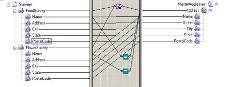

# Conditional Looping
You can add conditions to a **Looping** functoid by linking the output of a **Looping** functoid and a **Logical** functoid to the same destination record. The destination records are created only when the logical condition is met.  
  
## Conditional Looping Map  
   
  
 In the preceding figure, the first **Equal** functoid compares the **Name** field under **FoodSurvey** to "Wendy Wheeler". The second **Equal** functoid compares the **Name** field under **FlowerSurvey** to "Kelly Focht". Thus, the map creates the destination **Address** records only for the two names. Using the sample data from the **Looping** functoid example, the output instance message would appear as follows.  
  
```  
<ns0:MasterAddresses xmlns:ns0="http://ConditionalLoop.MasterAddresses">  
    <Address Name="Wendy Wheeler" Street="7890 Broadway" City="Columbus" State="OH" PostalCode="46290">  
    <Address Name="Kelly Focht" Street="456 1st Ave" City="Miami" State="FL" PostalCode="81406">  
</ns0:MasterAddresses>  
```  
  
## See Also  
 [How to Add Looping Functoids to a Map](../core/how-to-add-looping-functoids-to-a-map.md)   
 [Advanced Functoids](../core/advanced-functoids.md)   
 [Index Functoid](../core/index-functoid.md)   
 [Iteration Functoid](../core/iteration-functoid.md)   
 [Looping Functoid](../core/looping-functoid.md)   
 [Record Count Functoid](../core/record-count-functoid.md)