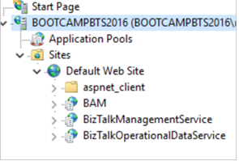
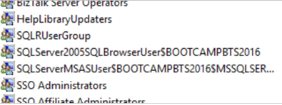
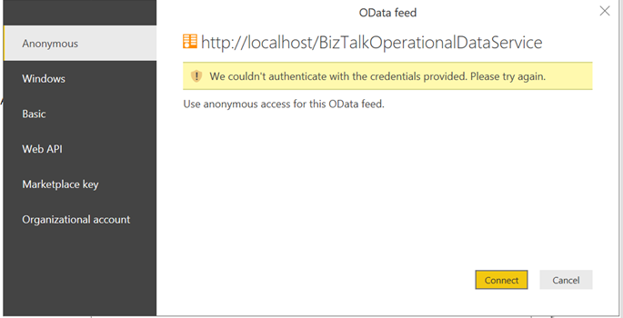

# Configure the Power BI operational data feed in BizTalk Server

**Starting with [!INCLUDE[bts2016_md](../includes/bts2016-md.md)] [!INCLUDE[featurepack1](../includes/featurepack1.md)]**, send tracking to Power BI using the Power BI template provided, or create your own. 

## What is operational data
Operational data is information on the instances and messages flowing through your [!INCLUDE[btsBizTalkServerNoVersion_md](../includes/btsbiztalkservernoversion-md.md)] environment. The operational data feed is the same data you get looking at Group Hub in [!INCLUDE[btsBizTalkServerAdminConsoleui_md](../includes/btsbiztalkserveradminconsoleui-md.md)]. The data is accessed and queried using visualization tools, including Power BI. 

The feed includes the following data tables:
* Application data
* AS2 Status Records
* Batching information
* Instance information
* Interchange Aggregations Records
* Interchange Status Records
* Messages
* Subscriptions
* Tracked Events
* Transaction reports
* Transaction sets

> [!TIP]
> [PowerBI.com](http://powerbi.microsoft.com) is a great resource to understand and learn more about Power BI.

## Prerequisites
* Download and install [Power BI Desktop](https://powerbi.microsoft.com/desktop/) on any computer that has network access to your [!INCLUDE[btsBizTalkServerNoVersion_md](../includes/btsbiztalkservernoversion-md.md)]
* Install [Feature Pack 2](https://aka.ms/bts2016fp2) on your [!INCLUDE[btsBizTalkServerNoVersion_md](../includes/btsbiztalkservernoversion-md.md)]
* Install IIS on the [!INCLUDE[btsBizTalkServerNoVersion_md](../includes/btsbiztalkservernoversion-md.md)]. In most [!INCLUDE[btsBizTalkServerNoVersion_md](../includes/btsbiztalkservernoversion-md.md)] environments, IIS is already installed. See [Hardware and Software Requirements for BizTalk Server 2016](../install-and-config-guides/hardware-and-software-requirements-for-biztalk-server-2016.md). Confirm IIS is installed by opening **Internet Information Services Manager**. 
* Optional. Install and configure a [Power BI Gateway](https://powerbi.microsoft.com/gateway/) to connect [PowerBI.com](http://powerbi.microsoft.com) with your on-premises BizTalk Server. If you're not using an on-premises BizTalk Server, then you don't need the gateway.

## Step 1: Enable operational data

1. Run Windows PowerShell as Administrator (**Start** menu, type **PowerShell**, right click, and select **Run as administrator**). 
2. Go to the BizTalk installation folder (for example, type: `cd 'C:\Program Files (x86)\Microsoft BizTalk Server 2016\'`).
3. In the following text, replace `Default Web Site`, `operationalDataServiceAppPool`, `domain\user`, `password`, and `domain\group` with your values:

    ```Powershell
    FeaturePack.ConfigureServices.ps1 -Service operationaldata -WebSiteName '<Default Web Site>' -ApplicationPool <operationalDataServiceAppPool> -ApplicationPoolUser <domain>\<user> -ApplicationPoolUserPassword <password> -AuthorizationRoles '<domain>\<group1>, <domain>\<group2>, <domain>\<user>, <domain>\<user2>'
    ```

    * **Service**: The service to be configured (**OperationalData** for Power BI)
    * **WebSiteName**: The existing IIS web site that hosts the service. The default value is **Default Web Site**.
    * **ApplicationPool**: The Application Pool used by the service. If it exists, a new one is not created. The default value is **DefaultAppPool**.
    * **ApplicationPoolUser**: Configures the application pool to run as this user identity. Must have BizTalk Server Operator, or higher privileges.
    * **ApplicationPoolUserPassword**: Password for the ApplicationPoolUser
    * **AuthorizationAccount**: List of authorized Groups or Users that can use this service

    In the following example, we use the `Default Web Site`, create an application pool named `PowerBIAppPool`, run the appPool as the `bootcampbts2016\btsservice` account, use `BIZTALK-serviceacct` as the user account password, and give the `BizTalk Server Administrators` group permissions. Be sure to enter the following, including the single quotes surrounding values with spaces: 

    ```Powershell
    FeaturePack.ConfigureServices.ps1 -Service operationaldata -WebSiteName 'Default Web Site' -ApplicationPool PowerBIAppPool -ApplicationPoolUser bootcampbts2016\btsservice -ApplicationPoolUserPassword  BIZTALK-serviceacct -AuthorizationRoles 'BOOTCAMPBTS2016\BizTalk Server Administrators'
    ```

    When complete, the BizTalkOperationalDataService application is created within IIS:  
    


4. To confirm it’s working, browse to `http://localhost/BizTalkOperationalDataService`. 

    If you are prompted to sign-in, sign in with an account that is member of the domain\group you entered in the previous step (`-AuthorizationRoles 'BOOTCAMPBTS2016\BizTalk Server Administrators'`). 

    If you are prompted to open or save BizTalkOperationalDataService.json, then your install completed. You can save it locally, and then open it in notepad or Visual Studio to see the contents. 

> [!WARNING]
> The BizTalkOperationalDataService application in IIS uses a web.config file. Elements within web.config **are case sensitive**. So when you execute the Windows PowerShell script, be sure to enter the correct case for `-AuthorizationRoles` value. If you’re not sure of the case, here’s an easy way to find out: 
> 
> 1. Open **Computer Management**, and expand **Local Users and Groups**.
> 2. Select **Groups**, and scroll down to the **SQLServer…** groups. 
> 3. In the following example, notice **BOOTCAMPBTS2016** is in all caps. If you see all caps, then enter the computer name in all caps. 
> 
> 

## Step 2: Use the template in Power BI

1. Download and install the [Power BI Desktop](https://powerbi.microsoft.com/desktop/) on your BizTalk Server. You can select to open it, which is optional. If you have a work or school account, you may have access to Power BI. Try signing in with that account. Or, you can try it for free after signing up. 
2. Open the `\Program Files (x86)\Microsoft BizTalk Server 2016\OperationalDataService` folder, and open the `BizTalkOperationalData.pbit` file:  


3. Power BI desktop opens, and you are prompted for a URL. Enter the `http://localhost/<yourWebSite>` URL that you created for your OData feed. For example, enter `http://localhost/BizTalkOperationalDataService`. Your URL looks similar to the following:  


4. Select **Load**. The window loads and connects to the different oData sources in the BizTalkOperationalDataService.json file. When it completes, the dashboard shows details about your environment.

## Couldn't authenticate
If you get `couldn't authenticate with the credentials provided` message similar to the following, then it’s possible your application pool identity doesn’t have enough access to the BizTalk Server databases. You can change the appPool identity within IIS to an account with more privileges, maybe your signed-in user account (which has local admin privileges). 



## Do more
This is just the beginning. Power BI also has a gateway that can be installed on an on-premises BizTalk Server. Using the gateway, you can publish your dashboard, get real-time data, and create a schedule to refresh the dashboard. The following blog does a great job detailing these steps: 

* [How to publish BizTalk operational data on Power BI – Step-by-step configuration](https://blog.sandro-pereira.com/2017/05/07/biztalk-server-2016-feature-pack-1-how-to-publish-biztalk-operational-data-power-bi-step-by-step-configuration-part-3/)

The [Guided Learning](https://powerbi.microsoft.com/guided-learning/) is also a great place to learn more about Power BI, and all the things you can do. 

## See also

[Learn more about Power BI](https://www.powerbi.com)  
[Configure the Feature Pack](../core/configure-the-feature-pack.md)
