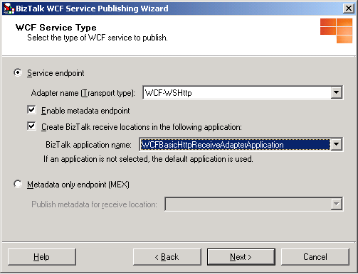
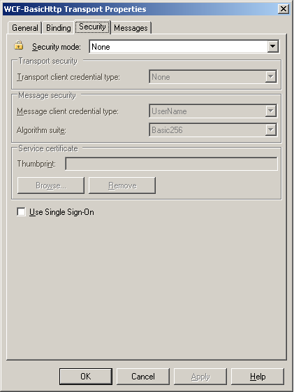
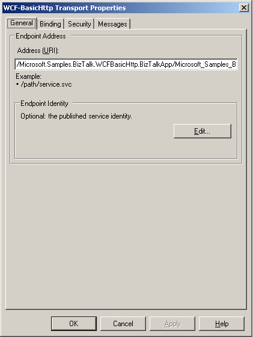

# How to Configure WCF Services Published with the BizTalk WCF Service Publishing Wizard
After publishing WCF services with the BizTalk WCF Service Publishing Wizard, you must configure them properly. This topic describes how to configure the published WCF services.  
  
> [!NOTE]
>  You must build your BizTalk projects and publish them by running the BizTalk WCF Service Publishing Wizard. For more information about how to use the BizTalk WCF Service Publishing Wizard, see [How to Use the BizTalk WCF Service Publishing Wizard to Publish Orchestrations as WCF Services](../core/publish-orchestrations-as-wcf-services--biztalk-wcf-service-publishing-wizard.md) and [How to Use the BizTalk WCF Service Publishing Wizard to Publish Schemas as WCF Services](../core/publish-schemas-as-wcf-services--use-the-biztalk-wcf-service-publishing-wizard.md).  
  
### To configure the receive locations for a published WCF service  
  
1.  Publish the BizTalk project by running the BizTalk WCF Service Publishing Wizard.  
  
2.  If you did not select the **Create BizTalk receive locations** option in the following figure when creating the WCF service, create a new receive port and receive location for the published WCF service, and then select the WCF adapter for the transport type that the receive location will use. You must select the same WCF adapter as is selected on the **WCF Service Type** page shown in the following figure. For more information about creating a receive location, see [How to Create a Receive Location](../core/how-to-create-a-receive-location.md).  
  
    > [!NOTE]
    >  The BizTalk WCF Service Publishing Wizard creates a binding file, BindingInfo.xml, in the \App_Data\Temp folder in the Web directory for the published WCF service (.svc file). If you select the **Create BizTalk receive locations** option, the wizard uses the binding file to create the receive location. In the BizTalk Server Administration console, you can import this binding file to create the receive location manually. For more information about importing a binding file, see [Importing Bindings](../core/importing-bindings2.md).  
  
       
  
3.  If necessary, open the BizTalk Server Administration console as follows: Click **Start**, point to **Programs**, point to **Microsoft BizTalk Server**, and then click **BizTalk Server Administration**.  
  
4.  In the console tree, expand **BizTalk Server Administration**, expand **BizTalk Group**, expand **Applications**, expand the application where the generated WCF service should be placed, expand **Receive Locations**, and then double-click the receive location for the WCF service.  
  
5.  In the **Receive Location Properties** dialog box, click **Configure**.  
  
6.  If the receive location hosts the WCF-BasicHttp or WCF-WSHttp adapter, in the **Transport Properties** dialog box, click the **Security** tab, and then configure the security properties on the tab. If the receive location hosts the WCF-CustomIsolated adapter, in the **Transport Properties** dialog box, click the **Binding** tab, and then configure the binding information on the tab.  
  
       
  
    > [!NOTE]
    >  The transport client credential type property for the isolated WCF adapter must match the authentication scheme of the Internet Information Services (IIS) virtual directory hosting this receive location. For example, if the property is set to **Windows**, you also need to enable **Integrated Windows authentication** for the virtual directory that hosts this receive location. Similarly if the property is set to **None**, you must allow anonymous access to the virtual directory that hosts this receive location. For more information about how to configure the security properties for the WCF-BasicHttp and WCF-WSHttp adapters, see [How to Configure a WCF-BasicHttp Receive Location](http://msdn.microsoft.com/library/43f18e5d-ba28-453c-b8ce-5bcdc6f27fdd), and [How to Configure a WCF-WSHttp Receive Location](../core/how-to-configure-a-wcf-wshttp-receive-location.md). For more information about how to configure the binding information, see [How to Configure a WCF-CustomIsolated Receive Location](../core/how-to-configure-a-wcf-customisolated-receive-location.md).  
  
7.  If you did not select the **Create BizTalk receive locations** option when creating the WCF services, in the **Transport Properties** dialog box, click the **General** tab. On the **General** tab, type the URI for this receive location in the **Address** text box. Specify the virtual directory plus the .svc file name that the BizTalk WCF Service Publishing Wizard generated in the previous procedure—for example, /path/service.svc.  
  
    > [!NOTE]
    >  The **Address** property should start with a forward slash ("/") and end in ".svc". The **Address** property must not contain a protocol scheme, computer name, or port number such as http://host:port. Only the virtual directory path can be used for the property. The WCF service markup file must have an .svc extension.  
  
       
  
8.  If you selected **Transport** or **TransportWithMessageCredential** in the **Security mode** drop-down list on the **Security** tab for the WCF-BasicHttp and WCF-WSHttp adapters, you must set up Secure Sockets Layer (SSL) in IIS. If you set the **Transport** or **TransportWithMessageCredential** security mode in the binding information for the WCF-CustomIsolated adapter, you must also set up SSL in IIS.  
  
9. If the receive location hosts the WCF-BasicHttp or WCF-WSHttp adapter, in the **Transport Properties** dialog box, configure the **General**, **Binding**, and **Messages** tabs if necessary. If the receive location hosts the WCF-CustomIsolated adapter, configure the **General**, **Behavior**, **Other**, and **Messages** tabs for your purpose. For the WCF-CustomIsolated adapter, you can import the **Address (URI)** and **Endpoint Identity** properties on the **General** tab, binding information on the **Binding** tab, and behaviors on the **Behavior** tab for this receive location from a configuration file.  
  
10. Enable the receive location for the published WCF service by using the BizTalk Server Administration console. For more information about how to enable the receive location, see [How to Enable a Receive Location](../core/how-to-enable-a-receive-location.md).  
  
    > [!NOTE]
    >  The receive locations are disabled when they are created. After creating receive locations with the BizTalk Server WCF Service Wizard, you must enable the receive locations.  
  
11. Configure the IIS application pool to host the receive location for the published WCF service by using the IIS Management console. For more information about how to configure the application pool for the isolated WCF adapters, see [Configuring IIS for the Isolated WCF Receive Adapters](../core/configuring-iis-for-the-isolated-wcf-receive-adapters.md).  
  
12. Open a command prompt, go to the folder where the BizTalk Server WCF Service Publishing Wizard created the WCF service in %SystemDrive%\InetPub\\, and then open the Web.config file using Notepad.  
  
13. In Notepad, add the following line inside the **\<system.web>** element:  
  
    ```  
    <trust level="Full" originUrl="" />  
    ```  
  
    > [!NOTE]
    >  This setting is optional and it grants the ASP.NET application hosting the published WCF service access to any resource that is subject to operating system security. This is the trust level that WCF requires when you have Windows SharePoint Services installed and running on the same machine with the published WCF services.  
  
14. In Internet Explorer, in the **Address** box, type the URL for the WCF service using the format http://*host[:port]*/*apppath*/*wcfservicename.svc* to test the published WCF service. The parameters are described in the following table.  
  
    |Parameter|Value|  
    |---------------|-----------|  
    |*host[:port]*|The name of the computer where you have deployed your WCF service. A colon and the port number can follow this server name.|  
    |*apppath*|The name of your virtual directory and the Web application path.|  
    |*wcfservicename.svc*|The name of the WCF service .svc file.|  
  
15. To prevent unintentional disclosure of potentially sensitive service metadata, it is recommended to disable this behavior on the production environment by performing the following tasks:  
  
    1.  In Notepad, open Web.config in the folder where the BizTalk Server WCF Service Publishing Wizard created the WCF service in %SystemDrive%\InetPub\\.  
  
    2.  In Notepad, set the  the **httpGetEnabled** attribute in the  **\<serviceMetadata>** element to false as following line:  
  
        ```  
        <serviceMetadata httpGetEnabled="false" httpsGetEnabled="false" />  
        ```  
  
## See Also  
 [Configuring the WCF-BasicHttp Adapter](http://msdn.microsoft.com/library/5929a338-46e0-4fc4-8837-792d7f7ae0fe)   
 [Configuring the WCF-WSHttp Adapter](../core/configuring-the-wcf-wshttp-adapter.md)   
 [Configuring the WCF-CustomIsolated Adapter](../core/configuring-the-wcf-customisolated-adapter.md)   
 [How To Configure IIS Web Site Authentication in Windows Server 2003](http://go.microsoft.com/fwlink/?LinkID=75699)