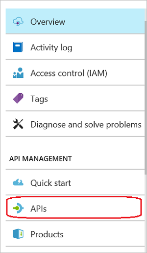
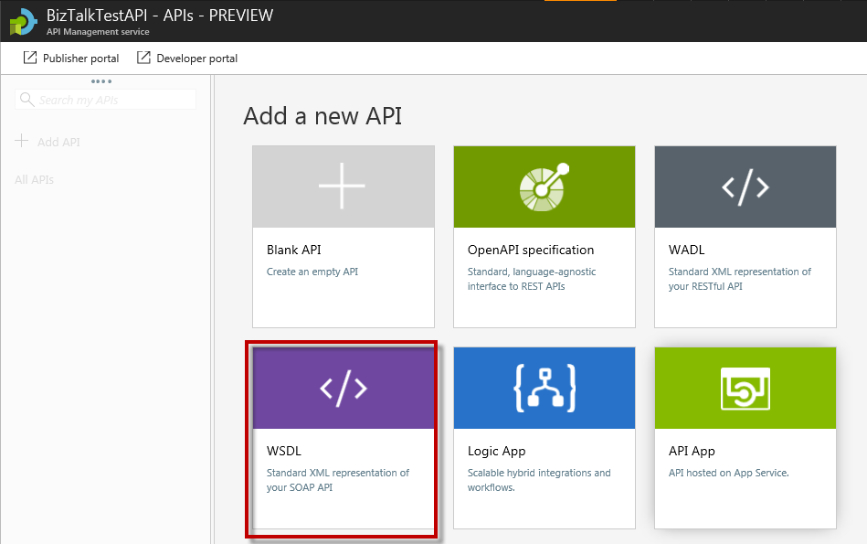
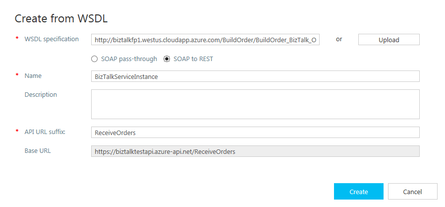

.---
title: "Connect to Azure API Management using BizTalk Server | Microsoft Docs"
description: Use BizTalk Feature Pack 1 to connect to API management from your BizTalk Server. Install BizTalk Feature Pack 2 to publish a WCF-http BizTalk port to Azure API Management using the BizTalk Administration Console.
ms.custom: ""
ms.date: "06/08/2017"
ms.prod: biztalk-server
ms.reviewer: ""
ms.suite: ""
ms.tgt_pltfrm: ""
ms.topic: "article"
ms.assetid: a87bfb40-7e6f-46aa-8ac7-db6d13ce7eb2
caps.latest.revision: 2
author: "tordgladnordahl"
ms.author: "tonordah"
manager: "anneta"
---
# Connect to Azure API Management
You can now easily expose your SOAP endpoint through API Management from BizTalk. This can be done through the API Management Portal directly, or, with BizTalk 2016 Feature Pack 2 installed, this can be done through the BizTalk Administration Console on the BizTalk Server.

## What is Azure API Management
Use Azure API Management as a turnkey solution for publishing APIs to external and internal customers. Quickly create consistent and modern API gateways for existing back-end services hosted anywhere, secure and protect them from abuse and overuse, and get insights into usage and health. Plus, automate and scale developer onboarding to help get your API program up and running. 

See [API Management](https://azure.microsoft.com/en-us/services/api-management/) to learn more about API Management.

## Prerequisites
* Configure and set up [Azure API Management](https://docs.microsoft.com/en-us/azure/api-management/api-management-get-started)
* Create a [virtual network](https://docs.microsoft.com/en-us/azure/api-management/api-management-using-with-vnet) between your BizTalk Machine and the API Management instance

## Installing through the API Management Portal directly
1. In the Azure portal, open up your API management, and select **APIs** from the menu:

	
	
2. Select the option for **WSDL** in the New API section:

	
	
3. To connect to API Management to your BizTalk WSDL, copy the URL to your BizTalk computer with the full URI to your SOAP endpoint. For example, copy `http://10.0.31.22/RestEndPoint/OrderIncome.svc?wsdl`:

	

4. Select if you want to use a **SOAP pass-through**, or set up a **SOAP to REST** service.
5. Enter the **name** of your API, the **Description**, and the **API Url suffix** for your service.
6. Select **Create** to create the communication to your backend SOAP endpoint.

## Installing using the BizTalk Administration Console
1. After installing BizTalk Feature Pack 2, open the BizTalk Administration Console, right-click on the receive location for an adapter that exposes an http endpoint and select Publish to API Management...
        
[NOTE] The Publish to API Management... option is available on all receive locations. When it is selected for a basic http receive location there is specific information from that receive location will be automatically populated.  At this time, the API Management Service will work with basic http, in the future additional functionality will be available.
2. A window similar to the following will appear:
        
   a. Click the Sign-in... button to sign-in to Azure and the specific API Management Service
   b. If the receive port is for the WCF-BasicHttp adapter the WSDL specification will have the Link option selected and the WSDL file location will be filled in. Note the location will default to localhost - this must be changed to connection information that the API Management Service can connect to - a DNS name or an IP address of the Biztalk server.
   c. API type can be set to either soap pass-through or SOAP to REST. The API can be published both ways by changing the API URL suffix and publishing again using the different option.
   d. The API Name will be filled in with information from the receive port properties.
   e. There is a checkbox option to indicate to update the API in API Management if it already exists.
   f. Choose an API URL suffix that will be used by consumers of the API
   g. Once all information is available, the Publish button will be enabled to publish to the API Management Service.
   h. After the API is published it will show up in the Azure API Management Service, once it is assigned to a Product it can be tested.
## See also
[Configure the feature pack](configure-the-feature-pack.md)
