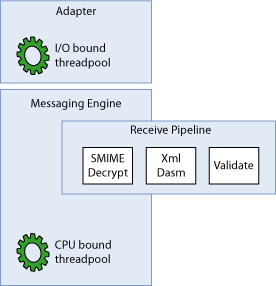
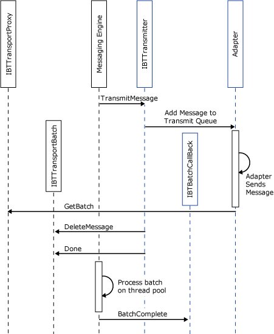
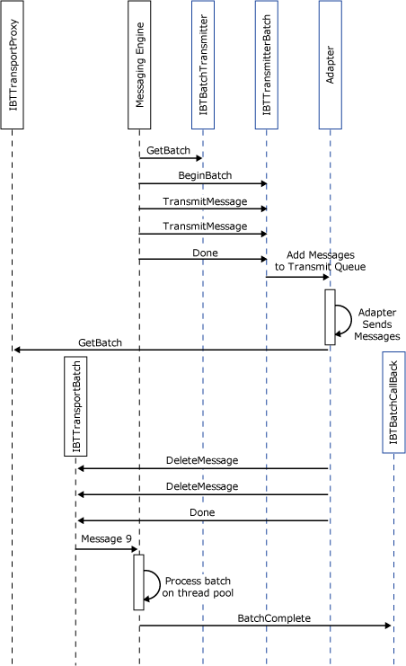
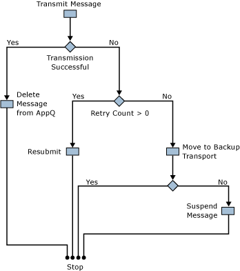

# Exchange Patterns for Send Adapters
Send adapters are delivered messages from the BizTalk Messaging Engine to be transmitted over the wire. These messages may be sent by using a one-way or two-way message exchange pattern. An adapter that handles this two-way message exchange pattern is called a Solicit-Response adapter.  
  
## Blocking vs. Non-Blocking Transmissions  
 The Messaging Engine delivers messages to the send adapter by using either the **IBTTransmitter.TransmitMessage** method or the **IBTTransmitterBatch.TransmitMessage** method, depending on whether the adapter is batch-aware. Both versions of the method have a Boolean return value that indicates how the adapter transmitted the message. If the adapter returns `true`, it has completely sent the message before returning. In this case the Messaging Engine deletes the message from the MessageBox database on behalf of the adapter. If the adapter returns `false`, it started message transmission and returned before the transmission completed. In this case, the adapter is responsible not only for deleting the message from its application queue but also for handling transmission failures that require the message to be retried for transmission or suspended.  
  
 The adapter returning `false` is a nonblocking call, meaning that the **TransmitMessage** implementation code does not block the calling thread of the Messaging Engine. The adapter simply adds the message to an in-memory queue ready to be transmitted and then returns. The adapter should have its own thread pool that services the in-memory queue, transmits the message, and then notifies the engine of the outcome of the transmission.  
  
 The Messaging Engine’s threads are typically more CPU bound than the threads used to send data over the wire. Mixing these two types of threads has a negative impact on performance. Non-blocking sends enable the decoupling of these two types of threads and yield a significant performance improvement over blocking calls.  
  
 The following diagram shows the adapter's thread pool which can tend to be bound by I/O operations. The BizTalk Server Messaging Engine's thread pool is more bound by the CPU processing. By keeping two different thread pools and not mixing the same type of threads the system can operate more efficiently.  
  
   
  
 **Performance Tip:** For the best performance, send adapters should be nonblocking and batch aware. When the BizTalk File adapter was changed from blocking and non-batch aware to nonblocking and batch aware, a threefold performance gain was realized.  
  
 **Troubleshooting Tip:** Blocking transmits can cause a performance degradation of an entire host instance. If the adapter does excessive blocking in **TransmitMessage** it will prevent engine threads from delivering messages to other adapters.  
  
## Non-Batched Sends  
 Adapters that are not batch aware should implement **IBTTransmitter** as detailed in [Interfaces for an Asynchronous Send Adapter](../core/interfaces-for-an-asynchronous-send-adapter.md). For each message that the adapter needs to transmit the Messaging Engine calls **IBTTransmitter.TransmitMessage**. The object interaction diagram below details the typical approach for transmitting messages, which consists of the following steps:  
  
1.  The engine delivers the message to the adapter.  
  
2.  The adapter enqueues the message to an in-memory queue ready to be transmitted.  
  
3.  A thread from the adapter's thread pool dequeues the message from the queue, reads the configuration for the message, and transmits the message over the wire.  
  
4.  The adapter gets a new batch from the engine.  
  
5.  The adapter calls **DeleteMessage** on the batch, passing in the message that it has just transmitted.  
  
6.  The adapter calls **Done** on the batch.  
  
7.  The engine processes the batch and deletes the message from the application queue.  
  
8.  The engine calls back the adapter to notify it of the outcome of the **DeleteMessage** operation.  
  
   
  
 The preceding object interaction diagram shows the adapter deleting a single message from the application queue. Ideally the adapter batches up message operations as opposed to operating on a single message at a time.  
  
## Batched Sends  
 Adapters that are batch aware should implement **IBTBatchTransmitter** and **IBTTransmitterBatch** as detailed in [Interfaces for Send Adapters](../core/interfaces-for-send-adapters.md). When the engine has messages for the adapter to transmit, the engine gets a new batch from the adapter by calling **IBTBatchTransmitter.GetBatch**. The adapter returns a new batch object that implements **IBTTransmitterBatch**. The engine then starts the batch by calling **IBTTransmitterBatch.BeginBatch**. This API has an out parameter that allows the adapter to specify the maximum number of messages that it will accept on the batch. The adapter may optionally return a DTC transaction. The engine then calls **IBTTransmitterBatch.TransmitMessage** once for each outgoing message to be added to the batch. The number of times this is called is greater than zero but less than or equal to the maximum size of the batch as indicated by the adapter. When all the messages have been added to the batch, the adapter calls **IBTTransmitterBatch.Done**. At this point the adapter typically enqueues all the messages in the batch to its in-memory queue. The adapter transmits the messages from a thread or threads in its own thread pool as in the case of non-batch-aware adapters. The adapter then notifies the engine of the outcome of the transmission.  
  
 The following object interaction diagram illustrates the transmission of two messages by a batched send adapter.  
  
   
  
## Handling Transmission Failures  
 The recommended semantics for transmission failures are illustrated in the figure below. These are only recommendations and are not enforced by the Messaging Engine. You can develop an adapter that deviates from these guidelines if there are valid reasons for doing so but you should be careful in this case. For example, in general an adapter should always move messages to the backup transport after all retries have been exhausted.  
  
 More commonly a transport may need to use more retries than are configured. While this is slightly different it is considered acceptable because the resilience of the transport layer is being increased. In general the APIs exposed by the Messaging Engine are designed to give the adapter maximum control where possible. With this control comes a greater level of responsibility.  
  
   
  
 The adapter determines the number of retries available on a message by checking the system context property **RetryCount**. The adapter calls the **Resubmit** API once for each retry attempt and passes in the message to be resubmitted. Along with the message it passes the time stamp indicating when the engine should deliver the message back to the adapter. This value should typically be the current time plus the value of **RetryInterval**. **RetryInterval** is a system context property whose units are minutes. Both the **RetryCount** and **RetryInterval** in the message context are the values that are configured on the send port. Consider a scaled-out deployment with instances of the same BizTalk Host deployed on multiple computers. If the message is delivered after the retry interval has expired, the message may be delivered to the any one of the host instances on any of the computers where they are configured to run. For this reason the adapter should not hold any state associated with a message to be used on the retry attempt because there is no guarantee that same instance of the adapter will be responsible for the transmission at a later time.  
  
 The adapter should only attempt to move the message to the backup transport after the retry count is less than or equal to zero. An attempt to move the message to the backup transport will fail if there is no backup transport configured for the port. In this case the message should be suspended.  
  
 The following code fragment illustrates how to determine the retry count and interval from the message context, and the subsequent resubmit or move to the backup transport.  
  
```  
using Microsoft.XLANGs.BaseTypes;  
using Microsoft.BizTalk.Message.Interop;  
using Microsoft.BizTalk.TransportProxy.Interop;  
 …  
// RetryCount and RetyInterval are system context properties...  
private static readonly PropertyBase RetryCountProperty =   
 new BTS.RetryCount();  
private static readonly PropertyBase RetryIntervalProperty =   
 new BTS.RetryInterval();  
  
public void HandleRetry(IBaseMessage msg, IBTTransportBatch batch)  
{  
int retryCount = 0;  
int retryInterval = 0;  
  
// Get the RetryCount and RetryInterval off the msg ctx...  
 GetMessageRetryState(msg, out retryCount, out retryInterval);  
  
// If we have retries available resubmit, else move to   
 // backup transport...  
 if ( retryCount > 0 )  
batch.Resubmit(  
 msg, DateTime.Now.AddMinutes(retryInterval));  
else  
batch.MoveToNextTransport(msg);  
}  
  
public void GetMessageRetryState(  
 IBaseMessage msg,   
 out int retryCount,   
 out int retryInterval )  
{  
retryCount = 0;  
retryInterval = 0;  
  
object obj =  msg.Context.Read(  
RetryCountProperty.Name.Name,    
RetryCountProperty.Name.Namespace);   
  
if ( null != obj )  
retryCount = (int)obj;  
  
obj =  msg.Context.Read(  
RetryIntervalProperty.Name.Name,    
RetryIntervalProperty.Name.Namespace);   
  
if ( null != obj )  
retryInterval = (int)obj;  
}  
```  
  
## Throwing an Exception from TransmitMessage  
 If the adapter throws an exception on any of the APIs **IBTTransmitter.TransmitMessage**, **IBTTransmitterBatch.TransmitMessage**, **IBTTransmitterBatch.Done**, the engine treats the transmission of the messages involved as transmission failures and takes the appropriate action for the message, as detailed in [How to Handle Adapter Failures](../core/how-to-handle-adapter-failures.md).  
  
 For batch-aware send adapters, throwing an exception on the TransmitMessage API results in the entire batch being cleared and the default transmit failure actions being performed for all messages in that batch.  
  
## Solicit-Response  
 Two-way send adapters typically support both one-way and two-way transmissions. The send adapter determines whether the message should be transmitted as a one-way or two-way send by inspecting the **IsSolicitResponse** system context property in the message context.  
  
 The following code fragment demonstrates this:  
  
```  
private bool portIsTwoWay = false;  
private static readonly PropertyBase IsSolicitResponseProperty= new BTS.IsSolicitResponse();  
  
...  
  
 // Port is one way or two way...  
 object obj =  this.message.Context.Read(  
 IsSolicitResponseProperty.Name.Name,    
 IsSolicitResponseProperty.Name.Namespace);   
  
if ( null != obj )  
 this.portIsTwoWay = (bool)obj;  
```  
  
 During a solicit-response transmission the adapter transmits the solicit message. After this completed it submits the associated response and tells the Messaging Engine to delete the original solicit message from the MessageBox database. The action of deleting the message from the application queue should be performed in the same transport proxy batch as the submission of the response message. This ensures atomicity of the deletion and submission of the response. For complete atomicity the adapter should use a DTC transaction whereby the transmission of the solicit message to a transaction-aware resource, submission of the response message, and deletion of the solicit message are all in the context of the same DTC transaction. As always, we recommend that the solicit message is transmitted using a non-blocking send.  
  
 The following code fragment illustrates the main aspects of a two-way send. When the engine calls **IBTTransmitter.TransmitMessage** the adapter enqueues the message to be transmitted to an in-memory queue. The adapter returns `false` to indicate that it is performing a non-blocking send. The adapter's thread pool (**WorkerThreadThunk**) services the in-memory queue and dequeues a message to hand it off to a helper method. This method is responsible for sending the solicit message and receiving the response message. (The implementation of this helper method is outside the scope of this topic.) The response message is submitted into the engine, and the solicit message is deleted from the application queue.  
  
```  
using System.Collections;  
using Microsoft.XLANGs.BaseTypes;  
using Microsoft.BizTalk.Message.Interop;  
using Microsoft.BizTalk.TransportProxy.Interop;  
  
     static private Queue _transmitQueue = new Queue();  
  static private IBTTransportProxy _transportProxy = null;   
// IBTTransmitter...  
 public bool TransmitMessage(IBaseMessage msg)  
{  
// Add message to the transmit queue...  
lock(_transmitQueue.SyncRoot)  
 {  
_transmitQueue.Enqueue(msg);  
 }  
  
 return false;  
}  
  
 // Threadpool worker thread...   
private void WorkerThreadThunk()  
{  
try  
{  
 IBaseMessage solicitMsg = null;  
  
 lock(_transmitQueue.SyncRoot)  
 {  
 solicitMsg =   
 (IBaseMessage)_transmitQueue.Dequeue();  
}  
  
 IBaseMessage responseMsg = SendSolicitResponse(   
 solicitMsg );  
Callback cb = new Callback();  
  
IBTTransportBatch batch = _transportProxy.GetBatch(  
 cb, null);  
batch.SubmitResponseMessage( solicitMsg, responseMsg );  
batch.DeleteMessage( solicitMsg );  
batch.Done(null);  
}  
catch(Exception)  
{  
// Handle failure....  
}  
}  
  
static private IBaseMessage SendSolicitResponse(  
 IBaseMessage solicitMsg )  
{  
// Helper method to send solicit message and receive   
 // response message...  
IBaseMessage responseMsg = null;  
return responseMsg;  
}  
```  
  
## Dynamic Sends  
 Dynamic send ports do not have adapter configuration associated with them. Instead they use handler configuration for any default properties that the adapter needs to transmit messages on a dynamic port. For example, an HTTP adapter may need to use a proxy and need to provide credentials. The user name, password, and port could be specified in the handler configuration that the adapter caches at run time.  
  
 For the engine to determine the transport that a dynamic message is to be sent over, the **OutboundTransportLocation** is prefixed with the adapter's alias. An adapter can register one or more aliases with [!INCLUDE[btsBizTalkServerNoVersion](../includes/btsbiztalkservernoversion-md.md)] at install time. The engine parses the **OutboundTransportLocation** at run time to find a match. The adapter is responsible for handling the **OutboundTransportLocation** with or without the alias prepended to it. The following table shows some examples of aliases registered for out-of-the-box BizTalk adapters.  
  
|Adapter alias|Adapter|OutboundTransportLocation example|  
|-------------------|-------------|---------------------------------------|  
|HTTP://|HTTP|http://www. MyCompany.com/bar|  
|HTTPS://|HTTP|https://www. MyCompany.com/bar|  
|mailto:|SMTP|mailto:A.User@MyCompany.com|  
|FILE://|FILE|FILE://C:\ MyCompany \\%MessageID%.xml|