# Executing a JD Edwards OneWorld Sample Query
The JD Edwards OneWorld (JDEOW) system is accessible from a [!INCLUDE[btsBizTalkServerNoVersion](../includes/btsbiztalkservernoversion-md.md)] system by using the JD Edwards OneWorld adapter. This adapter is one of a group of eight line-of-business (LOB) adapters shipped by Microsoft for use with [!INCLUDE[btsBizTalkServer2006r3](../includes/btsbiztalkserver2006r3-md.md)].  
  
 This is the second part of the JD Edwards OneWorld lab work. In the first part (Lab 1), you manually accessed data on the JD Edwards OneWorld system without the assistance of [!INCLUDE[btsBizTalkServerNoVersion](../includes/btsbiztalkservernoversion-md.md)] or other Microsoft technologies. In this part (Lab 2), you will create a BizTalk orchestration as part of a [!INCLUDE[btsVStudioNoVersion](../includes/btsvstudionoversion-md.md)] BizTalk project. You will configure ports on this orchestration to use the JD Edwards OneWorld adapter to get data from a JD Edwards OneWorld system.  
  
## Prerequisites  
  
-   Microsoft [!INCLUDE[btsBizTalkServer2006r3](../includes/btsbiztalkserver2006r3-md.md)]  
  
-   Microsoft [!INCLUDE[vs2010](../includes/vs2010-md.md)]  
  
-   JD Edwards OneWorld Client software  
  
-   Network connectivity to a JD Edwards OneWorld system on another server  
  
-   Microsoft BizTalk Adapters for Enterprise Applications  
  
> [!NOTE]
>  For information about installing and configuring Microsoft BizTalk Adapters for Enterprise Applications, see [HYPERLINK "http://go.microsoft.com/fwlink/?LinkId=196039" \t "_blank" http://go.microsoft.com/fwlink/?LinkId=196039](http://go.microsoft.com/fwlink/?LinkId=196039). This document includes key configuration information for the JD Edwards, PeopleSoft, JD Edwards OneWorld, TIBCO, and Siebel LOB adapters.  
  
## Lab 2 - Executing a JD Edwards OneWorld Sample Query  
 In this lab, you will execute a **Get** operation against the JD Edwards OneWorld system. Specifically you will perform the following tasks:  
  
-   Verify the JD Edwards OneWorld prerequisites  
  
-   Set up a JD Edwards OneWorld send port in [!INCLUDE[btsBizTalkServerNoVersion](../includes/btsbiztalkservernoversion-md.md)]  
  
-   Create a BizTalk orchestration project  
  
-   Build and deploy the project  
  
-   Test the application and view the XML output  
  
 You will use the JD Edwards OneWorld adapter to access data on the JD Edwards OneWorld system from [!INCLUDE[btsBizTalkServerNoVersion](../includes/btsbiztalkservernoversion-md.md)].  
  
 This adapter enables the processing of JD Edwards OneWorld objects by using requests and responses executed by an orchestration. Many methods are available for a schema object. This lab demonstrates how to use the **Address Book MBF** method.  
  
 Before running a service request, you must create service request and response schemas for the specific JD Edwards OneWorld object. The Add Generated Items/Add Adapter Wizard creates these schemas by directly interrogating the supporting metadata object in JD Edwards OneWorld. This lab illustrates the steps required to create schemas for the **Address Book MBF** method and to process a query.  
  
## Procedures for Lab 2- Executing a JD Edwards OneWorld Sample Query  
  
### Verifying the JD Edwards OneWorld Prerequisites  
 Before you start creating a BizTalk project for use with the JD Edwards OneWorld adapter, you need to be sure the files and the adapter are set up correctly to access the JD Edwards OneWorld system. On the [!INCLUDE[btsBizTalkServerNoVersion](../includes/btsbiztalkservernoversion-md.md)] computer, the JD Edwards OneWorld adapter communicates with the JD Edwards OneWorld system by using the Java interface.  
  
 Four files are necessary for proper interface access to a JD Edwards OneWorld system using the JD Edwards OneWorld adapter: Connector.jar, Kernel.jar, BTSLIBinterop.jar, and JDEJAccess.jar.  
  
-   The Connector.jar and Kernel.jar files come with the JD Edwards OneWorld system and are obtained from a JD Edwards OneWorld administrator. These files are located in the C:\JDEOWJars folder.  
  
-   The BTSLIBinterop.jar file is generated by the JD Edwards OneWorld system by following the instructions included in the Installation Guide for the adapters. This file is located in the C:\JDEOWJars folder.  
  
-   The JDEJAccess.jar file is a part of the JDEOW adapter and is included with the installation of the adapter. By default, it is located in the C:\Program Files\Microsoft BizTalk Adapters for Enterprise Applications\J.D. Edwards OneWorld®\Classes folder.  
  
##### To verify the JD Edwards OneWorld prerequisites  
  
1.  Ensure that the Connector.jar, Kernel.jar, and BTSLIBinterop.jar files exist on the [!INCLUDE[btsBizTalkServerNoVersion](../includes/btsbiztalkservernoversion-md.md)] computer in the C:\JDEOWJars folder.  
  
2.  Ensure that the JDEJAccess.jar file exists on the [!INCLUDE[btsBizTalkServerNoVersion](../includes/btsbiztalkservernoversion-md.md)] computer in the C:\Program Files\Microsoft BizTalk Adapters for Enterprise Applications\J.D. Edwards OneWorld®\Classes folder.  
  
3.  Click **Start**, point to **All Programs**, point to **Microsoft** [!INCLUDE[btsBizTalkServer2006r3ui](../includes/btsbiztalkserver2006r3ui-md.md)], and then click **BizTalk Server Administration**.  
  
### Configuring BizTalk Send Ports  
 Now you will verify that the JD Edwards OneWorld adapter is installed and create the JD Edwards OneWorld send port.  
  
##### To verify that the JD Edwards OneWorld adapter is installed in [!INCLUDE[prague](../includes/prague-md.md)]  
  
1.  Click **Start**, point to **All Programs**, point to **Microsoft** [!INCLUDE[btsBizTalkServer2006r3ui](../includes/btsbiztalkserver2006r3ui-md.md)], and then click **BizTalk Server Administration**.  
  
2.  In the [!INCLUDE[btsBizTalkServerNoVersion](../includes/btsbiztalkservernoversion-md.md)] Administration console, expand **Console Root**, expand **BizTalk Server Administration**, expand **BizTalk Group**, expand **Platform Settings**, and then expand **Adapters**.  
  
     Ensure that the **JDE_OneWorld** adapter is installed and on the list. If the JD Edwards OneWorld adapter is not installed, install the BizTalk Adapters for Enterprise Applications (see the earlier "Prerequisites" section). After the adapters are installed, right-click **Adapters** and then click **New - Adapter** to install the JD Edwards OneWorld adapter. You will have to restart the host instance for this to take effect.  
  
##### To create the JD Edwards OneWorld send port  
  
1.  In the [!INCLUDE[btsBizTalkServerNoVersion](../includes/btsbiztalkservernoversion-md.md)] Administration console, expand **Console Root**, expand **BizTalk Server Administration**, expand **BizTalk Group**, expand **Applications**, and then expand **BizTalk Application 1**.  
  
2.  Right-click **Send Ports**, click **New**, and then click **Static Solicit-Response Send Port**.Enter the following values for these fields:  
  
    1.  **Name:**  `JDE_OneWorldPort`  
  
    2.  **Type:**  `JDE_OneWorld`  
  
    3.  **Send handler:**  `BizTalkServerApplication`  
  
    4.  **Send pipeline:**  `XMLTransmit`  
  
    5.  **Receive pipeline:**  `XMLReceive`  
  
3.  Click **Configure**, and then enter the following property values:  
  
    1.  **Host:** \<enter your JDEOW host name>  
  
    2.  **JAVA_HOME:** `C:\j2sdk1.4.2_08`  
  
    3.  **JDEdwards Environment:** \<enter your JDEOW environment>  
  
    4.  **JDEdwards JAR files:** \<enter full path of JAR files>  
  
         `C:\JDEOWJars\BTSLIBInterop.jar; C:\JDEOWJars\Connector.jar; C:\JDEOWJars\Kernel.jar;C:\Program Files\Microsoft BizTalk Adapters for Enterprise Applications\J.D. Edwards OneWorld®\Classes\JDEJAccess.jar`  
  
    5.  **Password:** Use the drop-down list and then enter your JD Edwards OneWorld password.  
  
    6.  **Port:**  `6009`  
  
    7.  **User Name:** \<enter your JD Edwards User Name>  
  
     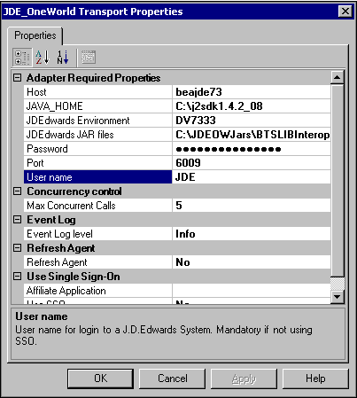  
  
4.  Click **OK** twice to close the **Send Port Properties** dialog box.  
  
### Creating a BizTalk Orchestration Project  
 Now you will create a BizTalk project in [!INCLUDE[btsVStudioNoVersion](../includes/btsvstudionoversion-md.md)] and configure an orchestration in the project to handle communication between [!INCLUDE[btsBizTalkServerNoVersion](../includes/btsbiztalkservernoversion-md.md)] and the JD Edwards OneWorld system. You will add send and receive ports, build the project, and then deploy the project.  
  
##### To create the BizTalk orchestration project in Visual Studio  
  
1.  Open [!INCLUDE[btsVStudioNoVersion](../includes/btsvstudionoversion-md.md)] and create a new BizTalk project in the C:\LABS folder. On the **File** menu, click **New**. The **New Project** dialog box appears. In the **Templates** section, select **Empty BizTalk Server project.** Enter `JDE_OW_Test` as the unique project name, and then click **OK**.  
  
2.  In Solution Explorer, right-click the project, click **Add**, and then click **Add Generated Items**. In the Categories pane, select **Add Adapter Metadata**, in the Templates pane, select **Add Adapter Metadata**, and then click **Add**.  
  
3.  In the Add Adapter Wizard, select the **JD Edwards OneWorld** adapter, select the **JDE_OneWorldPort** send port that you created in the preceding procedure, and then click **Next**.  
  
     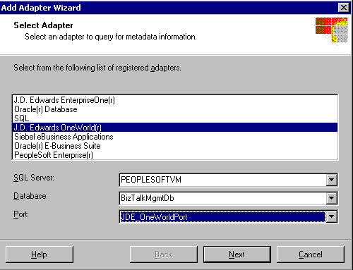  
  
4.  On the **Select Services to Import** page, open **JD Edwards OneWorld**. The JDEOW system is contacted through the adapter by using the BrowsingAgent program. The BrowsingAgent returns the following services.  
  
     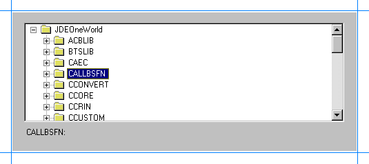  
  
5.  Expand **CALLBSFN** and scroll down to **N0100041 - Address Book MBF**. Select N0100041 and then click **Finish**.  
  
6.  In Solution Explorer, there is a new BizTalk orchestration with two new associated schema files. These files are created by the Add Adapter Wizard. Double-click the **BizTalk Orchestration.odx** file to open the orchestration.  
  
     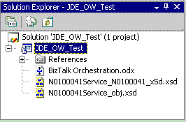  
  
 This orchestration accepts as input from the File adapter an XML file formatted for the JD Edwards OneWorld system. The orchestration uses the JD Edwards OneWorld adapter to send the XML file to the JD Edwards OneWorld system. JD Edwards OneWorld processes the query and generates an output XML file containing the results. This XML file returns to the orchestration through the JD Edwards OneWorld adapter, and the File adapter writes the XML file to the output location on disk.  
  
 To complete the orchestration, you need to create and configure ports to receive and send the XML files. First, configure a receive port to be used by the File adapter to input the XML containing the query into the orchestration from disk.  
  
##### To configure a receive port to accept the input XML file  
  
1.  Double-click the **BizTalk Orchestration.odx** file to open the orchestration.  
  
2.  In the BizTalk Orchestration.odx file, right-click the left port surface and then click **New Configured Port**. This starts the Port Configuration Wizard. On the **Welcome to the Port Configuration Wizard** page, click **Next**.  
  
3.  On the **Port Properties** page, enter `JDE_File_In` for **Name**, and then click **Next**.  
  
4.  On the **Select a Port Type** page, select **Create a new Port Type**, and then enter or select the following property values:  
  
     **Port Type Name**: `JDE_FileIn_Port`  
  
     **Communication Pattern**: **One Way**  
  
     **Access Restrictions**: **Internal - limited to this project**  
  
5.  Click **Next** to go to the **Port Binding** page, and then select the following property values:  
  
     **Port direction of communication**: **I'll always be receiving messages on this port**  
  
     **Port binding**: **Specify later**  
  
6.  Click **Next**, and then click **Finish**.  
  
 Next, create a send/receive port to send the initial XML input file containing the query to the JD Edwards OneWorld system. This port will also receive an output XML file containing the query results from the call to the JD Edwards OneWorld system.  
  
##### To configure a send/receive port to interface with JD Edwards OneWorld  
  
1.  In the BizTalk Orchestration.odx file, right-click the right port surface and then click **New Configured Port**. This starts the Port Configuration Wizard. On the **Welcome to the Port Configuration Wizard** page, click **Next**.  
  
2.  On the **Select a Port Type** page, select **Use an existing Port Type**. Under **Available Port Types**, select **JD_OW_Test.N0100041**,and then click **Next**.  
  
     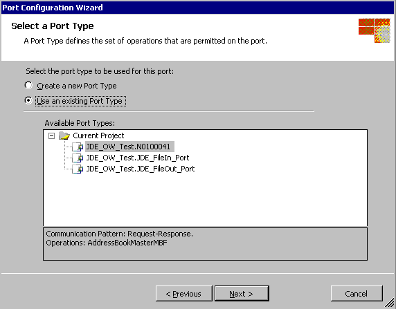  
  
3.  Select the following property values:  
  
     **Port direction of communication**: **I'll be sending a request and receiving a response**  
  
     **Port binding**: **Specify later**  
  
4.  Click **Next**, and then click **Finish**. On the port surface you will see the port and the available methods.  
  
 Finally, configure a send port to be used by the File adapter to output the XML containing the query results to disk.  
  
##### To configure a send port to output the XML file to disk  
  
1.  In the BizTalk Orchestration.odx file, right-click the left port surface and then click **New Configured Port**. This starts the Port Configuration Wizard. On the **Welcome to the Port Configuration Wizard** page, click **Next**.  
  
2.  On the **Port Properties** page, enter `JDE_FileOut` for **Name**, and then click **Next**.  
  
3.  On the **Select a Port Type** page, select **Create a new Port Type**, and then enter or select the following property values:  
  
     **Port Type Name**: `JDE_FileOut_Port`  
  
     **Communication Pattern**: **One Way**  
  
     **Access Restrictions**: **Internal - limited to this project**  
  
4.  Click **Next** to go to the **Port Binding** page, and then select the following property values:  
  
     **Port direction of communication**: **I'll always be sending messages on this port**  
  
     **Port binding**: **Specify later**  
  
5.  Click **Next**, and then click **Finish**.  
  
 Displayed on the port surface are the new ports and the available methods for the JD Edwards OneWorld services. Later you will specify the JD Edwards OneWorld adapter to send and receive files from the JD Edwards OneWorld system.  
  
 The **JDE_File_In** and **JDE_File_Out** ports you just created need associated message types.  
  
##### To assign message types to the ports  
  
1.  On the left port surface, on the **JDE_File_In** port, click **Request**. In the Properties window, expand **Message Type**, expand **Multi-part Message**, and then click **JDE_OW_TestAddressBookMasterMBF**.  
  
2.  On the left port surface, on the **JDE_File_Out** port, click **Request**. In the Properties window, expand **Message Type**, expand **Multi-part Message**, and then click **JDE_OW_TestAddressBookMasterMBFResponse**.  
  
 Insert two **Send** shapes and two **Receive** shapes into the orchestration to link to the ports.  
  
##### To add Send and Receive shapes  
  
1.  Drag a **Receive** component from the Toolbox and drop it immediately below the start of the orchestration (the green circle). Click the **Receive** shape, and in the Properties window, enter `Get_File` for the **Name**, and set **Activate** to `true`. Doing so will activate the orchestration when an incoming document is received on this receive port.  
  
2.  Drag a **Send** component from the Toolbox and drop it immediately below the **GetFileReceive** shape. Click the new **Send** shape, and in the Properties window, enter `SendToJDEOW` for the **Name**.  
  
3.  Drag a **Receive** component from the Toolbox and drop it immediately below the **SendToJDEOWSend** shape. Click the **Receive** shape, and in the Properties window, enter `JDEOW_Resp` for the **Name**.  
  
4.  Drag a **Send** component from the Toolbox and drop it immediately below the **JDEOW_RespReceive** shape. Click the new **Send** shape, and in the Properties window, enter `FileToDisk` for the **Name**.  
  
     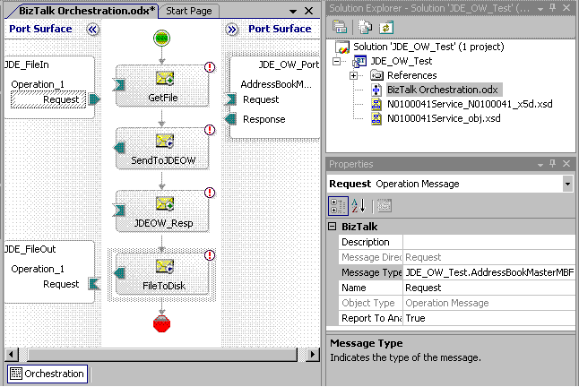  
  
5.  Connect the **JDE_FileIn** port to the **GetFileReceive** component.  
  
6.  Connect the **JDE_FileOut** port to the **FileToDiskReceive** component.  
  
7.  Go to **Orchestration View** and expand **Messages**. Change the identifier for **Message_1** to `MsgToJDEOW`, and for **Message_2** to `JDEOW_Resp.`  
  
8.  Highlight the **SendToJDEOWSend** component and set its **Message** property to **MsgToJDEOW**.  
  
9. Highlight the **JDEOW_RespReceive** component and set its **Message** property to **JDEOW_Resp**.  
  
10. Connect **SendToJDEOW** to the **Request** portion of the **JDE_OW_Port** port.  
  
11. Connect **JDEOW_Resp** to the **Response** portion of the **JDE_OW_Port** port.  
  
     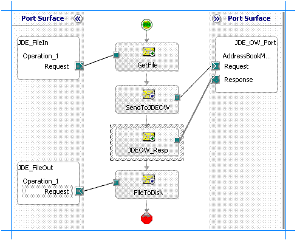  
  
### Building and Deploying the Project  
 Now the BizTalk project is complete and you can build and deploy it in [!INCLUDE[btsVStudioNoVersion](../includes/btsvstudionoversion-md.md)].  
  
##### To build and deploy the project  
  
1.  Start **Visual Studio Command Prompt**.  
  
2.  To build the project, you need a strong name key file. At the command prompt, enter the following to create a strong name key file:  
  
     **sn -k labs.snk**  
  
3.  In Solution Explorer, right-click the **JD_OW_Test** project, and then click **Properties** to launch the Project Designer for the project.  
  
4.  Click the **Signing** tab.  
  
5.  Select **Sign the assembly** option, click drop-down list for the **Choose a strong name key file** option, and then click **Browse**.  
  
6.  Browse to select the key file: **labs.snk**, and then click **Open**.  
  
7.  Click **Deployment** tab in the Project Designer.  
  
8.  Set the **Application Name** to `JDE_OW_Test`.  
  
9. In Solution Explorer, right-click the **JDE_OW_Test** project, and then click **Build.**  
  
       
  
10. After the build completes successfully, right-click the **XX_JD Edwards OneWorldQuery** project, and then click **Deploy**. In the output window the following output will be displayed:  
  
     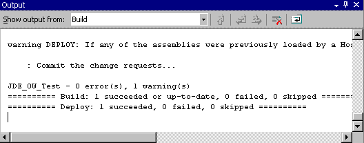  
  
### Testing the Application and Viewing the XML Output  
 Now you will test the application that you have created and deployed. You will create the XML file that starts the orchestration process, and then you will configure folders to receive and send XML files within the application. After you have configured the application, you will run it and view the XML files that the orchestration returns.  
  
##### To generate the XML file for the query  
  
1.  In Solution Explorer, double-click **N0100041Service_N0100041.xsd** to open the file.  
  
2.  Right-click **N0100041Service_N0100041.xsd** and then click **Properties**. For the **Output Instance Filename** enter the following path and file name for the sample XML:  
  
     `C:\LABS\JDE_OW_TEST\SAMPLE.XML`  
  
3.  Click **OK.** In the Properties window, select **\<Schema>** and set **Root Reference:** to `AddressBookMasterMBF`. This will cause the generated XML to include only the **Query** xml.  
  
     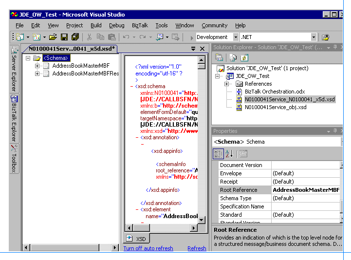  
  
4.  Right-click **N0100041Service_N0100041.xsd** and then click **Generate Instance**. This generates the **Sample.xml** file. This file will be dropped in the receive location as input to the adapter to start the orchestration process.  
  
##### To configure and start the BizTalk application  
  
1.  Configure folders for receiving the incoming files and sending the outgoing files. Go to **C:\LABS\JDE_OW_Test** and create two new subfolders named `FileIn` and `FileOut`.  
  
2.  In the [!INCLUDE[btsBizTalkServerNoVersion](../includes/btsbiztalkservernoversion-md.md)] Administration console,expand **Console Root**, expand**BizTalk Server Administration**, expand **BizTalk Group**, and expand **Applications**.  
  
3.  Right-click **JDE_OW_Test**, and then click **Configure**.  
  
     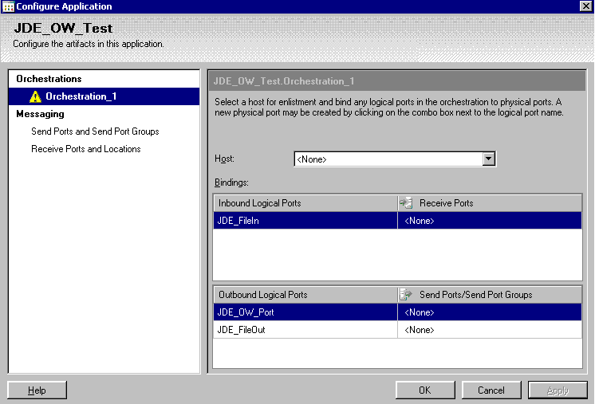  
  
4.  Select **Orchestration_1** and click the **Host** drop-down box. Select **BizTalkServerApplication**.  
  
5.  Under **Receive Ports**, click **\<None>**. In the drop-down list, select **New Receive Port**.  
  
6.  For **Name**, type `JDE_FileIn_Port`, and then click **OK**. A message box appears stating that you need to designate a receive location. Click **OK**, and then click **New**.  
  
     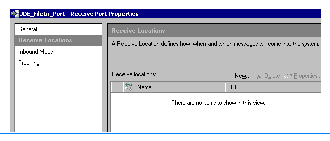  
  
7.  Type or select the following values for the properties:  
  
     **Name**: JDE_`FileInLoc`  
  
     **Type**: **File**  
  
     **Receive Handler**: **BizTalkServerApplication**  
  
     **Receive Pipeline**: **XMLReceive**  
  
     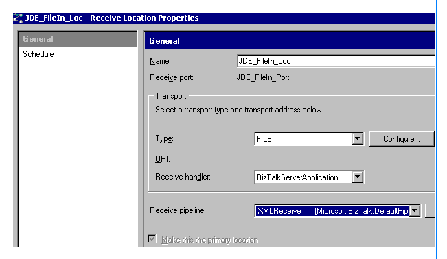  
  
8.  Click **Configure**, type `C:\LABS\JDE_OW_Test\FileIn` for **Receive Folder**, and then click **OK** three times.  
  
     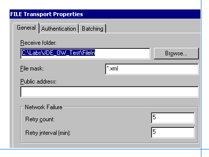  
  
9. Click **\<None>** for **JDE_OW_Port** in the drop-down list.  
  
10. Select **New Send Port** and then select or type the following values for the properties:  
  
     **Name**: `JDE_OW_Port`  
  
     **Type**: **JDE_OneWorld**  
  
     **Send Handler**: **BizTalkServerApplication**  
  
     **Pipelines**: **XMLTransmit** and **XMLReceive**  
  
11. Click **Configure**, and then enter the following property values:  
  
     **Host:** \<enter your JDEOW host name>  
  
     **JAVA_HOME:** `C:\j2sdk1.4.2_08`  
  
     **JDEdwards Environment:** \<enter your JDEOW environment>  
  
     **JDEdwards JAR files:** <enter full path of JAR files>  
  
     `C:JDEOWJarsBTSLIBInterop.jar; C:JDEOWJarsConnector.jar; C:JDEOWJarsKernel.jar;C:Program FilesMicrosoft BizTalk Adapters for Enterprise ApplicationsJ.D. Edwards OneWorld®ClassesJDEJAccess.jar`  
  
     **Password:** Use the drop-down list and then enter your JD Edwards OneWorld password.  
  
     **Port:**  `6009`  
  
     **User Name:** <enter your JD Edwards User Name>  
  
     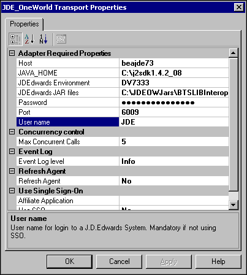  
  
12. Click **OK** twice to close the dialog boxes.  
  
13. In the Configure Applicationwindow, click **\<None>** for **JDE_FileOut** in the drop-down list.  
  
14. Select **New Send Port** and type or select the following values for the properties:  
  
     **Name**: `FileOutPort`  
  
     **Type**: **File**  
  
     **Send Handler**: **BizTalkServerApplication**  
  
     **Send Pipeline**: **XMLTransmit**  
  
15. Click **Configure** and type`C:\Labs\JDE_OW_Test\FileOut` for **Destination Folder.** Keep **%MessageID%.xml** for **File Name** because this results in a unique file for each message.  
  
     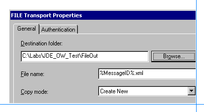  
  
16. Click **OK** three times to close the dialog boxes.  
  
17. In the [!INCLUDE[btsBizTalkServerNoVersion](../includes/btsbiztalkservernoversion-md.md)] Administration console,right-click the **JDE_OW_Test** application, and then click **Start**.  
  
##### To test the orchestration  
  
1.  In the **C:\Labs\JDE_OW_Test** directory the **Sample.xml** file will appear as:  
  
     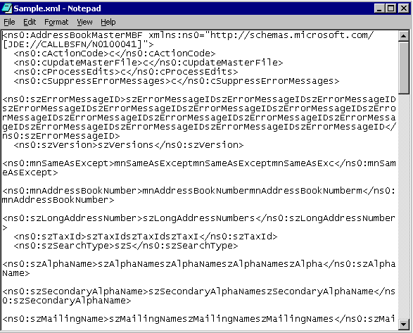  
  
2.  Edit the **Sample.xml** file to remove everything except the **cActionCode** and **mnAddressBookNumber** elements.  
  
       
  
3.  For the **cActionCode** element insert the letter `i`.  
  
4.  For **mnAddressBookNumber** insert the number `500`.  
  
5.  Save the changes and copy the file to the **C:\Labs\JDE_OW_Test\FileIn** folder. This is the receive location that starts the orchestration process.  
  
6.  In a few seconds, an XML file should appear in the **C:\Labs\JDE_OW_Test\FileOut** folder. This should contain the all the records where the address is 500.  
  
     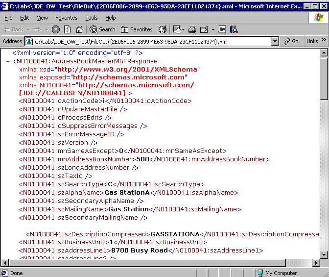  
  
     This returned record data should match the data returned by the query against the JD Edwards OneWorld system in Lab 1. By comparing the records you obtained in Lab 1, you can verify that the **Get** method worked properly.  
  
## Summary  
 In this lab, you first verified that the prerequisites were set up correctly to access the JD Edwards OneWorld system. Then you used [!INCLUDE[btsVStudioNoVersion](../includes/btsvstudionoversion-md.md)] to create a new BizTalk project containing an orchestration. You configured the BizTalk orchestration to use the JD Edwards OneWorld adapter to get data from the JD Edwards OneWorld system. To configure the orchestration, you created send, receive, and send/receive ports. You bound these ports to the JD Edwards OneWorld adapter, and assigned messages to the appropriate ports.  
  
 After you completed the BizTalk project, you used [!INCLUDE[btsVStudioNoVersion](../includes/btsvstudionoversion-md.md)] to build and deploy it. You then configured your new application and ran it to get data from the JD Edwards OneWorld system. To verify that the application worked correctly, you compared its output XML file to the file that you received from the JD Edwards OneWorld system in Lab 1.