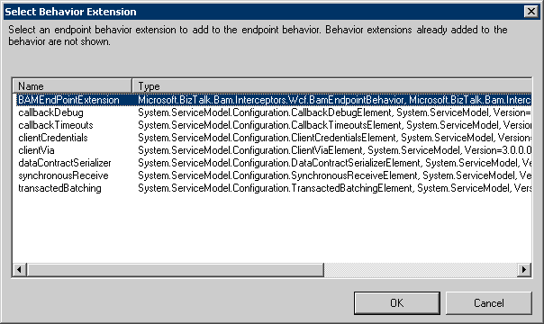

# How to Configure Receive and Send Locations and Ports for BAM WCF Interception
In this procedure you configure the receive and send locations in a content-based routing (CBR) scenario in order to demonstrate the key concepts in a straightforward manner. The concepts demonstrated here can be applied to an orchestration that is exposed as a [!INCLUDE[firstref_btsWinCommFoundation](../includes/firstref-btswincommfoundation-md.md)] service.  
  
## Prerequisites  
 This procedure assumes that you have:  
  
-   Modified your machince.config file as shown in [How to Add the BAM Interceptor Behavior to the Machine.config File](../core/how-to-add-the-bam-interceptor-behavior-to-the-machine-config-file.md).  
  
-   Created a WCF adapter for BizTalk Server as show in [How to Create a WCF Adapter for BizTalk Server](../core/how-to-create-a-wcf-adapter-for-biztalk-server.md).  
  
### To configure the receive and send locations  
  
1.  Open the BizTalk Administration Console. To do this, click **Start**, point to **All Programs**, point to [!INCLUDE[btsBizTalkServerStartMenuItemui](../includes/btsbiztalkserverstartmenuitemui-md.md)], and then click **BizTalk Server Administration**.  
  
2.  Expand the console tree to locate the Receive Locations node for your BizTalk application. Click [!INCLUDE[btsBizTalkServerAdminConsoleui](../includes/btsbiztalkserveradminconsoleui-md.md)], click **Applications**, click the application you selected in the [!INCLUDE[nextref_btsWinCommFoundation](../includes/nextref-btswincommfoundation-md.md)] Service Type dialog box, and then click **Receive Locations**. There will be a new receive location corresponding to the one you created. It will be in disabled status.  
  
3.  Double-click the receive location to open the **Receive Location Properties** dialog box, and then choose WCF-Custom as the transport type.  
  
4.  Click the **Configure** button to open the **WCF-Custom Transport Properties** dialog box.  
  
5.  Click the **Binding** tab and select the binding you want to use.  
  
6.  Click the **Behavior** tab, right-click the **EndpointBehavior** node, and then select **Add Extension**.  
  
7.  Select the BAMEndPointExtension (this is the extension you added to the machine.config file), and then click **Ok**.  
  
       
  
8.  Select the extension you just created, enter the following values, and then click **OK**:  
  
    |Property|Value|  
    |--------------|-----------|  
    |PollingIntervalSec|10|  
    |ConnectionString|ConnectionString: Integrated Security=SSPI;Persist Security Info=False;Initial Catalog=BAMPrimaryImport;Data Source=|  
  
9. In the **Receive Location Properties** dialog box, select **PassThruReceive** from the **Receive pipeline** drop-down list, and then click **OK**.  
  
10. Enable the receive location and refresh the Administration console. A started status indicates that the setup is successful.  
  
## See Also  
 [Configuring the WCF Adapter to Intercept BAM Data](../core/configuring-the-wcf-adapter-to-intercept-bam-data.md)