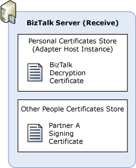
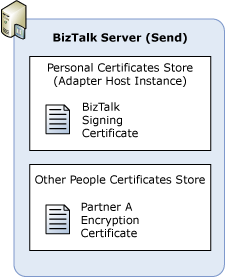

# How to install the Certificates for Digital Signatures
The following procedure lists the high-level steps that you have to follow to install the certificates for receiving and sending signed messages.  
  
-   To install the certificates in the certificates store to receive signed messages  
  
-   To install the signing certificates for sending signed messages in the certificates store  
  
-   To configure the BizTalk Group for sending signed messages  
  
> [!NOTE]
>  You can use one certificate for both signing and decryption operations, or you can use one certificate for each function.  
  
> [!IMPORTANT]
>  You can only specify one signing certificate with which [!INCLUDE[btsBizTalkServerNoVersion](../includes/btsbiztalkservernoversion-md.md)] signs all outbound messages. In other words, you cannot use different signing certificates depending on who you are sending the message to.  
  
### To install the certificates in the certificates store to receive signed messages  
  
1.  Partner A requests a private-public key pair for digital signatures from the certification authority (CA).  
  
2.  Partner A sends you its public key for digital signatures.  
  
3.  In [!INCLUDE[btsBizTalkServerNoVersion](../includes/btsbiztalkservernoversion-md.md)], log on to the server that has a host instance running a handler that will receive messages from Partner A. Install the Partner A public key certificate to verify their signature in the Other People store. The following figure shows the certificate store where you install the certificate.  
  
       
  
4.  In Partner A, install the Partner A private key certificate for signing messages in the appropriate store. (If Partner A is using [!INCLUDE[btsWin2kSvr](../includes/btswin2ksvr-md.md)], [!INCLUDE[btsWinSvr2k3](../includes/btswinsvr2k3-md.md)], or [!INCLUDE[btsWinSvr2k8](../includes/btswinsvr2k8-md.md)], install the private key in the personal store for the account that will sign messages sent to [!INCLUDE[btsBizTalkServerNoVersion](../includes/btsbiztalkservernoversion-md.md)].)  
  
### To install the signing certificates for sending signed messages in the certificates store  
  
1.  An administrator in your organization requests a private-public key pair for digital signatures from the CA for [!INCLUDE[btsBizTalkServerNoVersion](../includes/btsbiztalkservernoversion-md.md)] to use.  
  
2.  The administrator sends Partner A (and all other partners) the public key for digital signatures.  
  
3.  In [!INCLUDE[btsBizTalkServerNoVersion](../includes/btsbiztalkservernoversion-md.md)], log on as service account for the host instance running the handler that will send messages to Partner A. Install the [!INCLUDE[btsBizTalkServerNoVersion](../includes/btsbiztalkservernoversion-md.md)] private key certificate for signing messages in the personal store for the service account. The following figure shows the certificate store where you install the certificate.  
  
       
  
4.  In Partner A, install the [!INCLUDE[btsBizTalkServerNoVersion](../includes/btsbiztalkservernoversion-md.md)] public key certificate for verifying its digital signature in the appropriate store. (If Partner A is using [!INCLUDE[btsWin2kSvr](../includes/btswin2ksvr-md.md)], [!INCLUDE[btsWinSvr2k3](../includes/btswinsvr2k3-md.md)], or [!INCLUDE[btsWinSvr2k8](../includes/btswinsvr2k8-md.md)], install the public key in the Other people store.)  
  
### To configure the BizTalk Group for sending signed messages  
  
1.  Click **Start**, point to **All Programs**, point to [!INCLUDE[btsBizTalkServerStartMenuItemui](../includes/btsbiztalkserverstartmenuitemui-md.md)], and then click **BizTalk Server Administration**.  
  
2.  Right-click **BizTalk Group**, and then click **Properties**.  
  
3.  On the **Group Properties** dialog box, click **Certificate**, click **Browse**.  
  
4.  On the **Select Certificate** dialog box, select the signing certificate that you installed, and then close all of the dialog boxes.  
  
## Next Steps  
 You create a pipeline to receive signed messages in [How to Configure BizTalk Server for Receiving Signed Messages](../core/how-to-configure-biztalk-server-for-receiving-signed-messages.md).  
  
 You create a pipeline to send signed messages in [How to Configure BizTalk Server for Sending Signed Messages](../core/how-to-configure-biztalk-server-for-sending-signed-messages.md).  
  
## See Also  
 [Certificates that BizTalk Server Uses for Signed Messages](../core/certificates-that-biztalk-server-uses-for-signed-messages.md)   
 [Sending and Receiving Signed Messages](../core/sending-and-receiving-signed-messages.md)