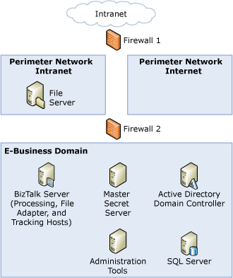

# Sample Architecture: File Adapter
This topic describes the sample architecture when you use the File adapter to send and receive messages.  
  
## File Adapter Components  
 The following figure shows the components of the BizTalk Server sample architecture when you use the File adapter.  
  
> [!NOTE]
>  This sample architecture is also applicable when you use the EDI adapter.  
  
 **Figure 1 Sample architecture that shows File adapter**  
  
   
  
 This sample architecture contains the components discussed in the following sections.  
  
## Perimeter network-Internet  
 Companies commonly use the File protocol for intranet-based communications, and therefore you do not need any servers in the Internet perimeter network to support this scenario.  
  
## Perimeter network-intranet  
 When you use the File adapter, there is a File server in the intranet perimeter network. This is the server where your partners drop their messages, and the BizTalk File receive adapter picks up messages from this server.  
  
## E-Business domain  
 The servers in this domain are:  
  
-   **BizTalk Server (processing, File adapter, and tracking hosts).** This server has an installation of the BizTalk Server runtime, and has instances of the hosts that contain the BizTalk orchestrations, pipelines, Business Rule Engine, and other business processes. This is where the BizTalk Server ports, receive locations, pipelines, maps, schemas, and assemblies are located to receive, route, process, and send messages. This server also has a host instance of a host that supports tracking of health monitoring and business monitoring data. Additionally, this host contains instances of the host that runs the File send and receive adapters.  
  
    > [!NOTE]
    >  As your performance needs increase, you can add more BizTalk Servers to your environment for host instances of your processing hosts. For more information about how to configure BizTalk Server for high availability, see [Planning for High Availability](../core/planning-for-high-availability3.md).  
  
-   **Master secret server.** Same as in the [Sample Architecture: Base BizTalk Server](../core/sample-architecture-base-biztalk-server.md).  
  
-   **SQL Server.** Same as in the [Sample Architecture: Base BizTalk Server](../core/sample-architecture-base-biztalk-server.md).  
  
-   **Domain controller.** Same as in the [Sample Architecture: Base BizTalk Server](../core/sample-architecture-base-biztalk-server.md).  
  
-   **Administration tools.** Same as in the [Sample Architecture: Base BizTalk Server](../core/sample-architecture-base-biztalk-server.md).  
  
## See Also  
 [Sample Architectures for Small & Medium-Sized Companies](../core/sample-architectures-for-small-medium-sized-companies.md)   
 [Sample Scenarios for Threat Model Analysis](../core/sample-scenarios-for-threat-model-analysis.md)