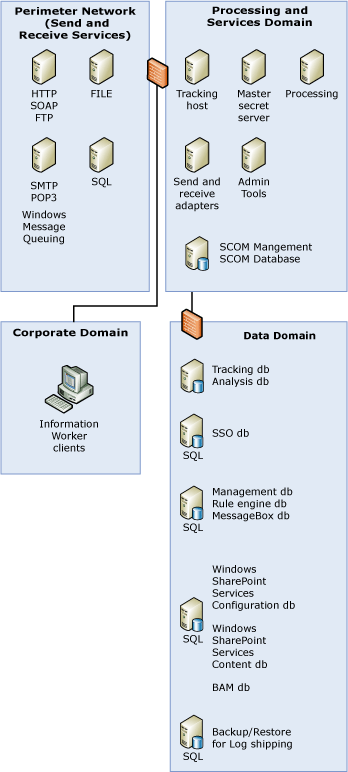

# Scaled Down Architecture with Information Worker Services
For complete information about the system architecture for BizTalk Server deployment, see [Sample BizTalk Server Architectures](../core/sample-biztalk-server-architectures.md).  
  
 The following figure provides a sample BizTalk Server architecture including the information worker services that combines some of the domains and BizTalk Servers to reduce the number of servers and firewalls you need. While this architecture is not the most distributed, it still separates the BizTalk Servers based on their function.  
  
   
  
        Scaled Down Architecture with Information Worker Services  
  
 In the previous figure, the servers in the service interfaces and services domain correspond to BizTalk Hosts, and not physical servers. While it is recommended to keep the master secret server and the administrative tools in stand-alone computers, you can have host instances for the tracking, processing, send, and receive hosts running on multiple computers. Similarly, the servers in the perimeter network correspond to logical locations.  
  
 The servers in the perimeter network for SMTP, Windows Message Queuing (also known as MSMQ), File, and SQL correspond to the mail servers, queue, directory, or SQL Server respectively from which the BizTalk receive and send hosts in the service interfaces domain receive and send messages.  
  
 The BAM databases in the data domain are BAM Primary Import, BAM Analysis, BAM Star Schema, and BAM Archive databases. The Tracking and Analysis databases in the Data domain are the ones BizTalk Server uses for storing tracking information.  
  
## See Also  
 [Scaled Down Architecture](../core/scaled-down-architecture.md)   
 [Large Distributed Architecture with Information Worker Services](../core/large-distributed-architecture-with-information-worker-services.md)   
 [Designing a Secure Architecture](../core/designing-a-secure-architecture.md)   
 [Sample BizTalk Server Architectures](../core/sample-biztalk-server-architectures.md)