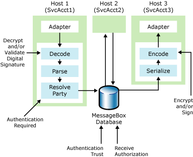

# Security for Sending and Receiving Messages
The following figure shows what happens to a message as BizTalk Server receives it, processes it, and sends it to another application or partner.  
  
   
Security features used throughout the lifetime of a message  
  
1.  The receive location for the adapter receives the message. Depending on the protocol, the adapter does protocol-level authentication of the sender to identify a Windows user account that represents the sender of the message.  
  
2.  The adapter then passes the message to the pipeline, where message-level authentication takes place if it has not already happened in the adapter.  
  
    1.  In the Decode stage, the pipeline decrypts the message and verifies the validity of the signature with the certificate attached to the message, or the one configured in the Other People certificate store of the local computer. After the pipeline validates the signature, the decoding component validates the certificate chain up to a trusted root Certificate Authority (CA). If you configure the pipeline to decode S/MIME messages, and the sender encrypted the message using S/MIME, the MIME/SMIME decoder verifies the signature of the message, and uses the certificate to identify the sender. For more information about how to use MIME/SMIME decoder pipeline components, see [Implementing Message Security](../core/implementing-message-security.md).  
  
    2.  In the Party Resolution stage, BizTalk Server uses the certificate information and the Sender Security ID (SSID) obtained from protocol-level authentication to determine whether the sender of the message is a recognized party in the system. The Sender SSID is the qualified name of the user authenticated by the adapter. For example. If BizTalk Server receives the message by way of the HTTP adapter using Windows authentication, then the sender SSID is domain\username. BizTalk Server assigns a Party ID (PID) to the message, which is either the party ID of a recognized party, or a guest ID. For more information about how to use party resolution component, see [Using Certificates for Party Resolution](../core/using-certificates-for-party-resolution.md).  
  
    3.  If you configured the receiving port to require the sender to be authenticated to a known party in the system, and BizTalk Server is not able to find a PID for the sender of the message, then BizTalk Server drops or suspends the message depending on the configuration of the receive port. BizTalk Server provides this feature to mitigate Denial of Service attacks. For more information about the authentication options for receive ports, see [How to Configure Authentication Options for a Receive Port](../core/how-to-configure-authentication-options-for-a-receive-port.md).  
  
3.  After the pipeline authenticates the message, it sends the message to the MessageBox database.  
  
    1.  If you did not identify the enqueuing host (on which the pipeline is running) as an authentication trusted host, the MessageBox database overwrites the PID with the guest ID, and the SSID with the service account that the enqueuing host instance is running as. For more information about authentication trusted host, see [Authentication of Messages Between Processes](../core/authentication-of-messages-between-processes.md). For more information about how to configure authentication trusted host, see [How to Modify Host Properties](../core/how-to-modify-host-properties.md).  
  
    2.  If the host on which the pipeline is running is marked as authentication trusted, the MessageBox database trusts the PID and SSID, and leaves this information in the context of the message so that downstream processes can use this information to authenticate and/or authorize the original sender of the message.  
  
    3.  If BizTalk Server requires receive authorization, the MessageBox database verifies that the hosts subscribed to the message have authorization to receive it. For more information about receive authorization, see [Authorizing the Receiver of a Message](../core/authorizing-the-receiver-of-a-message.md).  
  
4.  After BizTalk Server processes the message, the outbound pipeline encrypts and/or digitally signs the message in the encode stage.  
  
## See Also  
 [Implementing Message Security](../core/implementing-message-security.md)   
 [Planning Message Security](../core/planning-message-security.md)