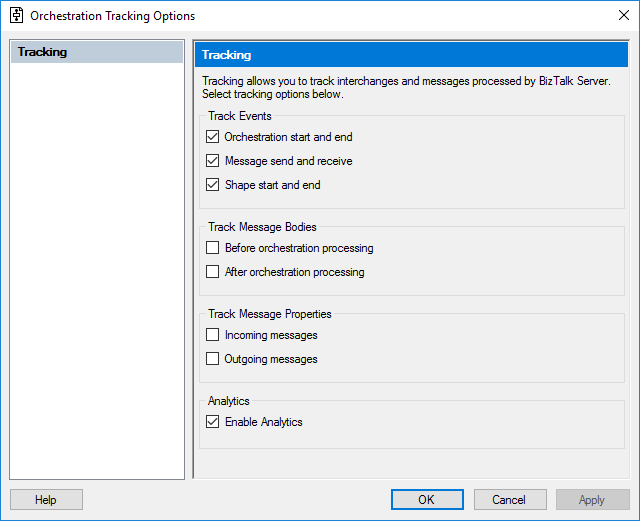
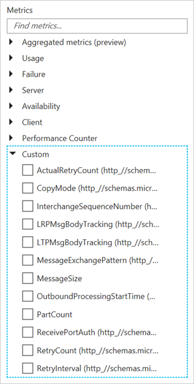

# Send tracking data to Azure Application Insights using BizTalk Server

**Starting with [!INCLUDE[bts2016_md](../includes/bts2016-md.md)] [!INCLUDE[featurepack1](../includes/featurepack1.md)]**, you can process and send your tracking data to Azure Application Insights. Use the Application Insights features to track your instances from receive ports, send ports, and orchestrations.
  		  
**Starting with [!INCLUDE[bts2016_md](../includes/bts2016-md.md)] Feature Pack 2**, this feature supports SQL default instances, and SQL named instances.

## Prerequisites
* Create a new instance of [Application Insights](https://docs.microsoft.com/azure/application-insights/app-insights-create-new-resource). In its properties, copy the **Instrumentation Key**. Paste it in another file so you have it ready. We use this key within BizTalk Server. 
* Install [Feature Pack 1](https://www.microsoft.com/download/details.aspx?id=55100) on your [!INCLUDE[btsBizTalkServerNoVersion_md](../includes/btsbiztalkservernoversion-md.md)]

## Enable analytics for your environment

1. Open the **BizTalk Server Administration** console, right-click the **BizTalk Group**, and select **Settings**. 
2. Check **Enable group-level analytics**.
3. For the **Target type**, select **Application Insight** from the list.
4. For the **Connection parameters**, enter your Application Insights **[instrumentation key](https://docs.microsoft.com/en-us/azure/application-insights/app-insights-create-new-resource)** (available in the Azure portal). Your Group settings look similar to the following: 

    

5. Select **OK** to save your changes. 

Once enabled, [!INCLUDE[btsBizTalkServerNoVersion_md](../includes/btsbiztalkservernoversion-md.md)] is ready to transmit data to Application Insights. Next, enable analytics on your ports and orchestrations. 

## Enable analytics on your artifacts

1. In BizTalk Server Administration, right-click a **receive port**, **send port** or **orchestration**, and select **Tracking**.
2. Under **Analytics**, check **Enable Analytics**, similar to the following. This setting starts tracking and transmitting data from the artifact to Application Insights.
    
    

3. Select **OK** to save your changes.
4. Restart the tracking host Instance, and confirm the BizTalk Application is started.

Next, run queries within Application Insights to see your data.  

> [!TIP]
> Connect your BizTalk Server Analytics with other systems to gain even more insight into your organizations data.

## View your data
Once the data is sent to Application Insights, you can use the analytics tools within Azure to create advanced queries, and analyze your data.

1. Sign in to the [Azure Portal](https://portal.azure.com).
2. Open your Application Insights resource, and select **Metrics Explorer**.
3. Empty charts may display. In a chart, select **Edit**. Under **Metrics**, select **Custom** to see the available tracked properties. Select some of the different options to see the changes on your chart: 

    

4. Go back to your Application Insights resource, and select **Analytics**. In **Usage**, select **Run**. A sample query is executed, and the results are displayed in a chart.  

> [!TIP]
> Azure Application Insights is a powerful tool. There are resources to help you write queries in Application Insights at [Analytics in Application Insights](https://docs.microsoft.com/azure/application-insights/app-insights-analytics), and even to get started at [What is Application Insights?](https://docs.microsoft.com/en-us/azure/application-insights/app-insights-overview).

## Where the data is stored

Your tracking data should display fairly quickly (within a few minutes) within Application Insights. If it doesn't, then there may be an issue with the tracking host. In SQL Server, the Analytics data is stored in the BizTalkMsgBoxDb database, in the TrackingData_2_*x* tables. In SQL Server Management Studio, return the top 1000 rows on these four tables. If the data is there, then the tracking host is not moving the data to the BizTalkDTADb database. 

Some possible resolutions:

1. Restart the tracking host.
2. Create a dedicated tracking host. When BizTalk Server is installed, tracking may be enabled on the **BizTalk Server Application 1** host. Typically, this application is also used to process messages. Create a dedicated tracking host using the following steps: 

    1. In BizTalk Server Administration, open the properties of the BizTalk Server Application 1 host, and uncheck **Allow Host Tracking**. Restart this host instance.

    2. Create a new host named **Tracking**, and check **Allow Host Tracking**. Create a host instance, and start it.

Now, query the BizTalkMsgBoxDb TrackingData_2_x tables again. If the tables are empty, then the data was moved, and should start displaying in Application Insights.
    
## See also
 [Configure the Feature Pack](../core/configure-the-feature-pack.md)