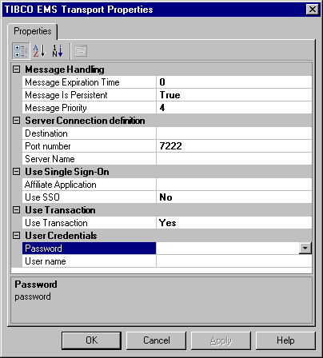

---
redirect_url: /biztalk/core/creating-tibco-enterprise-message-service-send-handlers/
redirect_document_id: TRUE

ROBOTS: NOINDEX
--- 

# Set send port Transport Properties for the Send Port for TIBCO Enterprise Message Service
The TIBCO Enterprise Message Service transport properties are configured in design time and used in run time. In the **Transport Properties** dialog box, you set the connection and credential parameters specific to the server system and the objects you are trying to access.  
  
   
  
## Enter transport properties  
  
1.  In the **Transport Properties** dialog box, expand **System Definition**, and enter all required information for connection to the TIBCO EMS server.  
  
     You must set configuration parameters to connect Microsoft BizTalk Adapter for TIBCO Enterprise Message Service to TIBCO EMS. This data is case sensitive.  
  
2.  Expand **Message Handling** and enter all required information.  
  
    |Parameter|Description|  
    |---------------|-----------------|  
    |`Message Expiration Time`|An integer that describes the length of time the message stays on the queue or topic; after the time expires, the message is deleted by the TIBCO EMS server.   It is synonymous to the EMS.Expiration message property header. It can be overridden with the orchestration.   Default value is 0 milliseconds, which means that the message will not expire from the destination.|  
    |`Message is Persistent`|Messages are written to disk by the TIBCO EMS server before they are acknowledged.   This is the TibcoEMS.DeliveryMode header property. It instructs sent messages to be persisted in the queue by the server before acknowledging reception of the message to the adapter.   Default value is **True**.|  
    |`Message Priority`|Numeric ranking from 0 to 9, which defines the priority of the message; the larger the value, the higher the priority.   Priority affects the order in which the server delivers messages to consumers (higher values first).   The JMS specification defines ten levels of priority value, from zero (lowest priority) to 9 (highest priority). The specification suggests that clients consider 0–4 as gradations of normal priority, and priorities 5–9 as gradations of expedited priority.   Default value is **4**.|  
  
3.  Expand **Server Connection Definition** and enter all required information.  
  
    |Parameter|Description|  
    |---------------|-----------------|  
    |`Destination`|Mandatory setting. Defines the name and type of the destination. For example: staticqueue[Q1].   Defines the queue or topic with the following format: {static}{dynamic]Queue[queuename] or {static}{dynamic]Topic[topicname]. **Note:**  You can send a message to a destination that does not exist. In such a case, TIBCO Enterprise Message Service creates the destination; this is referred to as a *Dynamic Destination*. This is a destination created by a producer and deleted when the message is consumed and the producer disconnects. A *static destination* is a destination which can only created by a TIBCO Enterprise Message Service Administrator. You cannot connect to a dynamic port when you open a connection to a destination because BizTalk Adapter for TIBCO Enterprise Message Service uses a name lookup mechanism on the server. Only static ports are visible when you are using the name lookup. When connecting to a dynamic port, you can use static destinations; however, if no destination by that name exists, a destination is created. Destination lets you explicitly specify the type of destination to use when defining the port. The syntax for the Destination is not case sensitive: staticqueue[queue_name], statictopic[topic_name], dynamicqueue[queue_name]; dynamictopic[topic_name].|  
    |`Port Number`|Port on which the TIBCO EMS server listens.|  
    |`Server Name`|Mandatory setting. Name of the system hosting the TIBCO EMS server.|  
  
4.  Provide credentials using Single Sign-On (SSO).  
  
     You can use two methods to access the TIBCO EMS system. You can use Credentials (User Name and Password parameters) or Single Sign-On.  
  
    -   Select **Yes** in the **Use SSO** to use Single Sign-On.  
  
    -   Select an affiliate application from the list.  
  
         An affiliate application, created by Enterprise Single Sign-On tools, represents an application such as TIBCO EMS. BizTalk Adapter for TIBCO EMS uses the credentials of an application user. These credentials are retrieved from the SSO database for the server system for a specified affiliate application.  
  
         For more information about how to create an affiliate application, see [Creating Affiliate Applications](../core/creating-affiliate-applications5.md).  
  
5.  In **Transaction Support**, select **Yes** if this send port will support transactions.  
  
     If you enable transaction support on the port, all orchestrations using this port must be transactional; otherwise, all calls are rolled back (for example, are not committed). The scope object added to the orchestration controls the transaction life-cycle.  
  
6.  Expand **User Credentials** and enter the **User Name** and **Password** to access the TIBCO EMS server.  
  
    |Parameter|Description|  
    |---------------|-----------------|  
    |`Password`|The user’s Password used to communicate with a TIBCO EMS daemon.   If you did not select **Use SSO**, you must set credential parameters for the BizTalk Adapter for TIBCO EMS to communicate with a TIBCO EMS daemon.|  
    |`User Name`|Name of a user used to communicate with a TIBCO EMS daemon.   If you did not select **Use SSO**, you must set credential parameters for the BizTalk Adapter for TIBCO EMS to communicate with a TIBCO EMS daemon.|  
  
7.  Click **Apply**, and then click **OK**.  
  
## See Also  
 [Secure the adapter](../core/security-in-biztalk-adapter-for-tibco-ems.md)  
 [Create the Send artifacts](../core/creating-tibco-enterprise-message-service-send-handlers.md)