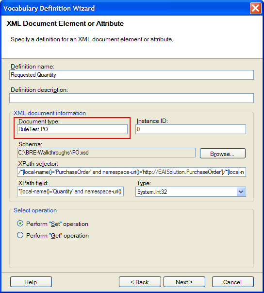
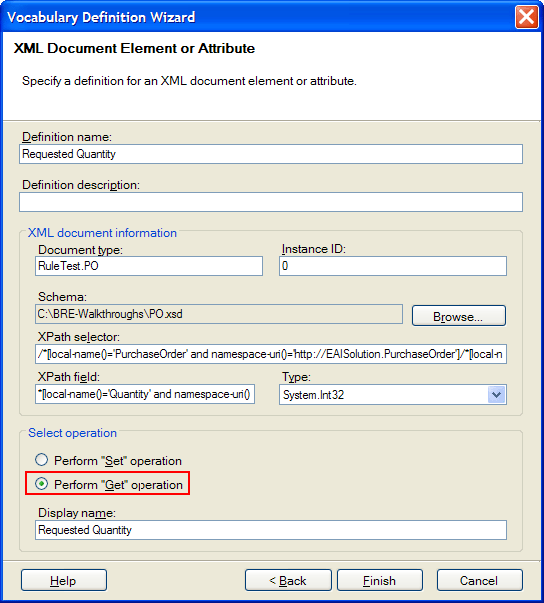
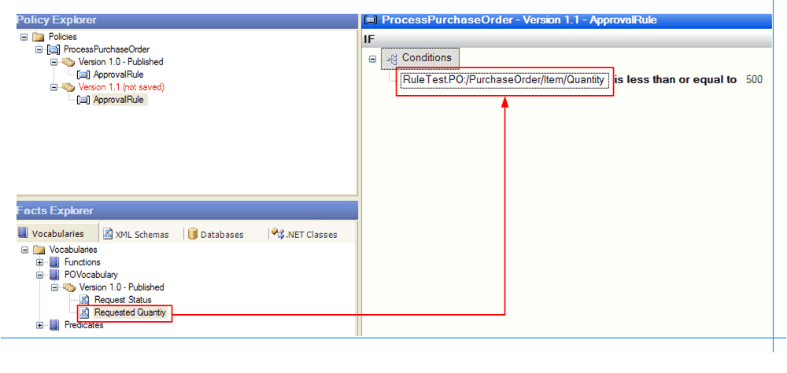
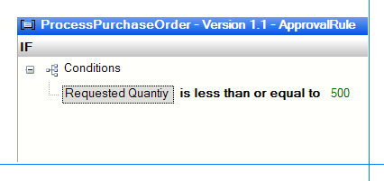

# Walkthrough: Creating and Using a Vocabulary in the Policy
This walkthrough provides step-by-step procedures for creating a vocabulary and using the vocabulary in the **ProcessPurchaseOrder** policy.  
  
## Prerequisites  
 You must complete the [Walkthrough: Creating a Simple Business Policy](../core/walkthrough-creating-a-simple-business-policy.md) walkthrough before performing this walkthrough. However, we recommend that you complete all the walkthroughs that are listed before this walkthrough in the documentation.  
  
## Overview of This Walkthrough  
 This walkthrough contains three procedures, as described in the following table.  
  
|Procedure title|Procedure descritpion|  
|---------------------|---------------------------|  
|To create the POVocabulary vocabulary|Provides step-by-step instructions for creating the **POVocabulary** vocabulary with three definitions: Requested Quantity, Maximum Number of Items Allowed, and Request Status.|  
|To use the POVocabulary in the ProcessPurchaseOrder policy|Provides step-by-step instructions for creating a new version of the **ProcessPurchaseOrder** policy using **POVocabulary**.|  
|To test the solution|Provides step-by-step instructions for testing the solution.|  
  
### To create the POVocabulary vocabulary  
  
1.  On the **Start** menu, open **Business Rule Composer**. If you have the Business Rule Composer already open, press F5 to refresh it.  
  
    > [!NOTE]
    >  On a system that supports User Account Control (UAC), you may need to run the tool with Administrative privileges. To do this, right-click the application, and then select **Run as administrator**.  
  
2.  In the Facts Explorer window, click the **Vocabularies** tab.  
  
3.  Right-click **Vocabularies**, click **Add New Vocabulary**, and then type **POVocabulary** as the name for the vocabulary.  
  
4.  If you did not change the name of the vocabulary to POVocabulary in step 3, change the name of the vocabulary to **POVocabulary**in the Properties window.  
  
5.  Right-click **Version 1.0(not saved)** in **POVocabulary**, and then click **Add New Definition**.  
  
6.  In the Vocabulary Definition Wizard, select **XML Document Element or Attribute**, and then click **Next**.  
  
7.  For the **Definition name**, type **Requested Quantity**.  
  
8.  Click **Browse**, and select the **PO.xsd** file you created in [Walkthrough: Creating a Simple Business Policy](../core/walkthrough-creating-a-simple-business-policy.md).  
  
9. In the **Select Binding** dialog box, expand **PurchaseOrder**, expand **Item**, and then double-click **Quantity**.  
  
10. Make sure that the **document type** is set to **RuleTest.PO**. If it is not, change the document type to RuleTest.PO. This step is very important.  
  
       
  
11. Specify the **select operation** in the **Select operation** group as **Perform Get Operation**.  
  
       
  
12. Click **Finish**.  
  
13. Right-click **Version 1.0(not saved)**, and then click **Add New Definition**.  
  
14. Select **XML Document Element or Attribute**, and then click **Next**.  
  
15. For the **Definition name**, type **Request Status**.  
  
16. Click **Browse**, and select the **PO.xsd** file.  
  
17. In the **Select Binding** dialog box, expand **PurchaseOrder**, and then double-click **Status**.  
  
18. Change the **document type** to **RuleTest.PO**. This step is very important.  
  
19. Make sure that the  **Perform Set operation** option is selected, and then click **Next.**  
  
20. Click **Finish**.  
  
21. Right-click **Version 1.0(not saved)**, and then click **Add New Definition**.  
  
22. Make sure that **Constant Value, Range of Values, or Set of Values** is selected, and then click **Next**.  
  
23. For the **Definition name**, type **Maximum Number of Items Allowed**.  
  
24. Make sure that **Constant Value definition type** is selected, and then click **Next**.  
  
25. Type **500** for the value, and then click **Finish**.  
  
26. Right-click **Version 1.0(not saved)**, and then click **Save**.  
  
27. Right-click **Version 1.0(not saved)**, and then click **Publish**.  
  
### To use the POVocabulary in the ProcessPurchaseOrder policy  
  
1.  In the Policy Explorer window, expand **Policies**, expand **ProcessPurchaseOrder**, right-click **Version 1.0**, and then click **Copy**.  
  
2.  Right-click **ProcessPurchaseOrder** and then click **Paste Policy Version**.  
  
3.  Click **ApprovalRule** in **Version 1.1(not saved)**.  
  
4.  In the Facts Explorer window, expand **Vocabularies**, expand **POVocabulary**, expand **Version 1.0**, and then drag **Requested Quantity** to the IF pane to replace the left hand side (LHS) argument of the LessThanOrEqual predicate.  
  
       
  
       
  
5.  Drag **Maximum Number of Items Allowed** to replace the right hand side (RHS) argument of the condition (**500**).  
  
6.  Select the existing action in the THEN pane, right-click, and then click **Delete action**.  
  
    > [!NOTE]
    >  You can also press DELETE after selecting the action to delete the action.  
  
7.  Drag **Request Status** to the **THEN** pane.  
  
8.  Click **\<empty string>** and then type **Approved**.  
  
9. Right-click **Version 1.1(not saved)** in the Policy Explorer window, and then click **Save**.  
  
10. Right-click **Version 1.1(not saved)** in the Policy Explorer window, and then click **Publish**.  
  
### To test the solution  
  
1.  In Business Rule Composer, expand **Policies**, expand **ProcessPurchaseOrder**, right-click **Version 1.0 - Deployed**, and then click **Undeploy**.  
  
    > [!NOTE]
    >  This step is optional because the orchestration always picks the latest deployed version of the policy, which is 1.1 after you perform step 2.  
  
2.  Right-click **Version 1.1- Published**, and then click **Deploy**.  
  
3.  Wait for approximately **60** seconds. The rule engine update service refreshes its cache every 60 seconds if there are any updates to a policy that it caches. It does not matter whether you perform step 1—the orchestration picks up the latest deployed version of the policy, which is 1.1  
  
4.  Open **SamplePO.xml** and **SamplePO2.xml** in Notepad and change the value of the **Status** field to **XYZ**.  
  
5.  Copy the **SamplePO.xml** file from C:\BRE-Walkthroughs directory to C:\BRE-Walkthroughs\RuleTestSol\Input directory for the orchestration.  
  
6.  You should see an output file in the C:\BRE-Walkthroughs\RuleTestSol\Output directory for the orchestration. Open the output XML file and notice that the value of the **Status** field is set to **Approved**.  
  
7.  Repeat steps 5 and 6 with **SamplePO2.xml**, and notice that the value of the **Status** field in the output document is the same as in the input document (**XYZ**).  
  
    > [!NOTE]
    >  The value of the **Status** field remains the same (XYZ) because the rule engine does not execute the action in the **ApprovalRule** rule because the condition evaluated to `false`.  
  
## Comments  
  
-   After you save the vocabulary, you can still modify it. After you publish the vocabulary, you cannot modify it.  
  
-   If you need to modify a definition, add a new definition, or delete a definition, you should create a new version of the vocabulary.  
  
-   Only published vocabularies can be used in policies.  
  
-   In the "To create the POVocabulary vocabulary" procedure, you changed the document type to **RuleTest.PO**. To see the results of this change, in [!INCLUDE[btsVStudioNoVersion](../includes/btsvstudionoversion-md.md)], in Solution Explorer, click **PO.xsd**. In the Properties window, note that **RuleTest** is the name of the namespace, and **PO** is the name of the **Type**.  
  
-   In this walkthrough, you used only an XML document as a fact to the policy. You can also use .NET facts and database facts when you create policies  
  
-   When you select **Perform "Set" operation** on the second page of the Vocabulary Definition Wizard, you can specify a **Display format string** on the page that follows. For example, you could change the display format string from **Request Status {0}** to **Request status is: {0}** before clicking **Finish** in the step 20 of the "create vocabulary" procedure.  
  
## Next Steps  
 Now that you have completed this walkthrough, perform the [Walkthrough: Adding a Rule to the Policy](../core/walkthrough-adding-a-rule-to-the-policy.md) walkthrough, which gives you step-by-step instructions for adding a new rule to the **ProcessPurchaseOrder** policy.  
  
## See Also  
 [Vocabularies](../core/vocabularies.md)   
 [How to Develop Vocabularies](../core/how-to-develop-vocabularies.md)   
 [Condition Evaluation and Action Execution](../core/condition-evaluation-and-action-execution.md)   
 [Agenda and Priority](../core/agenda-and-priority.md)