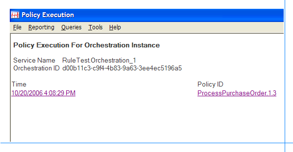
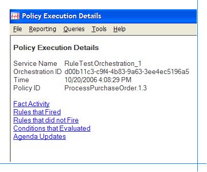
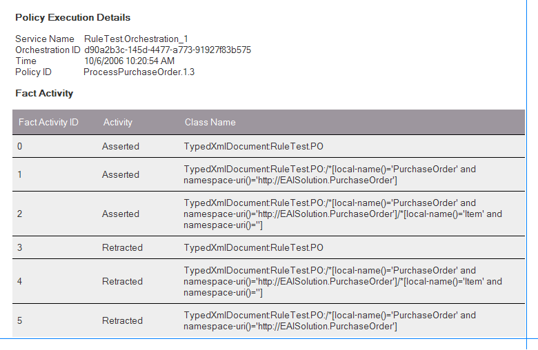
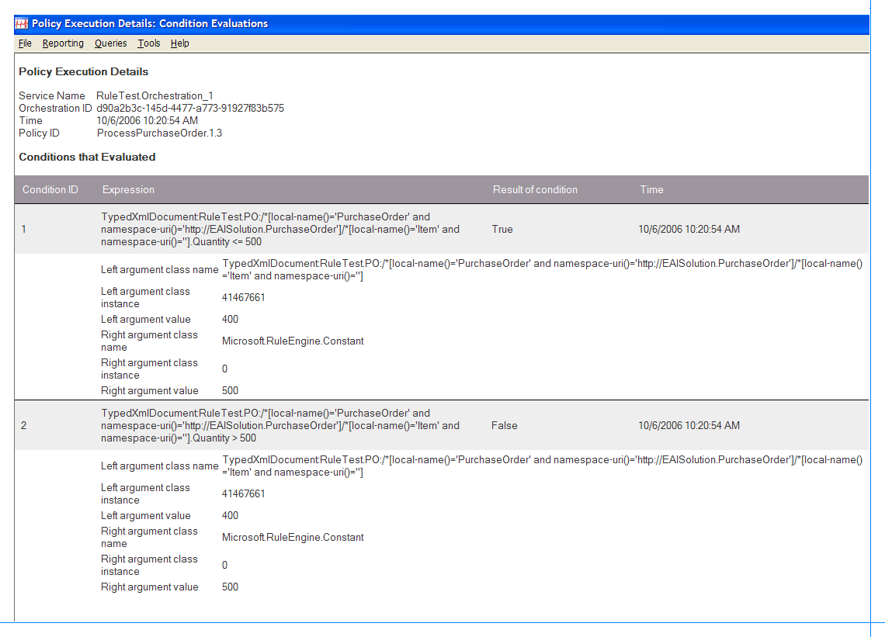
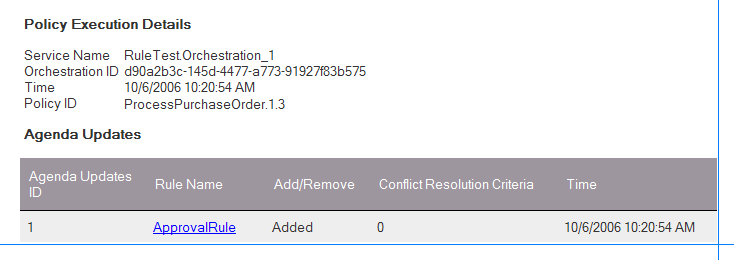

# Walkthrough: Tracking Policy Execution
This walkthrough provides step-by-step procedures for enabling tracking for the **ProcessPurchaseOrder** policy, and for viewing the tracking information after the policy is executed.  
  
## Prerequisites  
 You must complete the [Walkthrough: Modifying the Policy](../core/walkthrough-modifying-the-policy.md) walkthrough before performing this walkthrough.  
  
## Overview of This Walkthrough  
 This walkthrough contains two procedures, as described in the following table.  
  
|Procedure title|Procedure description|  
|---------------------|---------------------------|  
|To enable tracking for the ProcessPurchaseOrder policy|Provides step-by-step instructions for enabling tracking for the **ProcessPurchaseOrder** policy.|  
|To test the solution and view the tracking information|Provides step-by-step instructions for testing the solution and viewing the tracking information for the policy by using tracking.|  
  
### To enable tracking for the ProcessPurchaseOrder policy  
  
1.  On the **Start** menu, open **BizTalk Server Administration**. If you have the BizTalk Server Administration console already open, press F5 to refresh it.  
  
2.  Expand **Console Root**, expand **BizTalk Server Administration**, expand **BizTalk Group**, expand **Applications**, and then expand **RuleTestApp**.  
  
3.  Right-click **Policies**, point to **Add**, and then click **Policy**.  
  
    > [!NOTE]
    >  To enable tracking for a policy, you must add the policy to a BizTalk application by using the BizTalk Server Administration console.  
  
4.  In the **Add Policies** dialog box, expand **ProcessPurchaseOrder**, and select Version **1.3**.  
  
5.  Click **OK**.  
  
6.  Press F5 to refresh the view if you do not see **ProcessPurchaseOrder** in the list.  
  
7.  Right-click **ProcessPurchaseOrder**, and then click **Tracking.**  
  
8.  In the **Policy Tracking Options** dialog box, select all the check boxes for **Fact activity**, **Condition evaluation**, **Rule firings**, and **Agenda updates**.  
  
9. Click **OK**.  
  
### To test the solution and view the tracking information  
  
1.  Open **SamplePO.xml** and **SamplePO2.xml** in Notepad and change the value of the **Status** field to **XYZ**.  
  
2.  Copy **SamplePO.xml** that you created in [Walkthrough: Testing the Policy](../core/walkthrough-testing-the-policy.md) to the input directory for the orchestration.  
  
3.  You should see an output file in the output directory for the orchestration. Open the output XML file and notice that the value of the **Status** field is set to **Approved**.  
  
4.  Click **Start**, point to **Programs**, point to **Microsoft BizTalk Server**, and then click **BizTalk Server Administration**.  
  
5.  On the **Group Overview** page, click on the **Group Hub** tab, and then click on **Tracked Service Instances**.  
  
6.  Right-click the name of the Orchestration (RuleTest.Orchestration_1), and then click **Message Flow**.  
  
7.  Click **Follow this link to view the Policy execution details for this orchestration instance**.  
  
8.  Make sure you see the window that looks like the following figure.  
  
       
  
9. Click the time or **ProcessPurchaseOrder1.3** to see the following screen. In this screen, you can see the service (orchestration) that requested the policy execution, the ID of the orchestration, the time at which the policy was executed, and the ID of the policy.  
  
       
  
10. Click **Fact Activity** to see the facts (data) that were asserted into the rule engine's working memory and the facts that were retracted from the rule engine's working memory.  
  
       
  
11. On the **File** menu, click **Navigate back**.  
  
12. Click **Conditions that Evaluated**. You will see the details about the conditions that were evaluated. In this case, there are two rules in the policy, and each policy has a condition. You can see that two conditions were evaluated; one evaluated to `true` and the other one evaluated to `false`.  
  
       
  
13. On the **File** menu, click **Navigate back**.  
  
14. Click **Agenda Updates**. You can see that only the ApprovalRule is added to the agenda. The DeniedRule is not added to the agenda because its condition evaluates to `false`.  
  
       
  
15. Click **ApprovalRule** to see the definition of the ApprovalRule.  
  
16. On the **File** menu, click **Navigate back**.  
  
17. On **File** menu, click **Navigate back** again.  
  
18. Click **Rules that fired**. You can see that only ApprovalRule was fired (actions for the ApprovalRule were executed).  
  
19. On the **File** menu, click **Navigate back**.  
  
20. Click **Rules that did not fire**. You can see that DeniedRule was not fired because it was not in the agenda.  
  
21. Repeat steps 1-20 with **SamplePO2.xml**.  
  
## Comments  
  
-   The policy tracking information is very similar to the tracking information you see in Business Rule Composer when you test a policy.  
  
-   Although the orchestration name is RuleTest.odx, you see the name of the orchestration as Orchestration_1, because the Type Name for the orchestration is set to Orchestration_1 even though the Name is changed. Tracking is showing you the orchestration name in the format \<Namespace>.\<Type Name>.  
  
-   If you delete a policy from a BizTalk application by using the BizTalk Server Administration console, the tool deletes the policy not only from the application, but also from the rule engine database. You will no longer see the policy in Business Rule Composer (press F5 to refresh). Therefore, you should be careful when deleting a policy from an application.  
  
-   When you stop the RuleTestApp and select the **Full Stop** option, the ProcessPurchaseOrder policy (version 1.3) is automatically undeployed.  
  
-   If a policy is used by multiple applications, create a separate application for the policy and then create references to it from the client applications. If you add the policy to all the client applications, when you stop one of the client applications, the policy is undeployed, and the other client applications can no longer use the policy. Therefore it is a good practice to create a separate application for a policy that is shared across two or more applications.  
  
-   When you start the RuleTestApp, the ProcessPurchaseOrder policy (version 1.3) is automatically deployed.  
  
## Next Steps  
 Now that you have completed this walkthrough, perform the [Walkthrough: Deploying the Policy](../core/walkthrough-deploying-the-policy.md) walkthrough, which gives you step-by-step instructions for deploying policies.  
  
## See Also  
 [How to Configure Tracking for a Policy](../core/how-to-configure-tracking-for-a-policy.md)   
 [Managing Policies](../core/managing-policies.md)