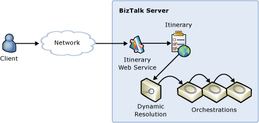

# Defining Routing and Message Transformation Through Multiple Orchestrations Using Itineraries
In this use case, a message submitted for processing contains an itinerary SOAP header that describes the list of services to execute and their resolution requirements. The itinerary specifies one or more Microsoft BizTalk Server orchestrations through which the message will pass during the processing cycle. Optionally, the itinerary can contain dynamic routing information used to determine endpoints or transformation requirements for the message. Figure 1 illustrates a schematic view of the process.  
  
   
  
 **Figure 1**  
  
 **Defining routing and message transformation through multiple orchestrations using itineraries**  
  
 The Itinerary On-Ramp sample included with the [!INCLUDE[esbToolkit](../includes/esbtoolkit-md.md)] demonstrates this use case. It shows how to create itineraries that contain resolution, routing, and service invocation instructions as a series of itinerary steps that define how the [!INCLUDE[esbToolkit](../includes/esbtoolkit-md.md)] and BizTalk Server will process the input message. One-way and request-response samples are included.  
  
 For more information, see [Installing and Running the Itinerary On-Ramp Sample](../esb-toolkit/installing-and-running-the-itinerary-on-ramp-sample.md).