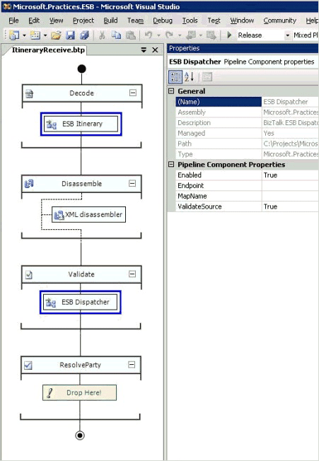

# Using a Pipeline Component to Read an Itinerary
A message that arrives in a receive pipeline can contain metadata in its SOAP header that defines its processing requirements (client-side itinerary). Figure 1 illustrates the use of the ESB Itinerary and ESB Dispatcher pipeline components.  
  
   
  
 **Figure 1**  
  
 **Example of an ESB Itinerary pipeline component**  
  
 An ESB Itinerary pipeline component can be used to capture the metadata from a message as context properties that can define the processing applied by the ESB.  
  
 The following sections describe the steps performed by each component.  
  
## ESB Itinerary Pipeline Component Process Steps  
 In the example shown in Figure 1, the ESB Itinerary pipeline component executes the following steps:  
  
-   It reads the itinerary SOAP header. The submitting party sets the itinerary by populating the SOAP header when he or she submits the message. A series of BizTalk message context properties represent the SOAP header; these properties vary, depending on the type of Web service adapter that is used. The following are the relevant Web service adapters:  
  
    -   **WCF adapter.** This adapter parses the SOAP headers and populates the BizTalk message context properties listed in the following table.  
  
        |Properties|  
        |----------------|  
        |**Name = Itinerary**|  
        |**Namespace = http://schemas.microsoft.biztalk.practices.esb.com/itinerary**|  
  
        > [!NOTE]
        >  By default, the Windows Communication Foundation (WCF) adapter uses the root name of the schema named ItineraryDescription.xsd (this schema is used to generate the ESB Itinerary SOAP header) as the BizTalk context **Name** argument, and it uses the target namespace of the schema as the BizTalk context **Namespace** argument.  
  
    -   **SOAP adapter.** This adapter parses the SOAP headers and populates the BizTalk message context properties listed in the following table.  
  
        |Properties|  
        |----------------|  
        |**Name = Itinerary**|  
        |**Namespace = http://schemas.microsoft.com/BizTalk/2003/SOAPHeader**|  
  
        > [!NOTE]
        >  By default, the SOAP Adapter uses the root name of the schema named Itinerary.xsd (this schema is used to generate the ESB Itinerary SOAP header) as the BizTalk context **Name** argument, and it uses the namespace of the SOAP header as the BizTalk context **Namespace** argument.  
  
-   It removes the original itinerary value from the message context.  
  
-   It validates the itinerary and sets specific properties to preset default values if they are null in the itinerary; for example:  
  
    -   If Service count is less than 1, the component throws an exception.  
  
    -   The component sets the itinerary root attributes using the values for the Service count, the identifier (**Uuid**), the start time (**BeginTime**), and whether this is a one-way or two-way request (**IsRequestResponse**).  
  
    -   The component validates the services, sets the identifiers, sets the current service instance (the service to process next), and validates any associated resolvers.  
  
    -   The component sets the BizTalk Segment of the itinerary using the following properties:  
  
        -   **correlationToken**  
  
        -   **reqRespTransmitPipelineID**  
  
        -   **interchangeId**  
  
        -   **receiveInstanceId**  
  
        -   **epmRRCorrelationToken**  
  
    -   The component writes the modified itinerary to the BizTalk message context properties listed in the following table using the properties defined in the System-Properties.xsd schema.  
  
        |Properties|  
        |----------------|  
        |**Name = ItineraryHeader**|  
        |**Namespace = http://schemas.microsoft.biztalk.practices.esb.com/itinerary/system-properties**|  
  
    -   The component promotes the four BizTalk context properties listed in the following table using the values defined in the System-Properties.xsd schema.  
  
        |Property|Value|  
        |--------------|-----------|  
        |**ServiceName**|The name of the current service instance defined in the itinerary.|  
        |**ServiceType**|Set to either **Orchestration** or **Messaging**|  
        |**IsRequestResponse**|Set to either **True** or **False**|  
        |**ServiceState**|Set to **Pending**|  
  
## ESB Dispatcher Pipeline Component Process Steps  
 In the example shown in Figure 1, the ESB Dispatcher pipeline component executes the following steps:  
  
-   It manages the execution of any itinerary steps of type **Messaging** and advances the itinerary. The ESB Dispatcher component is location-aware and executes logic based on its location in the messaging processing cycle, which could be **Receive Inbound, Send Transmit**, **Send Inbound**, or **Receive Outbound**. The ESB Dispatcher pipeline component invokes ESB itinerary messaging services specified in the Esb.config file. By default, the configuration properties of this component for routing and transformation are associated with the following services:  
  
    -   **Microsoft.Practices.ESB.Services.Transform.** This service executes BizTalk maps against the payload of an inbound message. The service validates transform requirements and updates the BizTalk context properties that contain the document specification name and the message type. The ESB Dispatcher executes this service only if this is the name of the transform service as it appears in the corresponding property of the ESB Dispatcher pipeline component.  
  
    -   **Microsoft.Practices.ESB.Services.Routing.**This service uses the Resolver and Adapter Provider Framework to set the appropriate endpoint routing information. The ESB Dispatcher executes this service only if this is the name of the routing service as it appears in the corresponding property of the ESB Dispatcher pipeline component.