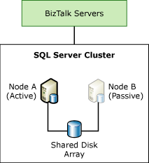

# Clustering the BizTalk Server Databases
If the [!INCLUDE[btsBizTalkServerNoVersion](../includes/btsbiztalkservernoversion-md.md)] databases become unavailable, the [!INCLUDE[btsBizTalkServerNoVersion](../includes/btsbiztalkservernoversion-md.md)] environment will not function correctly. To provide high availability, you can create a Microsoft [!INCLUDE[btsSQLServerNoVersion](../includes/btssqlservernoversion-md.md)] cluster for the [!INCLUDE[btsBizTalkServerNoVersion](../includes/btsbiztalkservernoversion-md.md)] databases, as shown in the following figure.  
  
   
  
 To create a highly available solution for the [!INCLUDE[btsBizTalkServerNoVersion](../includes/btsbiztalkservernoversion-md.md)] databases, you must have at least two computers that are running [!INCLUDE[btsSQLServerNoVersion](../includes/btssqlservernoversion-md.md)] and a shared disk array in the cluster.  
  
## Clustering Options  
 Determine the best cluster configuration for the [!INCLUDE[btsBizTalkServerNoVersion](../includes/btsbiztalkservernoversion-md.md)] databases for your business needs. Here is a list of the options:  
  
-   **Active/passive**. High availability for the [!INCLUDE[btsBizTalkServerNoVersion](../includes/btsbiztalkservernoversion-md.md)] databases typically consists of two or more database computers configured in an active/passive server cluster configuration. These computers share a common disk resource (such as a RAID 1+0 SCSI disk array or storage area network) and use Windows Clustering to provide backup redundancy and fault tolerance.  
  
-   **Active/active**. Windows Clustering and [!INCLUDE[btsSQLServerNoVersion](../includes/btssqlservernoversion-md.md)] allow you to run [!INCLUDE[btsSQLServerNoVersion](../includes/btssqlservernoversion-md.md)] in Active/Active mode where each node of the cluster is “active” and running one or more [!INCLUDE[btsSQLServerNoVersion](../includes/btssqlservernoversion-md.md)] instances. For example, this would allow you to have the MessageBox database on one node and all other [!INCLUDE[btsBizTalkServerNoVersion](../includes/btsbiztalkservernoversion-md.md)] databases on the other node. This allows you to maximize cluster hardware usage, but an active/active [!INCLUDE[btsSQLServerNoVersion](../includes/btssqlservernoversion-md.md)] configuration should be used with care.  
  
     Can each node simultaneously handle the load of all [!INCLUDE[btsSQLServerNoVersion](../includes/btssqlservernoversion-md.md)] instances during a [!INCLUDE[btsSQLServerNoVersion](../includes/btssqlservernoversion-md.md)] cluster node failover scenario? Are there enough CPU resources? Is there sufficient memory? What about network bandwidth? How about disk I/O contention?  
  
     These are just some of the questions that need to be answered in order to determine if an active/active [!INCLUDE[btsSQLServerNoVersion](../includes/btssqlservernoversion-md.md)] cluster is right for your BizTalk applications. If it is determined that one node cannot handle all [!INCLUDE[btsSQLServerNoVersion](../includes/btssqlservernoversion-md.md)] instances in a failover scenario, an alternative is to use active/active/passive clustering.  
  
-   **Active/active/passive**. The run-time processes write to the BizTalk Management database, MessageBox databases, Tracking Analysis Services database, BAM Analysis database, BAM Star Schema database, BAM Primary Import database, and BAM Archive database. Therefore, these databases are especially important if a disaster occurs, and must have greater priority when determining what databases to cluster. Only users or tools write to the other databases. For the MessageBox databases, you can consider an active/active/passive or active/active/active/passive configuration to minimize the hardware needed.  
  
> [!NOTE]  
>  [!INCLUDE[btsSQLServer2008R2](../includes/btssqlserver2008r2-md.md)] and [!INCLUDE[btsSQLServer2008](../includes/btssqlserver2008-md.md)] Standard Edition supports 2-node failover clusters. If you decide to use the active/active/passive configuration on [!INCLUDE[btsSQLServer2008R2](../includes/btssqlserver2008r2-md.md)] or [!INCLUDE[btsSQLServer2008](../includes/btssqlserver2008-md.md)], you must use the Enterprise Edition of [!INCLUDE[btsSQLServerNoVersion](../includes/btssqlservernoversion-md.md)].  
  
## Procedures for Clustering the Databases  
 Make sure you meet the following prerequisites before you start clustering the [!INCLUDE[btsBizTalkServerNoVersion](../includes/btsbiztalkservernoversion-md.md)] databases.  
  
-   When you create the domain groups for your [!INCLUDE[btsBizTalkServerNoVersion](../includes/btsbiztalkservernoversion-md.md)] environment, you must create global domain accounts.  
  
-   Configure the [!INCLUDE[btsSQLServerNoVersion](../includes/btssqlservernoversion-md.md)] cluster before you install and configure [!INCLUDE[btsBizTalkServerNoVersion](../includes/btsbiztalkservernoversion-md.md)]. For more information about clustering [!INCLUDE[btsSQLServer2008R2](../includes/btssqlserver2008r2-md.md)], see [Getting Started with SQL Server 2008 R2 Failover Clustering](http://go.microsoft.com/fwlink/?LinkId=156820) (http://go.microsoft.com/fwlink/?LinkId=156820).  
  
-   If you are also clustering the master secret server, configure that server first. For more information about high availability for Enterprise Single Sign-On, see [High Availability for the Master Secret Server](../technical-guides/high-availability-for-the-master-secret-server.md).  
  
#### To run the BizTalk Server Configuration Wizard  
  
1.  Install [!INCLUDE[btsBizTalkServer2006r3](../includes/btsbiztalkserver2006r3-md.md)] on a runtime server.  
  
2.  Launch the [!INCLUDE[btsBizTalkServerNoVersion](../includes/btsbiztalkservernoversion-md.md)] Configuration program. Click **Start**, point to **Programs**, point to **Microsoft [!INCLUDE[btsBizTalkServer2006r3ui](../includes/btsbiztalkserver2006r3ui-md.md)]**, and then click **BizTalk Server Configuration**.  
  
3.  To apply a custom configuration, follow the steps in [Working with the Custom Configuration Manager](http://go.microsoft.com/fwlink/?LinkId=156822) (http://go.microsoft.com/fwlink/?LinkId=156822) in [!INCLUDE[btsBizTalkServerNoVersion](../includes/btsbiztalkservernoversion-md.md)] Help. To specify the SQL Server cluster for the BizTalk Server databases enter the name of the SQL Server cluster in the **Databases** dialog of the configuration.  
  
4.  Complete the [!INCLUDE[btsBizTalkServerNoVersion](../includes/btsbiztalkservernoversion-md.md)] configuration by following the instructions in [Custom Configuration](http://go.microsoft.com/fwlink/?LinkId=156823) (http://go.microsoft.com/fwlink/?LinkId=156823) in [!INCLUDE[btsBizTalkServerNoVersion](../includes/btsbiztalkservernoversion-md.md)] Help.  
  
 For more information about clustering [!INCLUDE[btsBizTalkServerNoVersion](../includes/btsbiztalkservernoversion-md.md)] databases, see [Improving Fault Tolerance in BizTalk Server by Using a Windows Server 2008 Failover Cluster or Windows Server 2003 Server Cluster](http://go.microsoft.com/fwlink/?LinkId=156819) (http://go.microsoft.com/fwlink/?LinkId=156819).  
  
## Behavior of BizTalk Host Instances During SQL Server Failover  
 For more information about behavior of BizTalk host instances during SQL Server failover, see [Behavior of BizTalk Server Host Instances during SQL Server Failover](http://go.microsoft.com/fwlink/?LinkId=151287) (http://go.microsoft.com/fwlink/?LinkId=151287).  
  
## Using SQL Server Database Mirroring  
 For more information about using SQL Server database mirroring with respect to BizTalk Server database clustering, see [Use of SQL Server database mirroring or the Volume Shadow Copy service](http://go.microsoft.com/fwlink/?LinkId=151288) (http://go.microsoft.com/fwlink/?LinkId=151288) in BizTalk Server help.  
  
## See Also  
 [Scaling Out the BizTalk Server Databases](../technical-guides/scaling-out-the-biztalk-server-databases.md)