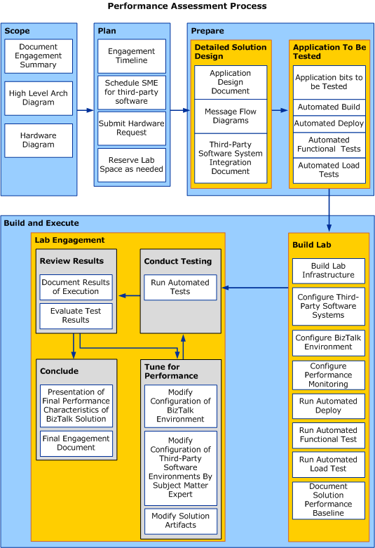

# Phases of a Performance Assessment
One of the primary goals of [!INCLUDE[btsBizTalkServerNoVersion](../includes/btsbiztalkservernoversion-md.md)] is to provide maximum flexibility for accommodating as many processing scenarios as possible. Because of this great flexibility, one of the primary challenges facing developers of a BizTalk solution is to determine how to make best use of the features available in [!INCLUDE[btsBizTalkServerNoVersion](../includes/btsbiztalkservernoversion-md.md)] to meet their business needs. This flexibility also poses a challenge when optimizing the performance of a BizTalk Server solution.  
  
 This section describes the methodology that should be used to optimize the performance of a BizTalk Server solution by engaging in a BizTalk Server performance assessment. A BizTalk Server performance assessment is used to maximize the performance of a particular BizTalk Server solution. In order to gain the maximum benefit from a BizTalk Server performance assessment, the performance assessment should be divided into the following five distinct steps/phases:  
  
1.  Scope  
  
2.  Plan  
  
3.  Prepare  
  
4.  Build lab  
  
5.  Execute  
  
 This topic describes each of these phases in greater detail.  
  
   
Phases of a BizTalk Server performance assessment  
  
## In This Section  
  
-   [Phase 1: Scoping the Assessment](../technical-guides/phase-1-scoping-the-assessment.md) - Describes the steps that should be followed when establishing the scope of the performance assessment.  
  
-   [Phase 2: Planning the Assessment](../technical-guides/phase-2-planning-the-assessment.md) – Describes how to create a solution milestones timeline. This is used as a master plan to clearly document when expected goals for the testing of the solution should be met.  
  
-   [Phase 3: Preparing for the Assessment](../technical-guides/phase-3-preparing-for-the-assessment.md) – Describes how to provide a detailed architectural diagram of the solution and specific aspects of the hardware configuration used by the solution.  
  
-   [Phase 4: Building the Assessment Environment](../technical-guides/phase-4-building-the-assessment-environment.md) – Describes installation of hardware and applications according to the detailed design of the solution platform that was established previously.  
  
-   [Phase 5: Executing the Assessment](../technical-guides/phase-5-executing-the-assessment.md) – Provides information about generating performance data via automated load testing and how to detect and eliminate any bottlenecks in the solution.  
  
## See Also  
 [BizTalk Server Performance Testing Methodology](../technical-guides/biztalk-server-performance-testing-methodology.md)