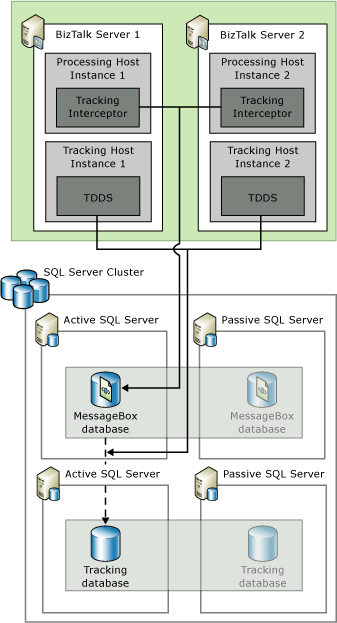
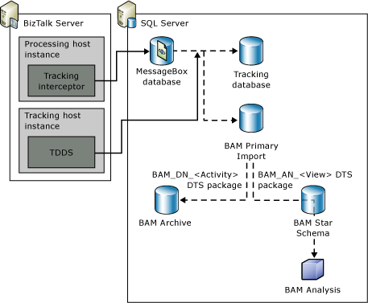

# Scaling Out the BizTalk Server Databases
To provide high availability for the [!INCLUDE[btsBizTalkServerNoVersion](../includes/btsbiztalkservernoversion-md.md)] databases, configure two computers that are running [!INCLUDE[btsSQLServer2008](../includes/btssqlserver2008-md.md)] or [!INCLUDE[btsSQLServer2005](../includes/btssqlserver2005-md.md)] in a Windows cluster. These computers can run in an active/active, active/passive, or active/active/passive (requires three computers) configuration for redundancy and can store data on a shared drive (such as a RAID 1+0 SCSI disk array) or storage area network (SAN).  
  
 If the [!INCLUDE[btsSQLServerNoVersion](../includes/btssqlservernoversion-md.md)] service becomes unavailable for any reason, the database cluster transfers resources from the active computer to the passive computer. During this failover process, the [!INCLUDE[btsBizTalkServerNoVersion](../includes/btsbiztalkservernoversion-md.md)] service instances experience database connection failures and automatically restart to reconnect to the databases. The functioning database computer (previously the passive computer) begins processing the database connections after assuming the resources during failover.  
  
 Clustering the [!INCLUDE[btsBizTalkServerNoVersion](../includes/btsbiztalkservernoversion-md.md)] databases is discussed in [Clustering the BizTalk Server Databases2](../technical-guides/clustering-the-biztalk-server-databases2.md). This section focuses on scaling out the [!INCLUDE[btsBizTalkServerNoVersion](../includes/btsbiztalkservernoversion-md.md)] databases to provide high availability.  
  
## Providing High Availability for the BizTalk MessageBox Database  
 This section provides information about to configure BizTalk MessageBox database for high availability.  
  
### Running Multiple MessageBox Databases  
 To enhance the scalability of the [!INCLUDE[btsBizTalkServerNoVersion](../includes/btsbiztalkservernoversion-md.md)] databases and to address high CPU utilization on the MessageBox database [!INCLUDE[btsSQLServerNoVersion](../includes/btssqlservernoversion-md.md)] computer, you can configure [!INCLUDE[btsBizTalkServerNoVersion](../includes/btsbiztalkservernoversion-md.md)] to store data across multiple MessageBox databases. You create the first MessageBox database when you run the Configuration Wizard. This MessageBox database is the master MessageBox database. There is a single master MessageBox database in your [!INCLUDE[btsBizTalkServerNoVersion](../includes/btsbiztalkservernoversion-md.md)] deployment. The master MessageBox database contains the master subscription information and routes messages to the appropriate MessageBox database. Typically, you want to dedicate the master MessageBox database to do routing only and let the other MessageBox databases do the processing. To make a MessageBox database to do routing only, select **Disable new message publication** from the MessageBox properties in BizTalk Administration console.  
  
 An example of MessageBox database processing flow is as follows:  
  
1.  When the master MessageBox database receives a new activation message—a brand new instance of a business process or a subscription message—the master MessageBox database distributes the activation message to the next available MessageBox database. For example, if you have one master MessageBox database and two MessageBox databases, the master MessageBox database routes the first activation message to MessageBox database 1, the second activation message to MessageBox database 2, the third activation message to MessageBox database 1, and so on in a round-robin pattern. The master MessageBox database uses built-in logic to load balance, and does not need additional load-balancing mechanisms.  
  
2.  After the master MessageBox database routes the activation message to a particular MessageBox database (for example, MessageBox database 1), the business process goes into memory and runs.  
  
3.  If the business process has to wait for a message, and the wait time is longer than several seconds, the business process is persisted back into MessageBox database 1. The business process is waiting for a correlation message.  
  
4.  When the correlation message arrives at the master MessageBox database, the Message Engine does a lookup operation in the database for the MessageBox database that contains the state for the correlation message (in this example, MessageBox 1). The master MessageBox database delivers the message to the MessageBox database that contains the business process.  
  
5.  The business process is brought back into memory to continue processing until it finishes or until it has to wait for another correlation message.  
  
 [!INCLUDE[btsBizTalkServerNoVersion](../includes/btsbiztalkservernoversion-md.md)] stores all the states in the MessageBox databases, and each MessageBox database contains state information for different business processes. For reliability, you must cluster all the MessageBox databases, including the master and secondary MessageBox databases.  
  
 To configure multiple MessageBox databases, you use the [!INCLUDE[btsBizTalkServerNoVersion](../includes/btsbiztalkservernoversion-md.md)] Administration console to add the computers that are running [!INCLUDE[btsSQLServer2008R2](../includes/btssqlserver2008r2-md.md)] or [!INCLUDE[btsSQLServer2008](../includes/btssqlserver2008-md.md)]. From an administration perspective, you only have to add new MessageBox databases. [!INCLUDE[btsBizTalkServerNoVersion](../includes/btsbiztalkservernoversion-md.md)] automatically handles the round-robin distribution of activation messages and sends correlation messages to the correct MessageBox databases.  
  
 If you configure multiple MessageBox databases in your environment you should create a minimum of three MessageBox databases for your [!INCLUDE[btsBizTalkServerNoVersion](../includes/btsbiztalkservernoversion-md.md)] group and you should disable message publication on the master MessageBox database. This recommendation is made because adding additional MessageBox databases incurs overhead by the master MessageBox database for routing messages between the MessageBox databases. If you only configure two MessageBox databases then most of the benefit gained by the additional MessageBox database is offset by the overhead consumed by the master MessageBox database for message routing.  
  
> [!IMPORTANT]  
>  [!INCLUDE[btsBizTalkServerNoVersion](../includes/btsbiztalkservernoversion-md.md)] stores all the states in the MessageBox databases, and each MessageBox database contains state information for different business processes. For reliability, you must cluster all the MessageBox databases, including the master and secondary MessageBox databases.  
  
### Providing High Availability for Multiple MessageBox Databases  
 While adding MessageBox databases to your [!INCLUDE[btsBizTalkServerNoVersion](../includes/btsbiztalkservernoversion-md.md)] deployment improves scalability, it does not provide high availability because each MessageBox database is unique and independent and is potentially a single point of failure for your [!INCLUDE[btsBizTalkServerNoVersion](../includes/btsbiztalkservernoversion-md.md)] environment. To add redundancy involves configuring a server cluster for each MessageBox database. [!INCLUDE[btsBizTalkServerNoVersion](../includes/btsbiztalkservernoversion-md.md)] distributes data across the multiple MessageBox databases, so the databases do not share data or otherwise provide redundancy without server clustering.  
  
## Providing High Availability for the BizTalk Tracking Database  
 Depending on the requirements of your particular deployment, you might want to enhance performance for tracking by isolating the BizTalk Tracking database onto a separate [!INCLUDE[btsSQLServerNoVersion](../includes/btssqlservernoversion-md.md)] computer and by creating a separate BizTalk Host dedicated to host tracking. The following figure shows a dedicated tracking host with two host instances and clustered databases.  
  
   
  
 If your deployment has high throughput and involves tracking lots of data for these messages, the tracking overhead could potentially consume lots of resources on the computer that is running [!INCLUDE[btsSQLServerNoVersion](../includes/btssqlservernoversion-md.md)]. If this situation occurs and a high rate of incoming messages continues, [!INCLUDE[btsBizTalkServerNoVersion](../includes/btsbiztalkservernoversion-md.md)] reaches a point where it cannot process new messages because the resources required to track messages are greater than the resources required to run the other [!INCLUDE[btsBizTalkServerNoVersion](../includes/btsbiztalkservernoversion-md.md)] components (such as receiving messages and persisting them to the MessageBox database).  
  
 To improve performance and security, we recommend that you dedicate a host for tracking that does not contain any other items (such as receive locations, orchestrations, or pipelines) and that you disable tracking from the receiving, processing, and sending hosts. To provide high availability for the tracking host, create more than one host instance of the tracking host. For more information about creating a tracking host, see [How to Create a New Host](http://go.microsoft.com/fwlink/?LinkId=156825) (http://go.microsoft.com/fwlink/?LinkId=156825) in [!INCLUDE[btsBizTalkServerNoVersion](../includes/btsbiztalkservernoversion-md.md)] Help.  
  
 For each MessageBox database, [!INCLUDE[btsBizTalkServerNoVersion](../includes/btsbiztalkservernoversion-md.md)] uses only one tracking host instance to move messages from the MessageBox database to the BizTalk Tracking database (BizTalkDTADb). If additional computers run instances of the tracking host, [!INCLUDE[btsBizTalkServerNoVersion](../includes/btsbiztalkservernoversion-md.md)] automatically scales out the handling of each MessageBox database to a separate instance of the tracking host. If the number of MessageBox databases is larger than the number of tracking host instances, one or more tracking host instances will service more than one MessageBox database.  
  
 To provide high availability for the BizTalk Tracking database, use Windows Clustering to configure two database computers that are running [!INCLUDE[btsSQLServer2008R2](../includes/btssqlserver2008r2-md.md)] or [!INCLUDE[btsSQLServer2008](../includes/btssqlserver2008-md.md)] in an active/passive configuration.  
  
## Providing High Availability for the BAM Databases  
 *Business Activity Monitoring* (BAM) provides visibility into business processes independent of the IT implementation or across a heterogeneous IT implementation. The BAM [!INCLUDE[btsSQLServerNoVersion](../includes/btssqlservernoversion-md.md)] databases (BAM Star Schema database, BAM Primary Import database, and BAM Archive database) and the BAM Analysis database store the business activity data that is different from the operational monitoring data. The following diagram shows the BAM database infrastructure.  
  
   
  
 To make sure your BAM infrastructure is highly available, do the following:  
  
-   **Cluster the BAM Primary Import database and the BAM Analysis database.** The BAM Primary Import database is the center of the Business Activity Monitoring system. It is therefore important that you make this database highly available by using Windows Clustering and that you follow the next two recommendations to prevent this database from filling up. The BAM Analysis database is an Analysis Services database that stores the data that business analysts use to build activity aggregations and OLAP cubes, and therefore any downtime of this database affects their productivity. While you do not have to cluster the BAM Archive database, we recommend that you monitor the event log for errors when the SQL Server Integration Services (SSIS) packages run to make sure the data has been transferred successfully, and to monitor the size of the database so that you can replace it before it fills up.  
  
-   **Define an online window.** To allow for better performance and avoid downtime, BAM partitions the data in the BAM Primary Import database into tables based on the timestamp when the activity was completed. BAM achieves this by regularly swapping the completed table with another empty table of identical format. After BAM does this, the additional completed activities go into the new partition (table), while BAM keeps the old partitions for the time defined in the online window. You must define an online window to make sure the number of partitions in the BAM Primary Import database does not grow too large. For more information about scheduling online windows, see [Archiving Primary Import Database Data](http://go.microsoft.com/fwlink/?LinkId=156826) (http://go.microsoft.com/fwlink/?LinkId=156826) in [!INCLUDE[btsBizTalkServerNoVersion](../includes/btsbiztalkservernoversion-md.md)] Help.  
  
-   **Schedule SSIS packages to run periodically.** Defining an online window makes sure your BAM Primary Import database does not fill up with old activity partitions. You must also schedule SSIS packages to run periodically to create a new partition for the activity data and to move the data from the old partitions in the BAM Primary Import database into the BAM Archive database. For more information about scheduling SSIS packages, see [Scheduling SQL Server Integration Services Packages](http://go.microsoft.com/fwlink/?LinkId=156827) (http://go.microsoft.com/fwlink/?LinkId=156827) in [!INCLUDE[btsBizTalkServerNoVersion](../includes/btsbiztalkservernoversion-md.md)] Help.  
  
-   **Carefully choose small sets of data items (checkpoints), and avoid including unnecessary data items when defining an activity.**  
  
-   **Understand the trade-offs between scheduled and real-time aggregations when you design your aggregations.** Real-time aggregations are automatically maintained by [!INCLUDE[btsSQLServerNoVersion](../includes/btssqlservernoversion-md.md)] triggers and have zero latency. They are ideal for some mission-critical low-latency scenarios, but they incur a performance cost whenever the events are being written to the BAM Primary Import database. Scheduled aggregations rely on scheduled cubing SSIS packages to update their aggregation data. Their latency is equal to or greater than the SSIS schedule interval, but overall they have a smaller performance impact on the BAM Primary Import database.  
  
-   **If you choose scheduled aggregations, make sure you schedule the cubing SSIS to run more frequently than the archiving SSIS.** This is because the archiving SSIS will not move the activity data that has been processed for scheduled aggregation to the BAM Archive database.  
  
-   **Enable the BAM Event Bus service in multiple computers to obtain failover functionality.**  
  
## Providing High Availability for the Other BizTalk Server Databases  
 To provide high availability for the other [!INCLUDE[btsBizTalkServerNoVersion](../includes/btsbiztalkservernoversion-md.md)] databases, configure two computers that are running [!INCLUDE[btsSQLServer2008R2](../includes/btssqlserver2008r2-md.md)] or [!INCLUDE[btsSQLServer2008](../includes/btssqlserver2008-md.md)] in a Windows cluster. These computers can run in an active/active or active/passive configuration for redundancy and can store data on a shared drive (such as a RAID 1+0 SCSI disk array) or storage area network (SAN).  
  
## See Also  
 [Clustering the BizTalk Server Databases2](../technical-guides/clustering-the-biztalk-server-databases2.md)