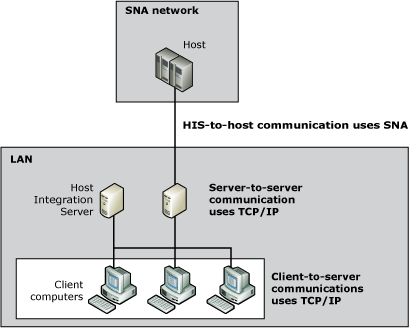

# Communication Between Multiple Host Integration Server Computers
[!INCLUDE[hisHostIntServNoVersion](../includes/hishostintservnoversion-md.md)] computers communicate with each other using mail slot or datagram broadcast messages. They use the SnaBase service to keep track of names of servers, client computers, and available transaction programs (TPs), which are the programs used for communication through Advanced Program-to-Program Communications (APPC) or Common Programming Interface for Communications (CPI-C).  
  
 Windows operating systems support multiple protocols simultaneously, but there is no need to send the same Host Integration Server broadcasts over all available protocols. Using the SNA Manager Console, you can specify the network protocol for server broadcasts. You must make sure that one protocol is available on all Host Integration Server computers in the SNA subdomain, and use that protocol for server broadcasts. For more information, see [Configuring a Server Broadcast](../HIS2010/configuring-a-server-broadcast1.md). The following figure shows a network in which TCP/IP is used for server-to-server communications and TCP/IP is used for client-to-server communications.  
  
   
Using different protocols for server-to-server and client-to-server communications  
  
## Separate protocol used for server-to-server and client-to-server communications  
 It is recommended that you use only one protocol for server broadcasts. Using multiple server-to-server transport protocols can add to network overhead because every server broadcast must be sent out through all the protocols selected.  
  
 Server broadcasts need to be configured only once for a subdomain; the configuration affects all servers in the subdomain.  
  
 The mean time between server broadcasts is specified in number of seconds, with the default being 60 seconds. Specifying a smaller value brings heavier demands on the network because the broadcasts occur more often.  
  
 In this Section  
  
 [Configuring a Server Broadcast](../HIS2010/configuring-a-server-broadcast1.md)  
  
## See Also  
 [SNA Service](../HIS2010/sna-service1.md)