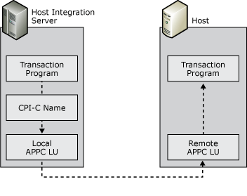

# Understanding CPI-C
Common Programming Interface for Communications (CPI-C) is an application programming interface (API) that uses the LU 6.2 communications architecture. CPI-C comprises a set of C programming language routines that allow applications on computers to communicate with one another to accomplish a processing task, such as copying a file or accessing a remote database.  
  
 CPI-C programming provides a mechanism called client-side information that associates a set of parameters with a specified CPI-C symbolic destination name. The CPI-C program uses the symbolic destination name to initialize a conversation using APPC LUs that are associated with the CPI-C symbolic name.  
  
   
Diagram showing CPI-C symbolic names  
  
 Host Integration Server supports the CPI-C API and provides for configuration of CPI-C parameters. These parameters allow applications on the Host Integration Server systems to communicate with applications on any platform that supports APPC communications and CPI-C including mainframes, AS/400s, Windows systems, and UNIX systems.  
  
## See Also  
 [Understanding Peer-to-Peer Networking](../HIS2010/understanding-peer-to-peer-networking1.md)