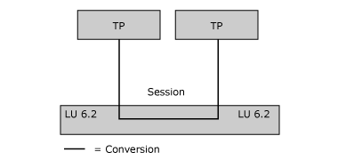
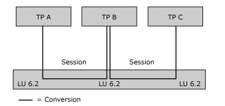

# Communication Between TPs (CPI-C)
Various hardware and software elements in the SNA environment are required for two transaction programs (TPs) to communicate with each other. The following figure illustrates several fundamental elements.  
  
   
Fundamental hardware and software elements in the SNA environment  
  
 Each TP is associated with a logical unit (LU) of type 6.2. The LU enables the TP to access the network. Note that several TPs can be associated with the same LU.  
  
 A partner TP can invoke another TP, which, in turn, invokes another TP, and so on. In the following figure, TP A invokes TP B, and TP B invokes TP C.  
  
   
Partner TP's invoking other partners  
  
 This section contains:  
  
-   [Fundamental Terms for TPs and LUs](../core/fundamental-terms-for-tps-and-lus-cpi-c.md)  
  
-   [Sample TPs Illustrating Fundamental Concepts](../core/sample-tps-illustrating-fundamental-concepts-cpi-c.md)  
  
-   [Configuring and Controlling TPs](../core/configuring-and-controlling-tps-cpi-c.md)  
  
-   [Creating TPs and Their Supporting Configuration](../core/creating-tps-and-their-supporting-configuration-cpi-c.md)