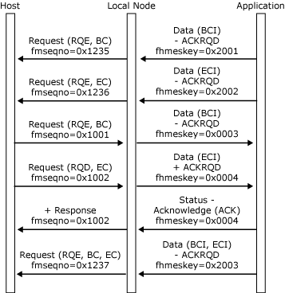
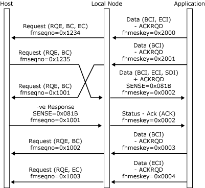

# Half-Duplex Contention
For half-duplex contention, the initial direction state is contention. Half-duplex protocol operates during a chain (only one partner can send), but the direction state normally returns to contention at the end of each chain. The change direction indicator (CDI) in the response header (RH) is thus not required. However, if the CDI is used, direction is reserved for the receiving half-session. Therefore, if the application receives change direction (CD), it should assume send state and not expect to receive data. Conversely, if the application sends CD, it cannot send again until it has received a chain from the host.  
  
 In the event of an error being discovered by either half-session, the application must assume receive state, because the host is responsible for recovery.  
  
 If both half-sessions attempt to start a chain when the direction state is contention, the race is resolved in favor of the secondary application using a sense code of 0x081B. However, the possible window between the local node and the application means that the local node cannot determine when outbound Request Exception (RQE) data is received by the application. Therefore, if the local node receives data from the application while it determines that the half-duplex contention state is receive, it will reject it with a noncritical NACK-2 (0x2004 direction).  
  
 The following two figures illustrate the direction protocol for applications using half-duplex contention mode. The three figures in the previous topic would also be valid although CD does not need to be specified.  
  
 In the following figure, the application issues and receives data using half-duplex contention protocol without error.  
  
   
Application issues and receives data using half-duplex contention protocol without error  
  
 In the following figure, the half-duplex contention race is resolved in favor of the application.  
  
   
Resolving half-duplex contention race in favor of the application  
  
## See Also  
 [Opening the PLU Connection](../core/opening-the-plu-connection2.md)   
 [PLU Session](../core/plu-session1.md)   
 [Outbound Chaining](../core/outbound-chaining1.md)   
 [Inbound Chaining](../core/inbound-chaining2.md)   
 [Segment Delivery](../core/segment-delivery2.md)   
 [Brackets](../core/brackets2.md)   
 [Direction](../core/direction2.md)   
 [Pacing and Chunking](../core/pacing-and-chunking2.md)   
 [Confirmation and Rejection of Data\]](../core/confirmation-and-rejection-of-data]2.md)   
 [Shutdown and Quiesce](../core/shutdown-and-quiesce2.md)   
 [Recovery](../core/recovery2.md)   
 [Application-Initiated Termination](../core/application-initiated-termination2.md)   
 [LUSTATs\]](../core/lustats]2.md)   
 [Response Time Monitor Data](../core/response-time-monitor-data2.md)