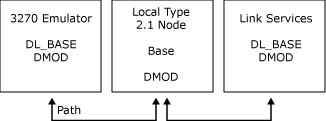

# Localities and DMODs (SNADIS)
A Base and its components (that is, a [!INCLUDE[hishostintegrationserver2009](../includes/hishostintegrationserver2009-md.md)] executable program) is called a **locality**. The Host Integration Server system therefore consists of one or more communicating localities (all the running [!INCLUDE[hishostintegrationserver2009](../includes/hishostintegrationserver2009-md.md)] executable programs within the LAN Manager domain). For each Host Integration Server system, there is a central configuration file. In addition, each Host Integration Server computer maintains configuration information about the SNALinks it supports.  
  
 In a system such as Host Integration Server, where the number of localities and their types are not configured in advance, the relationships between the localities are set up dynamically as individual localities come and go. Localities that can enter and leave a system in this way are called **dynamic localities**.  
  
 Dynamic localities communicate using the Dynamic Access Module (DMOD) component, which provides the communications facilities needed to pass messages between the Bases. This is illustrated in the following figure.  
  
   
Dynamic localities communicating using the DMOD component  
  
 This figure shows a system consisting of three dynamic localities. Dynamic localities can enter or leave this system at any time.