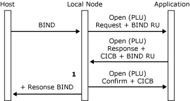
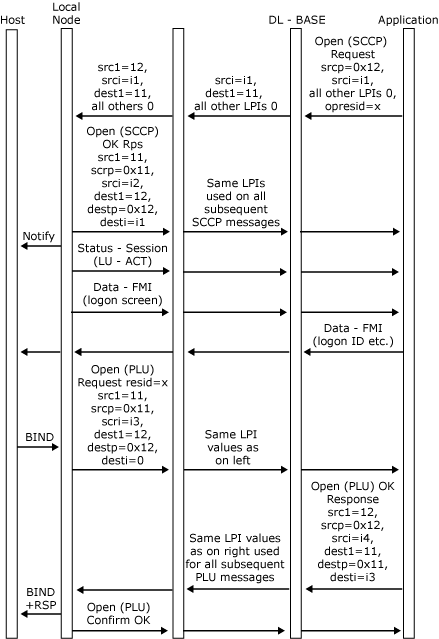

# Opening the PLU Connection
The opening of the primary logical unit (PLU) connection is closely associated with the establishment of the PLU session. The local node opens the PLU connection when it receives a **BIND** command from the host for a logical unit (LU) for which an application has previously opened a system services control point (SSCP) connection. Possible sequences are:  
  
-   An application opens its SSCP connection and sends a character-coded logon request or **INIT-SELF** request to the host SSCP. A host PLU subsequently sends a **BIND** request to the SNA server LU, and the local node opens the PLU connection.  
  
-   A host PLU sends an unsolicited **BIND** command to the SNA server LU. If the SSCP connection for the LU is open, the local node opens the PLU connection. If the local node is supporting **NOTIFY**, the host can be configured to send a **BIND** when it receives the **NOTIFY** message sent by the local node when the application opens its SSCP connection. (For more information, see [SSCP Connection](../core/sscp-connection1.md).)  
  
-   A host PLU sends a **BIND** command to the SNA server LU. If the SSCP connection for the LU is not open, the local node returns a negative response to the **BIND** request. The sense code used is 0x0845 (**NOTIFY** will be sent). The local node does not open the PLU connection. In this case, the local node sends **NOTIFY** when the SSCP connection is opened. (For more information, see **SSCP Connection**.)  
  
 To successfully open the PLU connection, the local node sends an [Open(PLU) Request](../HIS2010/open-plu-request1.md) to the application. The application responds with an [Open(PLU) OK Response](../HIS2010/open-plu-oresponse1.md). Finally the local node sends an [Open(PLU) OK Confirm](../HIS2010/open-plu-oconfirm2.md) to the application. This exchange of messages opens the PLU connection and establishes the PLU session. It should be noted that a successful PLU opening sequence is a three-way handshake, in comparison to the opening of the SSCP connection, which is a two-way handshake.  
  
 The **Open(PLU) Request** is delivered to the application using the SSCP connection for the LU. The **Open(PLU) Request** contains the application name and open resource identifier to allow applications to correlate the PLU and SSCP connections.  
  
 The **Open(PLU) Request** indicates the logical unit that the **BIND** request was directed to, references the resource identifier supplied in the [Open(SSCP) Request](../HIS2010/open-sscp-request1.md) for that LU, and carries the actual **BIND** request/response unit (RU) received from the host. (For more information, see [Open(PLU)](../HIS2010/open-plu-2.md).) It also carries the maximum RU sizes, chunk sizes (if appropriate), and pacing windows for the PLU session, to enable the application to determine the initial credit if it needs to be involved in outbound pacing. (For more information, see [Pacing and Chunking](../core/pacing-and-chunking1.md).)  
  
 The message flow for a successful opening of the PLU connection (on receipt of a nonnegotiable **BIND**) is shown in the following figure. Note that the **BIND** parameters are verified (at [1]) only when the application has supplied the **BIND** check table index as part of the connection information control block (CICB).  
  
   
Message flow for opening a PLU connection  
  
 The following figure shows the message sequence for the initiation of both the SSCP and PLU sessions, including details of where the Locality Partner Index (LPI) values are assigned. (The application's source P value of 0x12 indicates that it is a 3270 emulator. For more information about how the source LPI values are set, see [Open(SSCP) Request](../HIS2010/open-sscp-request1.md).) The message flow shown assumes that the connection to the host is already established and that both the configuration and the **BIND** are valid.  
  
 After this message sequence, there are two valid sets of LPI values, one for the SSCP session and one for the PLU session. The application can access either session at any time until **UNBIND** and can use the LPI values to distinguish between received data on the two sessions.  
  
   
Message sequence for the initiation of both the SSCP and PLU sessions  
  
## In This Section  
  
-   [BIND Checking](../core/bind-checking2.md)