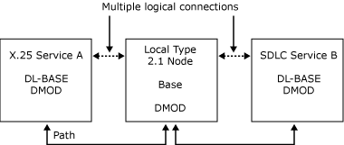

# Paths and DMODs
Dynamic Access Modules (DMODs) are responsible for the communication between localities. When the DMODs in two localities can successfully pass messages between them, a path exists between the two localities. A path must exist between two localities before a connection can exist between partners in those localities.  
  
 Host Integration Server establishes a path using an appropriate method for the network operating system in use. For example, with Microsoft LAN Manager, a named pipe is used. When the two localities are on the same computer, a local pipe is used. This is implemented using shared buffers to increase performance, but is used by the application in exactly the same way as communication with a remote locality.  
  
 The DMOD provides communication between dynamic localities and provides guaranteed in-order delivery of messages flowing over paths between localities. If the DMOD loses its path to another locality, it informs the Base.  
  
 The following figure illustrates the paths and connections between an SNA services local node and two 3270 emulation programs. Program A has two connections to the local node (one for each of two sessions). Program B has one connection to the local node.  
  
   
Paths and connections between an SNA server local node and two 3270 emulation programs